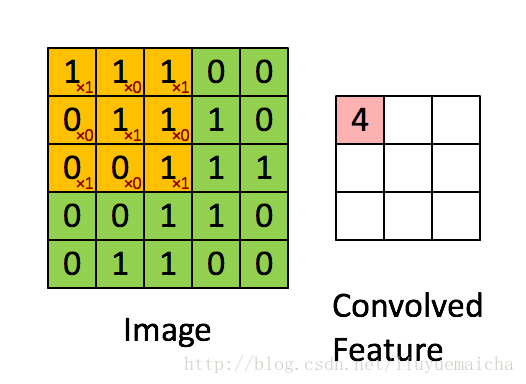
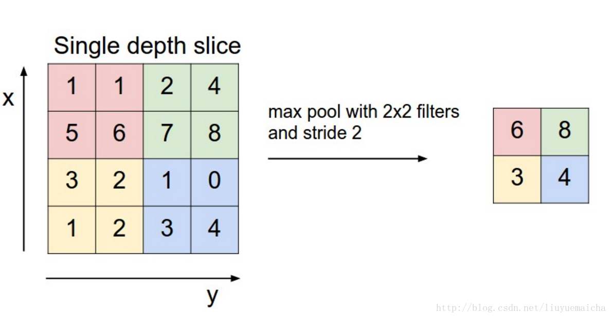

# AlexNet 调研报告

## 1. 原理 

AlexNet属于深层卷积神经网络(CNN), 2015年在ImageNet图像识别挑战赛中大放异彩，具有里程碑意义。其结构如下：


由于参数太多训练非常耗时，使用两个GPU分两路进行训练。

#### 结构：

 输入$\rightarrow$ 卷积层1 $\rightarrow^{ReLU}$ 池化层1 $\rightarrow$ 卷积层2 池化$\rightarrow^{ReLU}$ 层2$\rightarrow$卷积层3,4,5$\rightarrow$ 池化层3$\rightarrow^{ReLU}$  全连接层1,2$\rightarrow^{SoftMax}$ 输出

#### 数据：

输入图像224 x 224 x 3 (RGB) $\rightarrow$ 卷积核大小11x11，步长是 4 $\rightarrow$ 得到 55x55 大小的特征矩阵，经ReLU激活 $\rightarrow$ 最大池化，得27x27大小矩阵  $\rightarrow$  卷积...

卷积：




池化：



---

## 2. 可行性

要复现真正的AlexNet难度太大了，但是应该可以做个简单的卷积神经网络跑跑MNIST手写数字识别。

从最简单的一个开始：

输入$\rightarrow$  卷积层1 $\rightarrow$ 池化层1 $\rightarrow$ 全连接层1 $\rightarrow$ 输出

```c
//输入：8x8(每个像素点0-255,__u8)(只有一层的灰度图)
//  __u8 image[8][8];
//卷积核，大小暂定5*5
//  __u8 filter[5][5]= random_initial(); //随机初始化

//卷积：
__u8 ** Convolution(__u8 *image[],__u8 *filter[]){
    //卷积核 大小5x5，步长1，这样卷积出来的结果是一个4x4的矩阵
    //卷积核中25个参数是要训练得到的
        __u8 conv_result[4][4]
    for(int i=0;i<16){ //卷积核移动 
        //矩阵乘法
        for(int j=0;j<5;j++){
            for(int k=0;k<5;k++){
                result[i/4][i%4]+=filter[j][k]*image[i/4+k][i%4+j];
            }
        }
    }
	return conv_result；
}
//ReLU 激活函数
__u8** ReLU(__u8 *x[],int n){
    __u8 result[n][n];
    for(int i=0;i<n;i++){
        for(int j=0;j<n;j++){
            result[i][j]=(x[i][j]>0)？x[i][j]:0;
        }
    }
    return result;
}

//池化：AlexNet中采用最大值池化
//卷积的结果是一个4x4的矩阵，池化后变成2x2的
__u8 ** Pooling(__u8 *conv_result[]){
    __u8 pool_result[2][2];
    for(int i=0;i<2;i++){
        for(int j=0;j<2;j++){
            pool_result[i][j]=max(
            conv_result[2*i][2*j],
            conv_result[2*i+1][2*j],
            conv_result[2*i][2*j+1],
            conv_result[2*i+1][2*j+1]);
        }
    }
    return pool_result;
}

//全连接层, 返回值是一维数组
__u8 *FullConnectLayer(__u8 *pool_result[],__u8 FCL_filter1* []，__u8 FCL_filter2* []，__u8 FCL_filter3* []，__u8 FCL_filter4* []，){
    //假设全连接层有4个神经元
    __u8 Neuron[4];
    Neuron[i]=**Convolution(pool_result,FCL_filter{i})；
}

//Softmax层，输出0-9
int Softmax(){
    
}

int main(){
    __u8 image[8][8]; 
    /* input image */
    __u8 filter[5][5]= random_initial();
    
    result=Softmax(
        FullConnectLayer(
        Pooling(ReLU(Convolution(image,filter),4))
    	FCL_filter1,FCL_filter2,FCL_filter3,FCL_filter4)
        );
    /*进行验证，误差反向传播，使用BP算法训练参数 
      （这里可能很难实现，看需求，需要进一步调研）
      
      
      
      先空一大块
      
      
      
      
    */
}
```

---

## 3. 参考文献

1. <https://zhuanlan.zhihu.com/p/33841176>
2.  维基百科