# AlexNet 调研报告

[TOC]
1. 
{:toc}

## 一、 背景

### 1. 机器学习与神经网络

人工智能是人类迄今为止创造出的最为强大的一种通用性工具。它的通用与强大体现在它可以被应用于一切曾需要人脑智能解决的实际问题中，并且能在某些方面弥补单纯依靠人脑智能所带来的局限性。

作为人工智能领域一个重要的子集，机器学习方法已是家喻户晓，它的目标是通过提出优秀的算法与模型，优化机器对特定领域知识的学习拟合能力与对信息的综合处理决策能力。

神经网络是通过对人脑中数以亿计的神经元细胞处理与传递信息的过程的模仿与高度抽象而得到的一种机器学习算法。

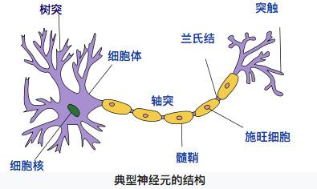

上图：生物体中，信息以电信号形式在神经元之间传播。一个神经元的轴末梢可以多次分支，形成被称为突触的结构，一个神经元通过其数量众多的突触可与数以百计的其它神经元相连，创造出极为复杂的神经网络结构。

下图：神经元被抽象为分层的计算节点（也常被称为神经元）。

每个神经元的输入数据被乘上权重 (weight)、加上偏置 (bias) 后进行计算，再经激活函数 (Activation function) 进行非线性变换后输出。

$$
\textrm{Output} = \textrm{Activation}(W·\vec X+\vec b)
$$

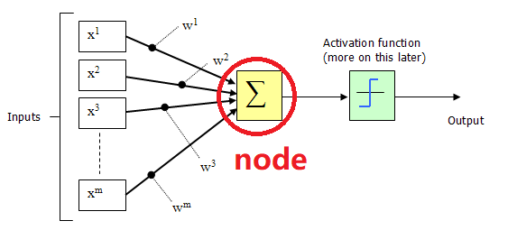

下图：神经元之间的连接被抽象为层与层之间（节点与节点之间）计算数据的传递，网络的层数被称为深度。输入输出层外的节点层被称为隐藏层。

理论上可以证明，即使是后一层神经元只与前一层神经元相连、后层与前层间没有反馈的简单结构下（前馈神经网络，Feedforward Neural Network），只要节点数量足够，一个两层的神经网络也可以拟合一切数学函数。

   

### 2. 卷积神经网络

通过仿照与抽象生物的视知觉 (visual perceptual) 结构，研究者们提出了卷积神经网络 (CNN, Convolutional Neural Network)，它是一种包含卷积运算的深度前馈神经网络。

其结构上的独特设计使得它在信息提取与优化计算性能上优势明显，被广泛应用于图像处理等领域。

### 3. AlexNet 与 ImageNet 图像识别挑战赛

ImageNet 是由 Stanford 华人教授李飞飞等人牵头搭建的具有海量分好层次类别的高清晰度、高质量标注的图像数据库。基于 ImageNet 的图像识别挑战赛自 2010 年开始举办，2017 年是最后一届。

下图：总结 2010-2016 年的 ImageNet 挑战赛成果：分类错误率从 0.28 降到了 0.03；物体识别的平均准确率从 0.23 上升到了 0.66。ImageNet 推动图形识别领域发展功不可没。 

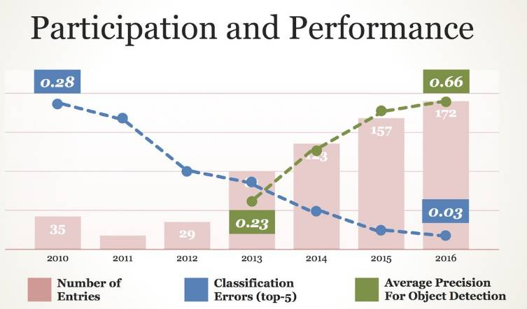

AlexNet 属于深层卷积神经网络， 2015年在 ImageNet 图像识别挑战赛中大放异彩，点燃了研究者们对于深度神经网络算法的热情，在人工智能的发展历程上具有里程碑意义。

区别于此前的神经网络架构，AlexNet 有如下特性：

|        算法        |           作用           |
| :----------------: | :----------------------: |
|  ReLU & 多个 GPU   |       提高训练速度       |
|      重叠池化      | 提高精度、不易发生过拟合 |
|     局部归一化     |         提高精度         |
| 数据扩充 & Dropout |        减少过拟合        |

+ ReLU 作为激活函数。

ReLU 为非饱和函数，论文中验证其效果在较深的网络超过了 Sigmoid，成功解决了 Sigmoid 在网络较深时的梯度弥散问题。

+ Dropout 避免模型过拟合。

在训练时使用 Dropout 随机忽略一部分神经元，以避免模型过拟合。在 AlexNet 的最后几个全连接层中使用了 Dropout。

+ 重叠的最大池化。

之前的 CNN 中普遍使用平均池化，而 Alexnet 全部使用最大池化，避免平均池化的模糊化效果。并且，池化的步长小于核尺寸，这样使得池化层的输出之间会有重叠和覆盖，提升了特征的丰富性。

+ 提出 LRN 层。

提出 LRN 层，对局部神经元的活动创建竞争机制，使得响应较大的值变得相对更大，并抑制其他反馈较小的神经元，增强了模型的泛化能力。

+ GPU 加速。

将卷积池化部分分成两组交给两个 GPU 完成，利用 GPU 计算能力增加计算速度。

+ 数据增强。

随机从 $256 \times 256$ 的原始图像中截取 $224 \times 224$ 大小的区域（以及水平翻转的镜像），相当于增强了 $(256-224) \times (256-224) \times 2 = 2048$ 倍的数据量。使用了数据增强后，减轻过拟合，提升泛化能力。避免因为原始数据量的大小使得参数众多的 CNN 陷入过拟合中。

AlexNet 被认为是计算机视觉领域发表的最具影响力的论文之一，它引发了更多的论文采用 CNN 和 GPU 加速深度学习。截至 2019 年，AlexNet 论文已被引用超过 40,000 次。下面将详细解释其原理。

## 二、原理

### 1. 训练一个神经网络

训练神经网络本质上是一个拟合最优化问题。 我们的目标是调整神经网络中的参数，使得网络模型根据输入数据得出的输出结果满足我们的预期要求。

为了衡量实际结果与理论预期的偏差，我们引入损失函数 (Cost/Loss function) 的概念。实际中损失函数可以根据数据特点采取均方误差、交叉熵等多种形式。

定义了损失函数之后，我们将神经网络的优化问题转化成了寻找损失函数的最小值点问题。

### 2. 卷积与池化

AlexNet 采用重叠卷积池化的方法，步长小于卷积核的尺寸。

两个卷积层移动步长是 4 个像素，分成两组在两个 GPU 上计算。

ReLU 后的像素层再经过池化运算，池化运算的尺寸为 $3 \times 3$。

池化后的像素层再进行归一化处理，归一化运算的尺寸为 $5 \times 5$，归一化后的像素规模不变，同样分成两组在两个 GPU 上计算。

#### 卷积

在高等数学中，我们学过，函数 $f(x),g(x)$ 的卷积运算为

$$
f(x)*g(x)= \int_{-\infty}^{\infty} f(x-t)g(t)dt
$$

其中 $g(x)$ 可以称为该卷积运算的卷积核 (kernel)。

由于图像在计算机内部以矩阵形式存储，下面我们考虑卷积运算的矩阵形式。以下图为例，直观表示矩阵卷积的过程：$k \times k$ 大小的卷积核矩阵与 $m \times n$ 大小的输入矩阵进行对应位相乘并求和，得到的结果作为新矩阵中的一个元素。


卷积运算的功能是对图像进行信息的提取。

我们可以看到，卷积核每次作用于输入图像上的一个局部区域（被称为感受野）进行运算，可以理解为将该局部位置的特征积累起来得到一个特征值。显然，不同大小、数值的卷积核，提取到的特征也是不同的。通过调整卷积核的大小、数值等参数，我们可以控制对图像特征提取的偏好，达到筛选特征进行分类的目标。

#### 池化

池化常是卷积的下一步，也是一种矩阵运算。其目的是通过只保留主要特征、忽略次要特征减少数据量，优化计算复杂度。

池化有重叠池化 (overlapping pooling)、最大值池化 (max pooling) 等方式。

以“最大值池化”方式为例，如下图，将一个 $4 \times 4$ 大小的中间结果矩阵，通过对每个子矩阵取元素最大值，压缩为一个 $2 \times 2$ 大小的矩阵进行后续运算。

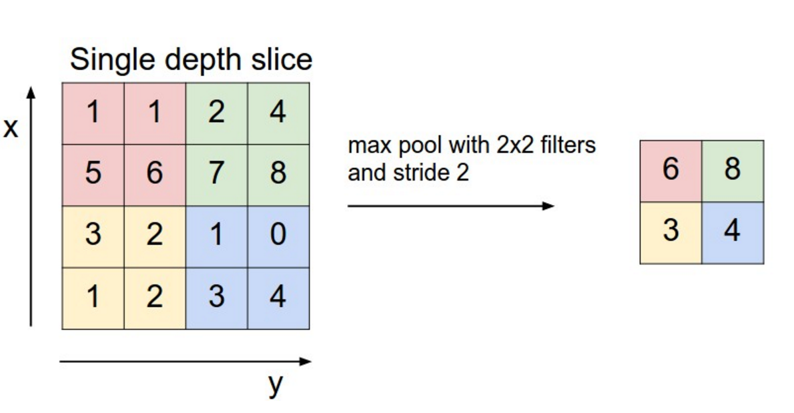

### 3. 全连接层

第一个全连接层 (FC, fully connected layer) 把前层得到的特征全部整合起来，如下图。


全连接层与全连接层之间神经元两两相互连接，形成一个密集的数据传输网络，参数量很大。如下图。

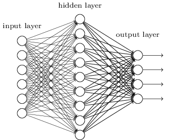

全连接层的存在可以排除特征所在空间位置对特征识别结果的干扰，提高模型的鲁棒性。(实际应用中，也有其他替代全连接层以减少参数量的方法)。

### 4. Softmax 归一化

Softmax 被用于接收来自全连接层的输入，产生最后的结果（以图像分类问题为例，最终的结果是各个可能类别的概率）。

公式如下：

$$
\textrm{Softmax}(x_i)=\frac {e^{x_i}} {\Sigma_{j=0}^n e^{x_j}} \in [0,1]
$$

Softmax 函数的值域是 $[0,1]$，很容易想到，这正是输出结果 $\textrm{label}=x_i$ 的概率 $P(x_i)$。

在我们小组的实现方案中，为了方便进行数据处理，我们将公式中的 $e$ 替换为 2。这样幂次可以直接通过移位实现。

$$
\textrm{Softmax}^{*}(x_i)=\frac {2^{x_i}} {\Sigma_{j=0}^n 2^{x_j}} \in [0,1]
$$

### 5. 前向传播

在两个全连接层，计算该层输出结果使用如下公式：

$$
L_{i+1} = W_iL_{i} + b_i
$$

对于 ReLU 和 Softmax 层，函数作用在矩阵上的方式为作用在矩阵的每个元素上。

### 6. 反向传播算法

反向传播算法基于简单的梯度下降法。

根据微积分知识我们易知函数梯度的逆方向是函数值下降最快的方向。因此，对需要调整的参数 $W$，若我们能够求出损失函数关于当前 $W$ 的偏导数值, 并人为设定基于该偏导数的梯度下降步长 $\eta$（称为学习率），可由下公式得到更新后的 $W$:

$$
W^{'}= W-\eta\times\frac {\partial f_{\textrm{Loss}}} {\partial W}
$$

梯度下降直观过程如下图。类似一步步走下山坡知道最低点（存在的问题是得到的目标点有可能是极小值点而非最小值点）。

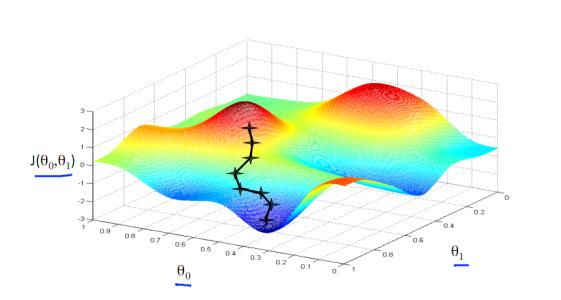

#### (1). 计算梯度

输入数据以及在 L1、L2 两层的权重和偏置，用矩阵表示如下:

$$
\begin{cases}
W(\textrm{weight})=\begin{pmatrix}
w_{11} & w_{12} & \cdots w_{1n}\\
w_{21} & w_{22} & \cdots w_{2n}\\
\vdots && \vdots\\
w_{m1} & w_{m2} & \cdots w_{mn}\\
\end{pmatrix}\\[5ex]

x(\textrm{input})=\begin{pmatrix}
x_1\\
x_2\\
\vdots\\
x_n
\end{pmatrix}
\
b(\textrm{bias})=\begin{pmatrix}
b_1\\
b_2\\
\vdots\\
b_m
\end{pmatrix}
\end{cases}
$$


输出层结果可以表示为：

$$
\begin{cases}
S(\textrm{softmax layer}) = \textrm{Softmax}(W_2 \cdot (\textrm{ReLU}(W_1 \cdot x + b_1) + b_2) \\[2ex]
\textrm{Loss} = -\ln(\frac{e^{S_i-t}}{\Sigma_{i=0}^{n}e^{S_i-t}}|i = \textrm{Label}), \ N=1 \\[2ex]
t=\max\{ {S_i}\}
\end{cases}
$$

计算每层输出对于输入的梯度：

$$
\begin{cases}
\nabla_S \textrm{Loss} = 
\begin{pmatrix}
\frac{\partial \textrm{Loss}}{\partial S0}\
\frac{\partial \textrm{Loss}}{\partial S1}
\end{pmatrix}
=
\begin{pmatrix}
-\frac{1}{S0}\
-\frac{1}{S1}
\end{pmatrix}
\\[2em]

\nabla_{L_2} S = 
\begin{pmatrix}
\frac{\partial S_0}{\partial L2_1}\
\frac{\partial S_0}{\partial L2_2} \\
\frac{\partial S_1}{\partial L2_1}\
\frac{\partial S_2}{\partial L2_2}
\end{pmatrix}
=
\begin{pmatrix}
\cdots
\end{pmatrix}
\\[2em]

\nabla_{\textrm{ReLU}} L2 = 
\begin{pmatrix}
\frac{\partial L2_1}{\partial \textrm{ReLU}_1}\
\frac{\partial L2_1}{\partial \textrm{ReLU}_2}\
\frac{\partial L2_1}{\partial \textrm{ReLU}_3}\\
\frac{\partial L2_2}{\partial \textrm{ReLU}_1}\
\frac{\partial L2_2}{\partial \textrm{ReLU}_2}\
\frac{\partial L2_2}{\partial \textrm{ReLU}_3}
\end{pmatrix} \\[2em]

\nabla_{L_{1}} \textrm{ReLU} =
\begin{pmatrix}
1 \ 1 \ 1
\end{pmatrix}
\\[2em]

\end{cases}
$$

由链式法则：

$$
\frac{\partial \textrm{Loss}}{\partial LP_{ij}} = \frac{\partial \textrm{Loss}}{\partial L_i} \cdots \frac{\partial L_j}{\partial LP_{ij}}
$$

这样可以得到偏差对于每层输入的梯度表达式。

#### (2). 更新参数

$$
LP_{ij}^{\textrm{new}} = LP_{ij} - \eta \cdot \frac{\partial \textrm{Loss}}{\partial LP_{ij}}
$$

其中 $\eta$ 为 学习率。

### 7. AlexNet 结构

#### (1). 总体结构

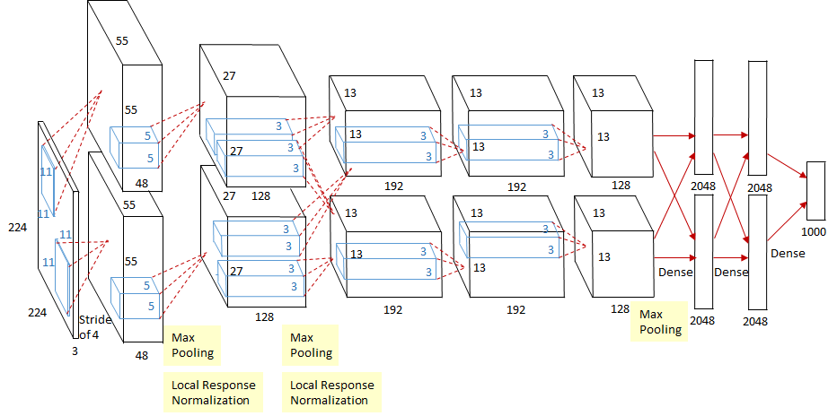

AlexNet 共有 8 层，前 5 层为卷积（含池化）层，后 3 层为全连接层。

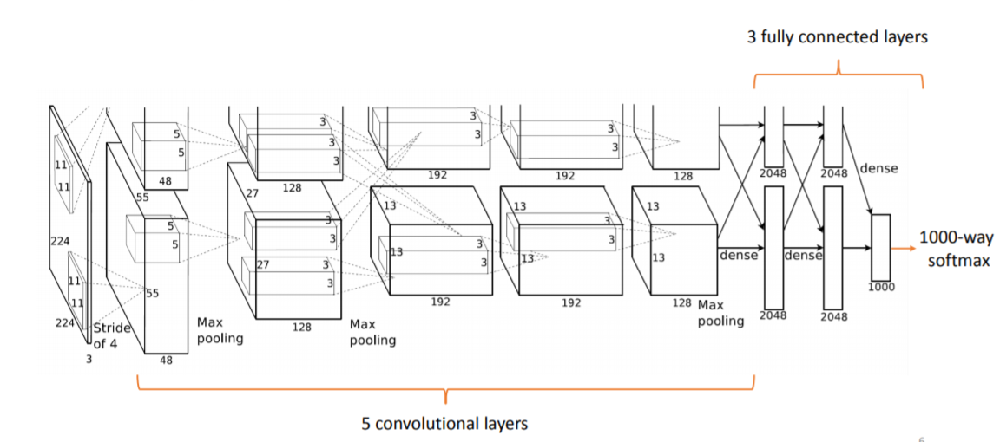

各层的参数数量如下图：

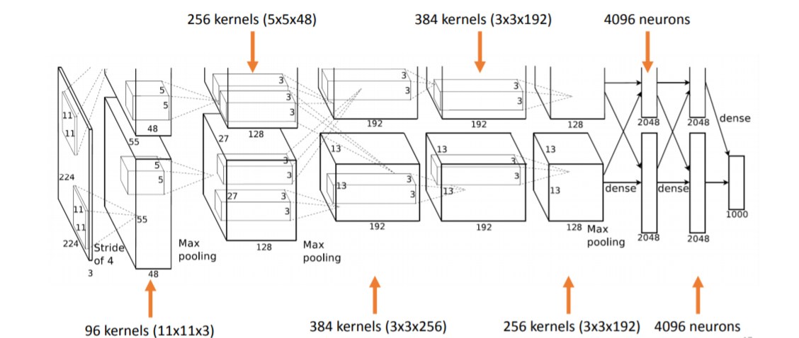

#### (2). 激活函数

AlexNet 使用 ReLU 作为神经元的激活函数。

$$
\textrm{ReLU}(x)=\max(x,0)
$$

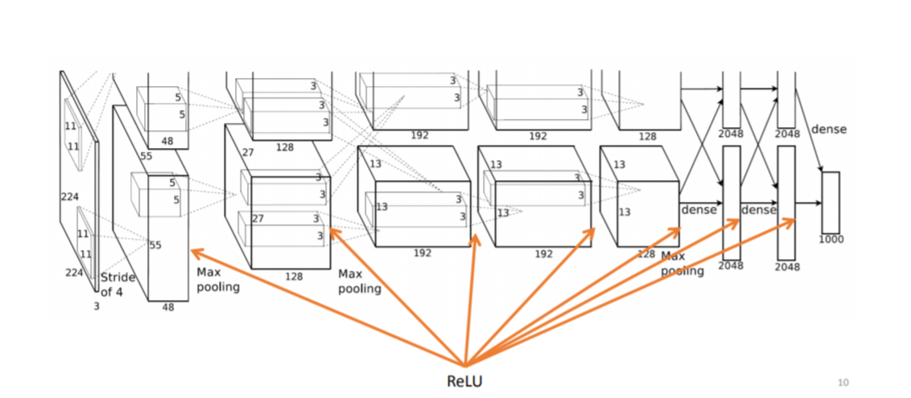

#### (3). Dropout 层

Dropout 是训练神经网络中常使用的防止过拟合的一种 trick（不得不提一下已被 Google 申请专利），原理是在每一次训练中随机选取一部分神经元不参与训练。（如下图）

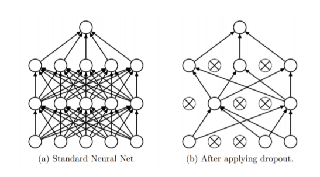

AlexNet 中 Dropout 用在两个全连接层中。

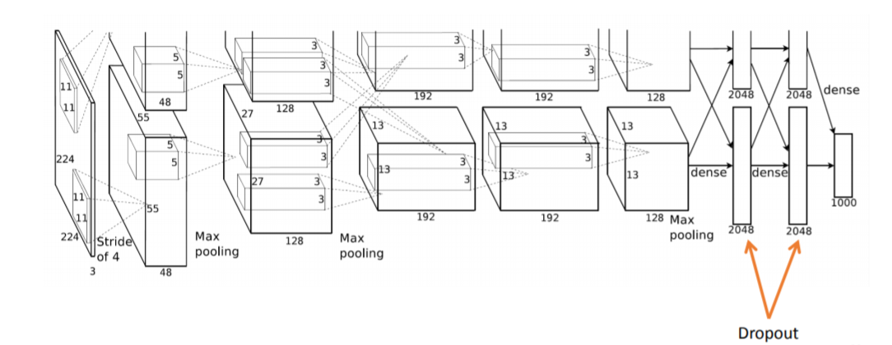

#### (4). 双 GPU 并行计算

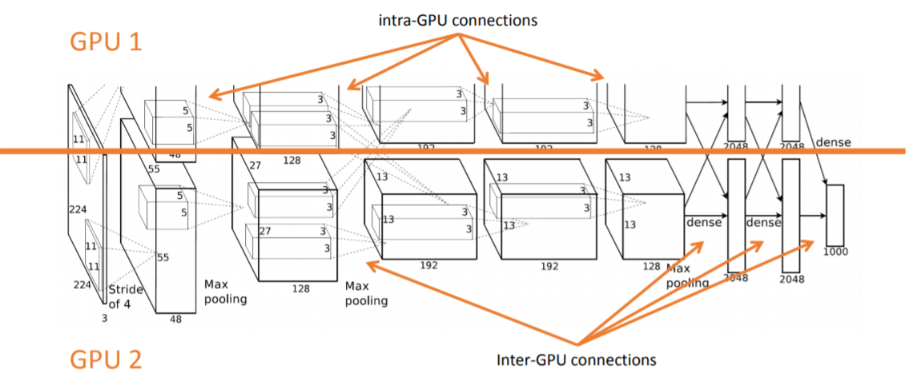

两路之间不进行通信，数据最后在 Softmax 层中进行汇总。

### 8. Agilio SmartNIC 在训练 AlexNet 上的优势

   1. 数据流架构与 NPU。
   2. 可编程的数据通路。

## 三、AlexNet 在 Agilio SmartNIC 的实现

### 1. 在 Agilio SmartNIC 上实现 AlexNet 的难点

   - 真正的 AlexNet 参数量巨大，约 650K 个神经元，60M 个参数，630M 次连接，复现极为复杂，更何况我们需要从头造轮子，时间上不允许。
   - AlexNet 训练过程中使用的 Dropout 实现起来很困难。
   - 涉及大量矩阵运算，尚未找到明确资料说明如何编程利用智能网卡对矩阵运算的支持单元。
   - 最大的问题是参数的训练：BP 算法涉及到对损失函数求偏导，这在网络比较小时，可以采用提前求好算式把其写在程序里的方式实现，但是网络大时这种方式不可行。
   - Agilio SmartNIC 上程序大小受到严格限制，存储能力有限，并且多核间通信以及保持数据一致性是一个很大的问题。
   - 需要相对准确的时序控制来保证多个核心之间的正常协作，需要考虑给多核分配不同的任务，并且在合适的时间进行计算与记录。

### 2. 实现思路

   > “怕什么真理无穷，进一寸有一寸的欢喜。”
   >
   > ——胡适

#### (1). 简化结构

我们的目标是实现一个基础的卷积神经网络，其结构如下：

输入 $\rightarrow$  卷积层1 $\xrightarrow{\textrm{ReLU}}$ 池化层1 $\rightarrow$ 全连接层1 $\xrightarrow{\textrm{Softmax}}$ 输出


   + 损失函数

     采用均方误差函数 (Mean Square Error)

     $$
     f_{\textrm{Loss}}=\frac {\sum_{i=1}^N(1-S_i|_{i=\textrm{label}})^2} N
     $$

     其中 N 是一组训练样本 (batch) 的大小。

   + Softmax

     如前所述，使用 2 代替公式中的 $e$

     $$
     \textrm{Softmax}^{*}(x_i)=\frac {2^{x_i}} {\Sigma_{j=0}^n 2^{x_j}} \in [0,1]
     $$

     则

     $$
     S_i=\frac {2^{ {W^3_{1i}}L_{21}+{W^3_{2i}}L_{22}+b_{3i}}} {\Sigma_{i=1}^2 {2^{ {W^3_{1i}}L_{21}+{W^3_{2i}}L_{22}+b_{3i}}}}
     $$

+ 训练方法

  由于网络结构简单，可以由 BP 算法直接写出各参数的更新公式。

  以全连接层 2 为例：

  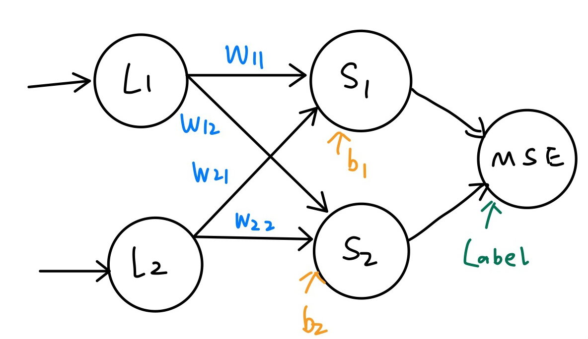

  $$
  \begin{align}
  \frac {\partial f_{\textrm{Loss}}} {\partial \vec W} & =[\frac {\partial f_{\textrm{Loss}}} {\partial W_{11}},\frac {\partial f_{\textrm{Loss}}} {\partial W_{12}},\frac {\partial f_{\textrm{Loss}}} {\partial W_{21}},\frac {\partial f_{\textrm{Loss}}} {\partial W_{22}}]\\
  & =\frac {\partial f_{\textrm{Loss}}} {\partial \vec S} \frac {\partial \vec S} {\partial \vec W}\\
  & =\frac 2 N \times[n_1\frac {d(1-S_1)} {dS_1},n_2\frac {d(1-S_2)} {dS_2}]\left[ 
  \begin{array}{c}
  {\frac {\partial S_1} {\partial W_{11}}}& {\frac {\partial S_1} {\partial W_{12}}} &
  {\frac {\partial S_1} {\partial W_{21}}} &
  {\frac {\partial S_1} {\partial W_{22}}}\\
  {\frac {\partial S_2} {\partial W_{11}}}& {\frac {\partial S_2} {\partial W_{12}}} &
  {\frac {\partial S_2} {\partial W_{21}}} &
  {\frac {\partial S_2} {\partial W_{22}}}
  \end{array}
  \right]\\

  \end{align}
  $$

  采用差分方式代替偏导。并将各参数放大 $2^{7}=128$ 倍以提高精度。

  $$
  \frac {\partial S_1} {\partial W_{11}}=\frac {S_1(W_{11})-S_1(W_{11}-\Delta W_{11})} {W_{11}-\Delta W_{11}}
  $$

  然后利用梯度下降公式更新参数：

  $$
  W^{'}= W-\eta\times\frac {\partial f_{\textrm{Loss}}} {\partial W}
  $$

#### (2). Hardware Offload

Agilio SmartNIC 上有很多相对独立的流处理核心，可以给每个核心分配不同的计算任务，使其充当上述神经网络中某一个节点或者计算对应的梯度，并且给两个隐藏层分配一定的存储空间来储存权重矩阵和偏置参数以及中间数据。此外还应有整体控制模块，用来发出信号，控制每个核心的工作顺序。

计算节点在接收到信号后开始从固定位置获取信息，并完成该节点的计算任务，然后在合适的时间存储，以供下一层节点使用。

整个迭代过程分为输入数据，前向传播，计算梯度，更新参数。其中后面三个阶段均会涉及到多个处理核心之间的通信，以及核与存储之间大量数据读写。

### 4. C 伪代码示例

```c
//输入：8x8(每个像素点0-255,__u8)(只有一层的灰度图)
//  __u8 image[8][8];
//卷积核，大小暂定5*5
//  __u8 filter[5][5]= random_initial(); //随机初始化

//卷积：
__u8 ** Convolution(__u8 *image[],__u8 *filter[]){
    //卷积核 大小5x5，步长1，这样卷积出来的结果是一个4x4的矩阵
    //卷积核中25个参数是要训练得到的
        __u8 conv_result[4][4]
    for(int i=0;i<16){ //卷积核移动 
        //矩阵乘法
        for(int j=0;j<5;j++){
            for(int k=0;k<5;k++){
                result[i/4][i%4]+=filter[j][k]*image[i/4+k][i%4+j];
            }
        }
    }
	return conv_result;
}
//ReLU 激活函数
__u8** ReLU(__u8 *x[],int n){
    __u8 result[n][n];
    for(int i=0;i<n;i++){
        for(int j=0;j<n;j++){
            result[i][j]=(x[i][j]>0)?x[i][j]:0;
        }
    }
    return result;
}

//池化：AlexNet中采用最大值池化
//卷积的结果是一个4x4的矩阵，池化后变成2x2的
__u8 ** Pooling(__u8 *conv_result[]){
    __u8 pool_result[2][2];
    for(int i=0;i<2;i++){
        for(int j=0;j<2;j++){
            pool_result[i][j]=max(
            conv_result[2*i][2*j],
            conv_result[2*i+1][2*j],
            conv_result[2*i][2*j+1],
            conv_result[2*i+1][2*j+1]);
        }
    }
    return pool_result;
}

//全连接层, 返回值是一维数组
__u8 *FullConnectLayer(__u8 *pool_result[],__u8 FCL_filter0* [], __u8 FCL_filter2* []，...，__u8 FCL_filter9* []，){
    //全连接层应该有10个神经元：对应数字识别
    __u8 neuron[10];
    for(i=0;i<10;i++){
	   Neuron[i]=**Convolution(pool_result,FCL_filter{i});
    }
    return neuron;
}

//Softmax层，输出0-9的识别概率
int *Softmax(__u8 neuron[]){
    int probability[10];
    int sum=0;
    for(int i=0;i<10;i++){
        sum+=exp(neuron[i]); //需要改成2
    }
    for(int i=0;i<10;i++){
        probability[i]=exp(neuron[i])/sum;
    }
    return probability;
}
//选出概率最大的作为预测结果
int Argmax(int x[],int n){
    int max=0,arg;
    for(int i=0;i<n;i++){
        if(x[i]>max){max=x[i];arg=i;}
    }
    return arg;
}

int main(){
    //一张图片
    __u8 image[8][8]; 

    /* input image */
    //偏置，是不需要训练（？）的参数,先设置为0.1
    __u8 Bias[4][4]={0.1,...}; 
    //学习率，超参数，人为设定，比如说0.4
    const __u8 eta=0.4;  
    //卷积核初始化，可以全赋值为1
    __u8 filter[5][5]= random_initial();
    __u8 FCL_filter1,...9[2][2]= random_initial();

    //若对数字识别：result=0,1,2,...,9
    //搭建神经网络：
    int result=Argmax(
        Softmax(
        FullConnectLayer(
        Pooling(ReLU(Convolution(image,filter)+Bias,4))
    	FCL_filter0,...,FCL_filter9)),10
        );

    /*训练：进行验证，误差反向传播，使用BP算法训练参数 */

    //误差可以采用均方误差（交叉熵要用log，算了）
    //每训练一组（batch），一组n张图，计算一次loss，然后用BP算法调参
    double loss=(sum((result-true_value)*(result-true_value))/n;

    //BP 算法，需事先把偏导式写出
    //这里要调整的参数有：卷积核5x5=25 + FCL卷积核 10x2x2=40 =65个参数
    wi-=eta*(A*wi+B*wj+C*wk+...);  

    printf("Pridiction is %d\n",result);
}
```

## 四、参考文献

1. [ImageNet Classification with Deep Convolutional Neural Networks](https://www.nvidia.cn/content/tesla/pdf/machine-learning/imagenet-classification-with-deep-convolutional-nn.pdf)
2. [实例详解神经网络的back propagation过程](https://software.intel.com/zh-cn/articles/step-by-step-explaination-on-neural-network-backward-propagation-process)

3. [多类别神经网络 (Multi-Class Neural Networks)：Softmax](https://developers.google.com/machine-learning/crash-course/multi-class-neural-networks/softmax)

4. [ImageNet](https://www.jiqizhixin.com/articles/2017-07-27-2)

5. AlexNet 结构：

   1. <http://cvml.ist.ac.at/courses/DLWT_W17/material/AlexNet.pdf>

   2. <http://vision.stanford.edu/teaching/cs231b_spring1415/slides/alexnet_tugce_kyunghee.pdf>

6. 全连接层：<https://zhuanlan.zhihu.com/p/33841176>

<!-- Mathjax Support -->
<script type="text/x-mathjax-config">
    MathJax.Hub.Config({
      tex2jax: {
        skipTags: ['script', 'noscript', 'style', 'textarea', 'pre'],
        inlineMath: [['$','$']]
      }
    });
  </script>
<script type="text/javascript" async
  src="https://cdn.mathjax.org/mathjax/latest/MathJax.js?config=TeX-MML-AM_CHTML">
</script>
