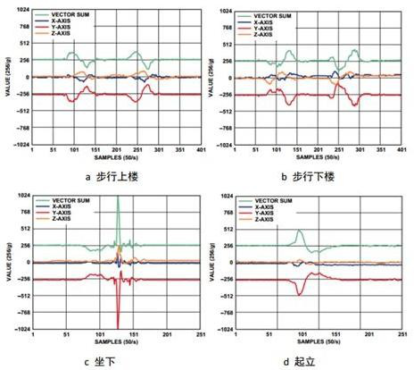
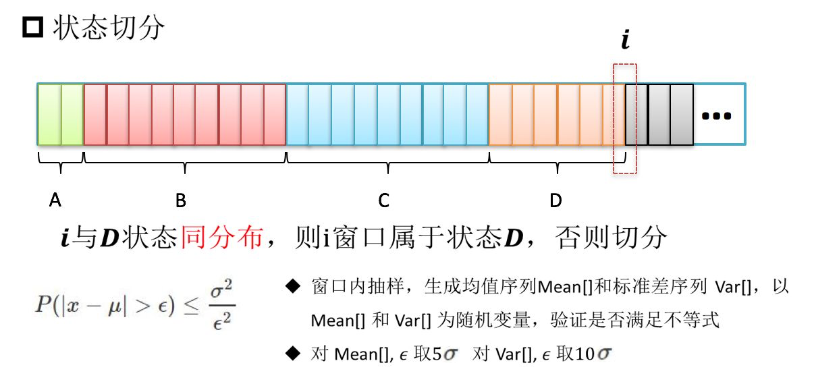

# 结题报告

**Monthly Subscription Group**

[TOC]

## 项目介绍

**我们的项目是：**对计算机在数据包处理上进行非冯化改造，绕过 CPU 与操作系统内核，在数据流架构的智能网卡上对数据包进行数据流驱动的实时处理。依据不同的处理需求，设计并实现不同的算法，并将程序硬件卸载到智能网卡上以完成数据处理。目标是纳秒级的延迟。

**我们涉及的数据处理需求包括：**基于方差分析（Analysis of Variance，ANOVA）算法的数据状态切分，和简化的 Alex net 深层卷积神经网络。对于前者，我们完整实现了数据准备与接收程序，方差分析算法的 eBPF 硬件卸载代码，以及基于 rdtsc 指令的延迟测试程序，并成功获得了正确结果。对于后者，我们完成了对算法本身的调研，以及容易编程的对算法的简化设计。

## 立项依据

基于冯诺依曼架构的现代计算机，由于程序计数器（Program Counter）带来的硬件根本概念的串行性，使得处理大批量数据流的能力十分有限。尽管现代计算机利用指令级并行、多核多线程编程等带来了大幅的性能提升，但在例如服务器等的海量 IO 和数据并发场景下，冯氏结构与并行性之间的矛盾愈加显著。与此同时，CPU 与主存之间的速度不一致进一步限制了海量数据并发下的处理效率。

为了应对处理大量高速数据流需求，基于数据流驱动架构的智能网卡（SmartNIC）应运而生。区别于传统的控制流计算机，数据流计算机在原理上不存在 PC 寄存器，只有当一条或一组指令所需的操作数全部准备好时，才能激发相应指令的一次执行，执行结果又流向等待这一数据的下一条或一组指令，以驱动该条或该组指令的执行。因此，程序中各条指令的执行顺序仅仅是由指令间的数据依赖关系决定的。另一方面，数据流计算模型中没有传统的变量这一概念，它仅处理数据值，忽略存放数据的容器，从而具有纯函数的特点。

智能网卡同时具备可编程特性。eBPF 是一个简便轻量的，适于简单网络数据处理的虚拟 CPU 体系结构。智能网卡支持在一定的限制与映射方式下，硬件卸载 eBPF 程序到各个智能网卡核心上执行，以获得显著低于 linux 内核和驱动层的延迟和比多核 CPU 更高的流处理速度。

Netronome 公司生产的 Agilio CX SmartNIC 同时直接支持 P4 和 micro C 高级语言编程，利用其专有的 SDK 编写、编译、调试、检测程序，并可以使用扩充命令充分利用网卡内的公共存储、矩阵运算单元等硬件结构，实现更为高级的大型算法。

## 基于方差分析算法的状态切分 eBPF 实现

本部分详细叙述第一个数据处理需求，也是本课题唯一必须完成的实现：基于方差分析算法的数据状态切分。算法实现包括紧密联系的外部数据处理部分与网卡内部的 eBPF 核心计算部分。

在本报告中，硬件环境信息将分布地以***斜体加粗***给出，关键思想、结论等将以**粗体**给出。

### 状态切分的应用背景

考虑对时间均匀采样的离散数据流：如每 10 ms 采集一次的人的加速度信息，每天收盘时各个股票的股价等。将时间作为离散自变量，数据的值（或值的组合）作为因变量，我们试图在不同的时间节点，划分出不同的极大数据区间，使得同一个数据区间内的数据代表同一个被采样者的行为特征。

如下图。比如，对一个被采样加速度数据的人，当它执行站起的动作时，放在他口袋里手机的三轴加速度曲线发生明显变化。当一个明显的曲线变化产生时，完美的状态切分算法应预测到这个变化，并在该时间节点做一个划分标记，标志该时间段前后的数据表示两个不同的行为。



状态切分算法是模式匹配机器学习的关键前期数据准备工作。做好了状态切分的数据可以发送到学习机器上，使机器学习出不同的状态所具有的数据特征（比如加速度的绝对大小，相对大小变化，增减性等），以及识别出该状态序列（或者说标记了状态的数据序列）对应哪个具体的人类动作——对上例来说，人是在站起还是坐下。这是后续的学习算法所识别出来的，而状态切分算法不关心数据对应的状态的 “含义” ，而只关心新数据是否意味着一个不同于前者的状态。

### 方差分析的基本思想

统计学上有理由认为：相同的状态所对应的各个数据应当具有相同的统计分布。当新的一段数据到来时，通过一定的算法，可以判断该段数据是否符合前一段数据的统计分布，进而决定是否切分状态。

方差分析算法基于数据时间滑动窗口的分析模式。数据窗口是一个固定时间跨度或固定数据个数的数据段。窗口滑动是指窗口相对时间向后滑动，窗口丢弃时间较旧的若干数据，替换为时间更新的数据，得到一个新的窗口。对于固定时间跨度的窗口，窗口每次滑动固定的时间；对固定数据个数的窗口，每次滑动固定的数据数目。两个相邻的窗口之间有重叠率，两者之间重叠固定百分比的时间跨度（或数据个数），而余下的是新的时间段（新的数据段）。窗口的（数据或时间）跨度，重叠率等是方差分析的关键参数，它决定了划分算法的最终精确程度，但不是算法的本质核心。

方差分析算法认为，两个被比较的窗口（可以是相邻窗口，有数据的重叠；也可以没有数据重叠，这也是算法 “参数” 设计的一部分），如果属于相同的状态，那么具有相同的数据统计分布。判断二者是否是统一分布的方法是使用切比雪夫不等式（以下直接简称为 “不等式” ）：

$$
P(|x-\mu|\geq\epsilon)\leq\frac{\sigma^2}{\epsilon^2}，
\mu是前一个窗口的数据均值，\sigma^2是方差，\epsilon是参数，x是后一窗口的数据
$$

其中参数是当两者分布相同时，理论上任取都会使不等式成立的，但我们的同一个窗口的数据是有限的，不能完全精准地描述其自身的分布，所以参数大小的选择也会影响划分的效果，但如何选择参数不是算法的核心。

前一个窗口将提供不等式中的均值和方差，而后一个窗口将提供若干随机变量的值 x，当满足括号内不等式的 x 的占比（或称频率，是概率 P 的近似）使得整个不等式不成立时，我们称应当切分状态，否则不切分状态，切分位置是前一个窗口的最后一个数据的后面。

切比雪夫不等式的放缩是十分宽松的，这从根本上影响我们划分的效果：我们不会对并不大的波动十分敏感。这有时是一些场景下本算法的优点，但在一些其他场合也会成为缺陷。

### 短抽样间隔、大数据窗口的方差分析算法设计及其 eBPF 实现的不可行性

考虑上面提到的人体加速度数据，典型的应用中，抽样间隔是 10 ms 左右，一个窗口大约取 5s，重叠率在 70% 到 80%。在易于编程而不违背算法根本的前提下，取窗口为固定数据个数 512 个的窗口，重叠率 75%，即每次替换 128 个数据。

下面在上述假定下，叙述算法思想，并在各个环节叙述 eBPF 硬件卸载架构对其的限制，以及可规避或不可规避并最终导致不可行的障碍。

#### 方差分析的窗口抽样算法

切比雪夫不等式是用 “随机变量 X ” 来做不等式判定的，不等式中的 x 应当是一个随机变量的值。这种抽样算法进一步考虑了这种数学限定，构造一个随机变量：对于窗口中的512个数据，每次随机无放回抽样 128 个，计算这 128 个数据的均值 mean 和方差 var，共做 64 次抽样。这样，这里的 mean 和 var 都可以看做随机变量，它们是不等式中的 x，而不等式中的均值和方差则是前一个窗口用同样方法得到的mean的均值和方差、var的均值和方差（64 次抽样，计算 64 次的均值和方差）。



只有含有大量数据窗口是能够多次随机抽样的，对于数据量较小的窗口，多次随机抽样后的数据不具有充分的独立性，而抽样次数过少又不利于得到优秀的不等式比较结果。

#### eBPF 硬件卸载架构的限制与抽样算法实现的不可行性

***我们使用的智能网卡型号为：Agilio CX SmartNIC 2x10Gbe。***

窗口抽样算法包括 512 个窗口数据的保存、窗口滑动 128 个数据时的更新两个必须的部分。这时涉及一个必须考虑到的问题，叫做如何规定一个数据包的格式：它含有多少个数据，含有哪些数据。

一个及其容易想到的，也颇为符合应用场景的方式是：每个时间节点的数据都用一个单独的数据包来发送。而这将带来硬件卸载架构下不可逾越的障碍，原因在于：
- Agilio CX 智能网卡的每个计算核的计算受 “数据包到来” 这一事件的触发，当数据包到来时，这个计算核内的指令开始从头执行，执行完之后，才能接受下一个数据包。对于 eBPF 硬件卸载，各个核之间的程序是完全相同却彼此独立执行的。网卡无法控制某一个数据包具体前往 60 个计算核的哪一个，所以一个计算核内必须保有完整的算法代码而非它的一部分。而窗口每次滑动 128 个数据，除非使用各个核共享的存储区域，我们无法统一保管窗口的数据。
- 为了使用共享存储区，写操作需要使用 eBPF 数据结构 Map 及其调用 map_update，而Netronome 官方证实该调用尚未在硬件卸载架构下实现。一个替代是使用原子操作，每次递增一个存储区的值，但数据的更新变化可以很大，光用递增操作过慢。同时，各个核之间的同步与互斥问题难以预料和解决。

为了规避它，必须更改数据包格式。**一个良好的，接下来也会使用的替代数据包格式是：**为使得每个计算核的计算彼此独立，一个单独的数据包应当含有一个计算核所需要的全部数据。对于本例而言，一个计算核执行一次完整的切分判定，那么每个数据包应当包含当前窗口的 512 个数据以及下次滑动所需要的 128 个数据，即同时包含待判定的两个窗口。这样，我们可以解决上述问题，不再需要公共存储区，因为包到达与到达之间、不同的计算核之间不必保存状态或传递信息，也不会有同步互斥困难。

这个思想是关键的，但依旧不足以解决所有困难。另一不可逾越的障碍在于抽样：无放回随机抽样一般要多次循环，而由于每次循环抽到的数据可能抽过，所以虽然只抽 128 个，但循环次数一般大于 128 且不固定。这又引出了 eBPF 架构本身的另一限制：
- verifier 检查 eBPF 程序的安全性，确保程序可以结束。由于停机问题是图灵不可计算的，所以 verifier 粗暴地阻止任何跳转指令向之前的指令跳转从而构成循环。固定次数的循环是可以用循环展开来规避这一限制的，但不固定次数的循环无法实现。

为避免它，最好的办法就是做有放回随机抽样，或者根本不抽样。无论前者还是后者，最终都会在指令个数限制上被彻底宣告死刑。

#### 指令数限制与非抽样算法实现的不可行性

如果干脆就不抽样，不等式中的 x 就是后一个窗口中的数据本身，均值和方差就是前一个窗口的数据本身的均值和方差，这样计算量显然会大大缩短，但是依旧会超过指令条数的限制：
- eBPF 架构本身规定指令字节码不得超过 4096 字节。大多 eBPF 指令是 64 位的，这意味着指令数不超过 512。进一步地，网卡的硬件卸载架构会将 64 位 eBPF指令转化为自身的 32 位指令（网卡指令字节码大小不超过 8192 字节），同时不支持尾跳转，这会进一步限制 eBPF 指令的条数。

这实际上是限制了我们能够处理的窗口大小，512个数据中每个数据要参加一次求均值和方差的运算，至少需要数条指令。接下来会叙述小窗口方差分析算法的实现，那时我们会看到，一个数据涉及的指令在 4 条以上，一个只有 16 个数据的包处理算法也要一百多条指令。

**总之，从根本上，由于指令数的限制，大数据窗口的方差分析无法通过 eBPF 硬件卸载编程实现。**

### 长抽样间隔、小数据窗口的方差分析算法

另一种状态切分的应用场景是像股票价格这种抽样间隔较长（一天一次），且数据窗口不宜取得太大（一般取七八个数据为一个窗口，这就对应了一周的股价数据）否则不具备实时即刻的应用意义。接下来本小组使用的数据也是每日一更新的股价数据。

接下来本报告将叙述其各个环节，包括数据包格式与算法定义、参数取值，数据包发送与接收程序，eBPF 核心算法程序，延迟测试程序等的设计，并通过最终设计的成功来得到可行性。

#### 窗口、算法与数据包格式的规定

在不违反算法本质核心的前提下，取窗口为固定数据个数为 8 个，每两个完全相邻的窗口重叠 7 个数据（即只更新一天的最新股价）。

现在的窗口数据较少，再从极少数据里继续做随机抽样已不具备更大的应用意义。遂不进行抽样。代入不等式的均值和方差就是前一个窗口八个数据的均值和方差，不等式的 x 就是后一个窗口的 8 个数据，概率 P 就是频率为八分之几。尚欠参数待确定，取为 0.1，这是调参获得的，不是本小组算法的设计核心，而且在这个参数下我们也得到了不错的划分结果。

经过上面的论述，数据包的格式必须要囊括一次划分判定所需的两个窗口的全部数据。取两个相邻的窗口做划分判定是不恰当的，因为数据重叠率高达 87.5%，只有一个数据不同，这样高的重叠率很难在必然应该划分状态的位置做出有效判断（实际测试时也是如此，在直接用 C 编程并划分之后，没有任何一个位置被划分了状态）。本小组在经过尝试后，最终选择这样的两个窗口：取相邻的 16 个数据，前 8 个数据是一个窗口，后 8 个数据为后一个窗口，这两个窗口将判定是否在这 16 个数据的中间划分状态。

那么最终，对于一个拥有 N 个时间节点数据的数据集（对本实例为 N 天的股价），共有 N-7 个数据窗口，第 i 个窗口将与第 i+8 个窗口做划分判定，以决定是否在二者的中间划分状态。

同时，这里考虑到服务器上其它数据包的干扰，我们也规定了一些其它的额外标记，使得最终的数据包格式为：
- 前 64 位，为一个 magic number，它标识了我们所要处理的数据包。
- 再 64 位，为一个无符号数值 tag，eBPF 程序将只处理 tag 为 0 的包。该区域也会用来向网卡外返回处理结果：当tag被更改为 1，代表要对这两个窗口中间进行划分；tag 为 2，代表没有划分。此外，tag 可以在将来做更多的程序上的扩展，使有不同 tag 的数据包运行不同的代码。
- 之后紧接着是 16 个窗口数据。

仍有一个关键问题，来自 eBPF 体系结构：

- eBPF 没有浮点运算指令，而大多数科学计算或实际数据多是浮点数。这意味着原始的浮点数据必须经过处理，转化为整数格式后才能参与运算。

如何将浮点数转化为整数见仁见智。理论上，拿一个 64 位无符号整数来存放一个 double 的各个数据位，用大量位运算来模拟浮点数的加减乘除并非不可行，但太过复杂，极有可能使指令数爆炸增长。所以，本小组提取了所用数据的 “特性”，来用另一种方式转化：

- 所用的股价数据（乃至由老师提供的全部数据），都是正数，至多有三位小数，最大值不超过65535。在这样的条件下，我们可以将原始数据转化为一个 32 位无符号整数：这个数的高六位无用，它的最低一位（2 的 0 次位）对应原始数据的 2 的 -10 次位——三位小数，它的第 26 位（2 的 25 次位）对应原始数据的 2 的 15 次位。这样的精度足够精准地表示原有浮点数，并且可以相当直接地将浮点运算变为对应的整数运算。

根据 IEEE 规定的 double 格式标准，这个转化的代码如下：

```c
static __always_inline __u32 double_to_u32(__u64 data){
    __u32 exponent;
    __u64 x;
    if (data==(__u64)0) x=(__u64)0;
    else{
        exponent=(__u32)(data >> 52)-(__u32)1023;
    	x=data&(__u64)0x000FFFFFFFFFFFFF|(__u64)0x0010000000000000;
    	if ((__u32)42-exponent>(__u32)0) x>>=(__u32)42-exponent;
    	else x<<=exponent-(__u32)42;
    }
    return (__u32)x;
}
```

代码原文请[参见仓库](https://github.com/OSH-2019/x-monthly-subscription/blob/master/code/censyu/double2u64.c)。

当然了，这种表示有其相当的局限性和不可移植性。但针对特定应用、特定场景做特定优化，本就是本小组设计程序、降低延迟的必经途径。

如何表示浮点数已经确定，但谁来做这个转化？有两个选择：准备数据包的外部程序（运行在服务器 CPU 上的程序，以下不再解释）把原始浮点数直接打进数据包，由网卡内的 eBPF 程序来做这个转化；另一种是打包数据的外部程序把转化好的整数值打包进去，网卡内的 eBPF 程序直接去操作整数值。