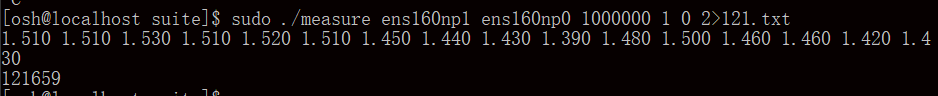
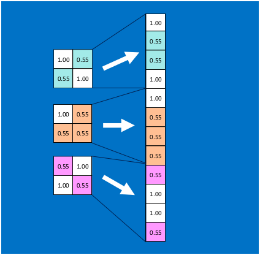

# 结题报告
{:.no_toc}

建议在此链接阅读：<https://osh-2019.github.io/x-monthly-subscription/docs/conclusion>

**Monthly Subscription Group**

* TOC 
{:toc}

# 项目介绍

**我们的项目是：**对计算机在数据处理上进行非冯化改造，绕过 CPU 与操作系统内核，在数据流架构的智能网卡上进行数据流驱动的实时处理。依据不同的处理需求，设计并实现不同的算法，将程序硬件卸载到智能网卡上以完成数据处理。目标是纳秒级的延迟。

**我们涉及的数据处理需求包括：**基于方差分析 (Analysis of Variance, ANOVA) 算法的数据状态切分，和简化的 AlexNet 深层卷积神经网络。对于前者，我们完整实现了数据准备与接收程序，方差分析算法的 eBPF 硬件卸载代码，以及基于 `rdtscp` 指令的延迟测试，成功获得了正确划分结果并对延迟级别给出了估计。对于后者，我们完成了对算法本身的调研，以及容易编程的对算法的简化设计，同时尝试给每个步骤对应其所用的网卡硬件结构。

# 立项依据

基于冯诺依曼架构的现代计算机，由于程序计数器 (Program Counter) 带来的硬件根本概念的串行性，处理大批量数据流的能力十分有限。尽管现代计算机利用指令级并行、多核多线程编程等带来了大幅的性能提升，但在例如服务器等的海量 IO 和数据并发场景下，冯氏结构与并行性之间的矛盾愈加显著。与此同时，CPU 与主存之间的速度不一致进一步限制了海量数据并发下的处理效率。

为了应对处理大量高速数据流需求，基于数据流驱动架构的智能网卡 (SmartNIC) 应运而生。区别于传统的控制流计算机，数据流计算机在原理上不存在 PC 寄存器，只有当一条或一组指令所需的操作数全部准备好时，才能激发相应指令的一次执行，执行结果又流向等待这一数据的下一条或一组指令，以驱动该条或该组指令的执行。因此，程序中各条指令的执行顺序仅仅是由指令间的数据依赖关系决定的。另一方面，数据流计算模型中没有传统的变量这一概念，它仅处理数据值，忽略存放数据的容器，从而具有纯函数的特点。

智能网卡同时具备可编程特性。eBPF 是一个简便轻量的，适于简单网络数据处理的虚拟 CPU 体系结构。智能网卡支持在一定的限制与映射方式下，硬件卸载 eBPF 程序到各个智能网卡核心上执行，以获得显著低于 Linux 内核和驱动层的延迟和比多核 CPU 更高的流处理速度。

Netronome 公司生产的 Agilio CX 智能网卡同时能直接支持 P4 和 Micro-C 高级语言编程，利用其专有的 SDK 编写、编译、调试、检测程序，并可以使用扩充命令充分利用网卡内的公共存储、矩阵运算单元等硬件结构，实现更为高级的大型算法。

# 基于方差分析算法的状态切分 eBPF 实现

本部分详细叙述第一个数据处理需求，也是本课题唯一必须完成的实现：基于方差分析算法的数据状态切分。算法实现包括紧密联系的外部数据处理部分与网卡内部的 eBPF 核心计算部分。

在本报告中，硬件环境信息将分布地以 ***斜体加粗*** 给出，关键思想、结论等将以 **粗体** 给出。

## 状态切分的应用背景

考虑对时间均匀采样的离散数据流：比如每 10 ms 采集一次人的加速度信息，每天收盘时各个股票的股价等。将时间作为离散自变量，数据的值（或值的向量）作为因变量，我们试图在不同的时间节点，划分出不同的极大数据区间，使得同一个数据区间内的数据代表同一个被采样者的行为特征。

如下图。比如，对一个被采样加速度数据的人，当它做站起的动作时，放在他口袋里手机的三轴加速度曲线发生明显变化。当一个明显的曲线变化开始时，完美的状态切分算法应预测到这个变化，并在该时间节点做一个划分标记，表明该时间段前后的数据表示两个不同的行为。


对原始数据的状态切分是模式匹配机器学习的关键准备工作。做好了状态切分的数据可以发送到学习机器上，使机器学习出不同的状态所具有的数据特征（比如加速度的绝对大小，相对大小变化，增减性等），以及识别出该状态序列（或者说标记了状态的数据序列）对应哪个具体的人类动作——对上例来说，人是在站起还是坐下。这是后续的学习算法所识别出来的，而状态切分算法不关心数据对应的状态的“含义”，而只关心新数据是否意味着一个不同于前者的状态。

## 方差分析的基本思想

统计学上有理由认为：相同的状态所对应的各个数据应当具有相同的统计分布。当新的一段数据到来时，通过一定的算法，可以判断该段数据是否符合前一段数据的统计分布，进而决定是否切分状态。

方差分析算法是基于“时间滑动窗口”的数据分析模式。数据窗口是一个固定时间跨度或固定数据个数的连续时间内的数据段。窗口滑动是指窗口相对时间向后滑动，窗口丢弃时间较旧的若干数据，替换为时间更新的数据，得到一个新的窗口。对于固定时间跨度的窗口，窗口每次滑动固定的时间；对固定数据个数的窗口，每次滑动固定的数据数目。两个相邻的窗口之间有重叠率，两者之间重叠固定百分比的时间跨度（或数据个数），而余下的是新的时间段（新的数据段）。窗口的（数据或时间）跨度，重叠率等是方差分析的关键参数，它决定了划分算法的最终精确程度，但不是算法的核心。

方差分析算法认为，两个被比较的窗口（可以是相邻窗口，有数据的重叠；也可以没有数据重叠，这也是算法“参数”设计的一部分），如果属于相同的状态，那么具有相同的数据统计分布。判断二者是否是同一分布的方法是切比雪夫不等式（以下直接简称为“不等式” ）：

$$
P(|x-\mu|\geq\epsilon)\leq\frac{\sigma^2}{\epsilon^2}
$$

$\mu$ 是前一个窗口的数据均值，$\sigma^2$ 是方差，$\epsilon$ 是参数，$x$ 是后一窗口的数据。

其中参数是当两者分布相同时，理论上任取都会使不等式成立的，但我们的同一个窗口的数据是有限的，不能完全精准地描述其自身的分布，所以参数大小的选择也会影响划分的效果，但如何选择参数不是算法的核心。

前一个窗口将提供不等式中的均值和方差，而后一个窗口将提供若干随机变量的值 $x$，当满足括号内不等式的 $x$ 的占比（或称频率，是概率 $P$ 的近似）使得整个不等式不成立时，我们称应当切分状态，否则不切分状态，切分位置取决于两个窗口的相对位置。

切比雪夫不等式的放缩是十分宽松的，这从根本上影响我们划分的效果：我们不会对并不大的波动十分敏感。这有时是一些场景下本算法的优点，但在一些其他场合也会成为缺陷。

## 短抽样间隔、大数据窗口的方差分析算法设计及其 eBPF 实现的不可行性

考虑上面提到的人体加速度数据，典型的应用中，抽样间隔是 10 ms 左右，一个窗口大约取 5 s，重叠率在 70% 到 80%。在易于编程而不违背算法根本的前提下，取窗口为固定数据个数 512 个的窗口，重叠率 75%，即每次替换 128 个数据。

下面在上述假定下，叙述算法思想，并在各个环节叙述 eBPF 硬件卸载架构对其的限制，以及可规避或不可规避并最终导致不可行的障碍。

*本节所述中使用的数据由杜文文学长提供。*

### 方差分析的窗口抽样算法

切比雪夫不等式是用“随机变量 $X$”来做不等式判定的，不等式中的 $x$ 应当是一个随机变量的值。这种抽样算法进一步考虑了这种数学限定，构造一个随机变量：对于窗口中的 512 个数据，每次随机无放回抽样 128 个，计算这 128 个数据的均值 mean 和方差 var，共做 64 次抽样。这样，这里的 64 个 mean 和 var 都可以看做随机变量的值，它们是不等式中的 $x$，而不等式中的均值和方差则是前一个窗口用同样方法得到的 mean 的均值和方差、var 的均值和方差（64 次抽样，计算 64 次的均值和方差）。


只有含有大量数据窗口是能够多次随机抽样的，对于数据量较小的窗口，多次随机抽样后的数据不具有充分的独立性，而抽样次数过少又不利于得到优秀的不等式比较结果。

### eBPF 硬件卸载架构的限制与抽样算法实现的不可行性

***我们使用的智能网卡型号为：Agilio CX SmartNIC 2x10Gbe。***

窗口抽样算法包括 512 个窗口数据的保存、窗口滑动 128 个数据时的更新两个必须的过程。这时涉及一个必须考虑到的问题，叫做如何规定一个数据包的格式：它含有多少个数据，含有哪些数据。

一个及其容易想到的，也颇为符合应用场景的方式是：每个时间节点的数据都用一个单独的数据包来发送。而这将带来硬件卸载架构下不可逾越的障碍，原因在于：
- Agilio CX 智能网卡的每个计算核的计算受“数据包到来”这一事件的触发，当数据包到来时，这个计算核内的指令开始从头执行，执行完之后，才能接受下一个数据包。对于 eBPF 硬件卸载，各个核之间的程序是完全相同却彼此独立执行的。网卡无法控制某一个数据包具体前往 60 个计算核的哪一个，所以一个计算核内必须保有完整的算法代码而非它的一部分。而窗口每次滑动 128 个数据，除非使用各个核共享的存储区域，我们无法统一保管窗口的数据。
- 为了使用共享存储区，需要使用 eBPF 数据结构 Map 及其调用 `map_update` 以进行写操作，而 Netronome 官方证实该调用尚未在硬件卸载架构下实现。一个替代是使用原子操作，每次递增一个存储区的值，但数据的更新变化可以很大，光用递增操作过慢。同时，各个核之间的同步与互斥问题难以预料和解决。

为了规避它，必须更改数据包格式。**一个良好的，接下来也会使用的替代数据包格式是：**各个计算核执行完全相同的完整算法程序，而为了使每个计算核的计算彼此独立，一个单独的数据包应当含有一个计算核所需要的全部数据。对于本例而言，一个计算核执行一次完整的切分判定，那么每个数据包应当包含当前窗口的 512 个数据以及下次滑动所需要的 128 个数据，即同时包含待判定的两个窗口。这样，我们可以解决上述问题，不再需要公共存储区，因为包到达与到达之间、不同的计算核之间不必保存状态或传递信息，也不会有同步互斥困难。

这个思想是关键的，但依旧不足以解决所有问题。另一不可逾越的障碍在于抽样：无放回随机抽样一般要进行多次循环，而由于每次循环抽到的数据可能抽过，所以虽然只抽 128 个，但循环次数一般大于 128 且并不固定。这又引出了 eBPF 架构本身的另一限制：
- verifier 检查 eBPF 程序的安全性，确保程序可以结束。由于停机问题是图灵不可计算的，所以 verifier 粗暴地阻止任何跳转指令向之前跳转从而构成循环。固定次数的或有次数上限的循环是可以用循环展开来规避这一限制的，但不固定次数的循环无法实现。

为避免它，最好的办法就是做有放回随机抽样，或者根本不抽样。无论前者还是后者，最终都会在指令个数限制上被彻底宣告死刑。

### 指令数限制与非抽样算法实现的不可行性

如果干脆就不抽样，不等式中的 $x$ 就是后一个窗口中的数据本身，均值和方差就是前一个窗口的数据本身的均值和方差，这样计算量显然会大大缩短，但是依旧会超过指令条数的限制：
- eBPF 架构本身规定指令字节码不得超过 4096 字节。大多 eBPF 指令是 64 位的，这意味着指令数不超过 512。进一步地，网卡的硬件卸载架构会将 64 位 eBPF 指令转化为自身的 32 位指令（网卡指令字节码大小不超过 8192 字节），同时不支持尾跳转，这会进一步限制 eBPF 指令的条数。

这实际上限制了我们能够处理的窗口大小，512 个数据中每个数据要参加一次求均值和方差的运算，至少需要数条指令。接下来会叙述小窗口方差分析算法的实现，那时我们会看到，一个数据涉及的指令在 4 条以上，一个只有 16 个数据的包处理算法也要一百多条指令。

**总之，从根本上，由于指令数的限制，大数据窗口的方差分析无法通过 eBPF 硬件卸载编程实现。**

## 长抽样间隔、小数据窗口的方差分析算法

另一种状态切分的应用场景是像股票价格这种抽样间隔较长（一天一次），且数据窗口不宜取得太大（一般取七八个数据为一个窗口，这就对应了一周的股价数据），否则不具备实时即刻的应用意义。本小组使用的数据也是每日一更新的股价数据。

接下来本报告将叙述其各个环节，包括数据包格式与算法定义、参数取值，数据包发送与接收程序，eBPF 核心算法程序，延迟测试程序等的设计，并通过最终设计的成功来得到可行性。

*本节所述中使用的数据由邢凯老师提供。*

### 窗口、算法与数据包格式的规定

在不违反算法本质核心的前提下，取窗口为固定数据个数为 8 个，每两个完全相邻的窗口重叠 7 个数据（即只更新一天的最新股价）。

现在的窗口数据较少，再从极少数据里继续做随机抽样已不具备更大的应用意义。遂不进行抽样。代入不等式的均值和方差就是前一个窗口八个数据的均值和方差，不等式的 $x$ 就是后一个窗口的 8 个数据，概率 $P$ 就是频率为八分之几。尚欠参数待确定，取为 0.1，这是调参获得的，不是本小组算法的设计核心，而且在这个参数下我们也得到了不错的划分结果。

经过上面的论述，数据包的格式必须要囊括一次划分判定所需的两个窗口的全部数据。取两个相邻的窗口做划分判定是不恰当的，因为数据重叠率高达 87.5%，只有一个数据不同，这样高的重叠率很难在应该划分状态的位置做出有效判断（实际测试时也是如此，在直接用 C 编程并尝试划分之后，没有任何一个位置被划分了状态）。**本小组经过尝试，最终选择这样的两个窗口：取相邻的 16 个数据，前 8 个数据是一个窗口，后 8 个数据为后一个窗口，这两个窗口将判定是否在这 16 个数据的中间划分状态。**

那么最终，对于一个拥有 $N$ 个时间节点数据的数据集（对本实例为 $N$ 天的股价），共有 $N-7$ 个数据窗口，第 $i$ 个窗口将与第 $i+8$ 个窗口做划分判定，以决定是否在二者的中间划分状态。

同时，这里考虑到服务器上其它数据包的干扰，我们也规定了一些其它的额外标记，使得最终的数据包格式为：
- 前 64 位，为一个 magic number，它标识了我们所要处理的数据包。
- 再 64 位，为一个无符号数值 `tag`，eBPF 程序将只处理 `tag` 为 0 的包。该区域也会用来向网卡外返回处理结果：当 `tag` 被更改为 1，代表要对这两个窗口中间进行划分；`tag` 为 2，代表没有划分。此外，`tag` 可以在将来做更多的程序上的扩展，使有不同 `tag` 的数据包运行不同的代码段。
- 之后紧接着是 16 个窗口数据。

仍有一个关键问题，来自 eBPF 体系结构：

- eBPF 没有浮点运算指令，而大多数科学计算或实际数据多是浮点数。这意味着原始的浮点数据必须经过处理，转化为整数格式后才能参与运算。

如何将浮点数转化为整数见仁见智。理论上，拿一个 64 位无符号整数来存放一个 `double` 的各个二进制位，用大量位运算来模拟浮点数的加减乘除并非不可行，但太过复杂，极有可能使指令数爆炸增长。所以，本小组利用了所用数据的 “特性”，来用另一种方式转化：

- 所用的股价数据（乃至由老师提供的全部数据），都是正数，至多有三位小数，最大值不超过 65535。在这样的条件下，我们可以将原始数据转化为一个 32 位无符号整数：它的最低一位（2 的 0 次位）对应原始数据的 2 的 -10 次位——三位小数，它的第 26 位（2 的 25 次位）对应原始数据的 2 的 15 次位。这样足够表示原有的浮点数，并且可以相当直接地将浮点运算变为对应的整数运算。

**但实际上这样是不行的。原因不在于方法，而在于精度。**整数化后的最低一位对应原浮点数据的 2 的 -10 次方位是否够用，要不要再往后扩充几位？转化表示必然产生精度损失，而测试这种损失是否严重的最直接方法是：用原始 `double` 数据，与做了整数转化后的数据，分别计算一下状态划分结果。其代码比较简单，参见 [测试程序](https://github.com/OSH-2019/x-monthly-subscription/blob/master/code/thelitfire/ANOVA-example/ANOVA.c) 。对于测试程序同目录下的 [数据](https://github.com/OSH-2019/x-monthly-subscription/blob/master/code/thelitfire/ANOVA-example/data_000001SZ.txt) ，以纯浮点数的计算划分结果为基准，各种整数化方式得到的划分结果与前者相同的比例如下（\* 2048 整数化意味着整数的 2 的 0 次位对应原始数据的 2 的 -11 次位，其余类似）：

| 纯浮点数 | \* 1024 整数化 | \* 2048 整数化 | \* 4096 整数化 | \* 8192 整数化 | \* 16384 整数化 | \* 32768 整数化 |
| -------- | -------------- | -------------- | -------------- | -------------- | --------------- | --------------- |
| 100%     | 86.755%        | 91.201%        | 95.739%        | 97.592%        | 98.950%         | 99.444%         |

**本小组最终选择的是 \* 16384 整数化，这是二进制位数限定下所能达到的最高精度。**至于“二进制位数限定”是基于这样的考虑：

- 如果使用 \* 16384 整数化，意味着整数的 2 的 0 次位对应浮点数的 2 的 -14 次位，欲表示不超过 65535 的浮点数，需要二进制位数为 14 + 16 = 30 位。当我们进行求数据的方差运算时，需要求 $E(X^2)$，那么就会有 8 个 30 \* 2 = 60 位的二进制数相加，其和最高可达 63 位。如果使用 \* 32768 整数化，那么上述求和可达 65 位，这超过了本小组使用网卡的常用数表示范围（64 位无符号数），必须手动编写高精度运算。在精度（上表中的百分比）没有很大提升的情况下，额外编写高精度导致复杂的汇编代码工程是不值得的。

根据 IEEE 规定的 `double` 格式标准，这个 \* 16384 转化的代码如下：

```c
static __always_inline __u32 double_to_u32(__u64 data) {
    __u32 exponent;
    __u64 x;
    if (data == (__u64)0) x = (__u64)0;
    else {
        exponent = (__u32)(data >> 52) - (__u32)1023;
    	x = data & (__u64)0x000FFFFFFFFFFFFF | (__u64)0x0010000000000000;
    	if ((__u32)38-exponent > (__u32)0) x >>= (__u32)38 - exponent;
    	else x <<= exponent-(__u32)38;
    }
    return (__u32)x;
}
```

代码原文请 [参见仓库](https://github.com/OSH-2019/x-monthly-subscription/blob/master/code/censyu/double2u64.c)。

当然了，这种表示有其相当的局限性和不可移植性。但针对特定应用、特定场景做特定优化，本就是本小组设计程序、降低延迟的必经途径。

转化浮点数的方法已经可以确定，但谁来做这个转化？有两个选择：准备数据包的外部程序（运行在服务器 CPU 上，为网卡将原始数据打包的程序）把原始浮点数直接打进数据包，由网卡内的 eBPF 程序来做这个转化；另一种是打包数据的外部程序把转化好的整数值打包进去，网卡内的 eBPF 程序直接去操作整数。两种做法都有其理由：前者可以使所有“计算”都包括在 eBPF 程序内，外部程序只做一些 eBPF 不可能做的事情（整合数据包和接收数据包并整理运算结果），更贴切本课题使用 eBPF 实现完整算法的主题；而后者认为转化数据自有格式也可以看作整合数据包的一部分过程，不是算法的核心运算，从 eBPF 中将其剔除情有可原。

本小组对两个方式都有所实现。前者的代码请参阅 [手写汇编 version 2](https://github.com/OSH-2019/x-monthly-subscription/blob/master/code/thelitfire/ANOVA_offload_handwrite_v2.s) 和 [C 程序描述](https://github.com/OSH-2019/x-monthly-subscription/blob/master/code/thelitfire/ANOVA_offload_v2.c)，后者的请参阅 [手写汇编 version 1](https://github.com/OSH-2019/x-monthly-subscription/blob/master/code/thelitfire/ANOVA_offload_handwrite_v1.s) 和 [C 程序描述](https://github.com/OSH-2019/x-monthly-subscription/blob/master/code/thelitfire/ANOVA_offload_v1.c) 。二者的本质是一样的，只是 version 2 相较 version 1 多了三百多行汇编指令，都是浮点数转整数的过程。

### eBPF 算法实现

接下来以 version 1 （在外部程序完成整数化的版本）为主体叙述算法的 eBPF 实现过程。讲述直接使用 `clang` 等编译器获得汇编码、机器编译汇编如何不能被 verifier 通过、机器汇编能告诉我们什么、手写汇编并最终通过 verifier，这四个大的过程。

#### 使用 `clang` 和 LLVM 获得编译结果

***我们使用的编译环境为：***

- ***Linux 5.1.12-300.fc30.x86_64***
- ***clang version 8.0.0 (Fedora 8.0.0-1.fc30)***
- ***LLVM version 8.0.0***

编译 [version 1 的 C 程序](https://github.com/OSH-2019/x-monthly-subscription/blob/master/code/thelitfire/ANOVA_offload_v1.c) ，首先尝试的编译选项为一般选项。参阅 Netronome 官方给出的 [eBPF 硬件卸载简单教程](https://github.com/OSH-2019/x-monthly-subscription/blob/master/resources/UG_Getting_Started_with_eBPF_Offload.pdf)，编译一个名为 ANOVA_offload_v1.c 的面向 eBPF 编写的程序：

```
clang -target bpf -S -o ANOVA_offload_v11.s ANOVA_offload_v1.c -O2
llvm-mc -triple bpf -filetype=obj -o ANOVA_offload_v11.o ANOVA_offload_v11.s
```

得到名为 `ANOVA_offload_v11.s` 的可视汇编代码，与和它相对应的 `obj` 文件。**这里 O2 优化或其他优化选项是必须的**，因为函数调用必须内联并同时优化指令条数。否则，很多时候 verifier 会给出类似“compiler bug”等类似的错误信息。

另一种编译方式由 Netronome 官方通过邮件推荐，可以尽可能生成网卡本身支持的 32 位 ALU 指令，而不是 eBPF 自带但不得不另做更复杂转换才能被网卡自身指令支持的 64 位 ALU 指令：

```
clang -emit-llvm -O2 -S ANOVA_offload_v1.c -o ANOVA_offload_v10.ll -target bpf
llc -mattr=+alu32 ANOVA_offload_v10.ll
```

将产生名为 `ANOVA_offload_v10.s` 的可视汇编代码。

#### verifier 拒绝汇编结果

如前所述，verifier 会检查 `obj` 文件是否符合网卡本身的限制。直到目前，我们没有任何一个 ANOVA 算法程序仅仅使用编译器就能通过 verifier。

在不包括指令数超限，产生循环等广为人知的 eBPF 限制的情况下，如今产生的 verifier 报错包括但不限于：
- 上述第一种编译方式中，我们的算法涉及到 32 位乘 32 位得到 64 位数据的运算。这是网卡支持的，但必须让 verifier 清晰明确地知道 64 位操作数寄存器内的值是一定不超过 32 位的，这可以通过对 64 位寄存器先向左移 32 位再向右逻辑移 32 位，然后做乘法运算。**但 clang 编译器在诸多地方，包括这两个移位和乘法运算的指令中间进行了类似的乱序处理，将乘法指令排到了移位之前**。最终导致 verifier 拒绝乘法指令。在另外一些情况下，编译器汇编以 32 位数格式取出数据包数据，但却毫不必要地以 64 位格式存入栈空间，之后再取出来利用，导致原本可以看作 32 位数的被视作 64 位。下图展示了这一效果。
- 在一些偶发场景下，verifier 拒绝由 eBPF 指令集支持的大约三百条指令范围的跳转。
- 在上述第二种编译方式下，生成的诸多 32 位指令，有些根本不能通过 `llvm-mc` 将汇编文件转化为 `obj` 文件，比如 32 位向 64 位寄存器赋值。
- 在上述第二种编译方式下，有些 eBPF 指令级支持但不被网卡支持的指令，比如对 32 位而非 64 位寄存器做移位运算，也被编译器产生，进而被 verifier 拒绝。


#### 编译器产生的汇编代码中可以窥见的内容

以上诸多情形使本小组不得不转而放弃编译器，直接手写汇编代码。但编译器产生的结果也值得参考。比如寄存器使用：
- `r0` 是返回值寄存器，对于不同的 XDP 包命令（丢弃，通过，弹回等）有不同的确定的返回值，本小组实验中 `r0 = 2` 为通过。
- `r1` 是网络数据包指针，通过对 `r1` 施加常量偏移，我们可以获取包内的各个数据，并且编译器代码告诉了我们位置，比如 magic number 在哪个偏移量，等等。
- `r10` 是只读栈指针，对栈指针的访问必须通过常量偏移（否则将会被 verifier 拒绝）。本实验最终没有用到栈空间和 `r10` 寄存器，但编译器产生的汇编用到了。
- 剩下的都可以作为通用寄存器。

下图展示了借鉴于官方 XDP 编程实例的数据包提取 C 写法（图右），以及借鉴的编译器产生的对应汇编过程（图左）。


#### 手写汇编代码设计

**本小组最终得到的两个汇编代码，eBPF负责浮点数转换的 [手写汇编 version 2](https://github.com/OSH-2019/x-monthly-subscription/blob/master/code/thelitfire/ANOVA_offload_handwrite_v2.s) 以及外部负责浮点数转换的 [手写汇编 version 1](https://github.com/OSH-2019/x-monthly-subscription/blob/master/code/thelitfire/ANOVA_offload_handwrite_v1.s)**，均以编译器结果做为参考，对照各自的 C 程序人工翻译而成，并较编译器结果有如下优点：

- 手写汇编不使用栈空间，数据要么放在寄存器内要么从数据包内一次取出；而编译器时常使用栈空间却并没有必要。
- 代码量更短，甚至对于外部浮点转换版本 version 1，手写汇编代码指令数目只有编译器结果的近一半，version 2 的编译器结果并不能满足指令数限制而手写汇编只有约四百条。
- 能够通过 verifier。

下图展示了两个 version 的最终指令条数。version 1 仅 119 条，version 2 共 407 条。


### 外部包准备、发送、接收、测时、验证程序设计

本节叙述运行在服务器 CPU 上的，为网卡整合处理原始数据并发送数据包，待网卡处理结束后收回数据包并检验 `tag` 域的修改（表示是否做状态划分）是否与预期一致，并测算网卡运算延迟的程序。分数据包准备、发送、接收与验证，以及延迟测算两个部分。

#### 数据包的准备、发送、接收与验证

在我们所使用的服务器上，所使用的智能网卡暴露了两个接口：`ens160np0` 和 `ens160np1`：

```
1: lo: <LOOPBACK,UP,LOWER_UP> mtu 65536 qdisc noqueue state UNKNOWN mode DEFAULT group default qlen 1000
    link/loopback 00:00:00:00:00:00 brd 00:00:00:00:00:00
2: ens192: <BROADCAST,MULTICAST,UP,LOWER_UP> mtu 1500 qdisc mq state UP mode DEFAULT group default qlen 1000
    link/ether 00:50:56:af:4a:dc brd ff:ff:ff:ff:ff:ff
3: ens160np0: <BROADCAST,MULTICAST,UP,LOWER_UP> mtu 1500 qdisc mq state UP mode DEFAULT group default qlen 1000
    link/ether 00:15:4d:13:5d:26 brd ff:ff:ff:ff:ff:ff
4: ens160np1: <BROADCAST,MULTICAST,UP,LOWER_UP> mtu 1500 qdisc mq state UP mode DEFAULT group default qlen 1000
    link/ether 00:15:4d:13:5d:27 brd ff:ff:ff:ff:ff:ff
```

我们的 eBPF 程序挂载在 `ens160np1` 上。而物理上，这两个网卡接口是通过一根网线直接相连的。

**本小组是远程 SSH 操作服务器的**，服务器另有一连接外网、只有一个接口的网卡。基于此，本小组尝试过为这两个智能网卡接口配置唯一 IP 以定向传送数据包，但尝试最终失败。最后我们采用了比较简便的广播方式：服务器向 `ens160np0` 发送广播包，从 `ens160np1` 接收广播包。

数据包定义为 UDP，结构如下：

```c
struct packet {
    unsigned long magic;
    unsigned long tag;
    union {
        unsigned int data[16];  // 整数化后数据
        double data_raw[16];  // 原始数据
    };
};
```

当使用程序时，用户指定是否要将原始数据整数化后再提供给 eBPF。如果是这样，那么在以上表示中，`union` 取 `data` 存储数据，否则就是 `data_raw`。这分别对应以上两个方差分析算法实现版本。

**本小组的最终 [外部程序](https://github.com/OSH-2019/x-monthly-subscription/tree/master/code/taoky/suite) 见链接 github 网址。**其中包括三部分：`sender`，`receiver` 和 `measure`。`measure` 将在测时部分讲述。

`sender` 将从指定文件里不断读入浮点数据，打包成用户期望的选项以及算法所规定的格式，加上 `magic` 和 `tag` 域后，打成一个数据包发送。整个存储原始浮点数据的文件会被完整地打成各个独立数据包，依次发送过去为网卡准备处理。

**`sender` 所使用的参数为** `[发送数据包的 interface] [数据文件名] [是否整数化（0 是，1 否）]`

`receiver` 接收从端口出来的所有数据包，但丢弃并非我们所发送的数据包（`magic` 域是否与规定的一致）。随后 `receiver` 根据收到的数据包内的数据（eBPF 程序只修改数据包的 `tag`，16 个数据没有改动）自行计算一下方差分析算法的状态划分结果，并与 eBPF 的结果 `tag` 比较。分两种情况：

- 若发送的是原始浮点数据，就取数据包中的 `double` 并完全用 `double` 计算。这种情形下，如果 eBPF 程序正确，那么依据上文中表格统计，正确率应约为 99%，剩下的 1% 是整数化后的精度误差引起的。也可以另作测试方法，也将原始 `double` 整数化之后再算结果与 tag 比较，这种情况应没有任何错误。
- 若发送的是整数化之后的数据，就取数据包中的 `unsigned int` 并用整数化数据运算。这种情形下，完全没有任何错误才能保证 eBPF 程序正确。

**`receiver` 所使用的参数为** `[接收数据包的 interface] [信息详细程度（0: 只显示 tag 是否与预期一致，1: 检查 magic 是否完全正确，输出接收到的数据内容，2: 额外显示接收的包的 hexdump）] [是否整数化（0 是，1 否）]`，**需注意，`sender` 和 `receiver` 和 eBPF 程序关于整数化的选项应当一致配合！**

#### 手写汇编程序的正确性验证

接下来分别测试外部整数化版本 [手写汇编 version 1](https://github.com/OSH-2019/x-monthly-subscription/blob/master/code/thelitfire/ANOVA_offload_handwrite_v1.s) 和网卡内整数化版本 [手写汇编 version 2](https://github.com/OSH-2019/x-monthly-subscription/blob/master/code/thelitfire/ANOVA_offload_handwrite_v2.s) 的正确性。

转到两个汇编所在的目录，执行：

```
llvm-mc -triple bpf -filetype=obj -o ANOVA_offload_handwrite_v1.o ANOVA_offload_handwrite_v1.s
llvm-mc -triple bpf -filetype=obj -o ANOVA_offload_handwrite_v2.o ANOVA_offload_handwrite_v2.s
```

生成两个 `obj` 文件。

向网卡挂载（硬件卸载）version 1 的 eBPF 程序，执行命令：

```
sudo ip link set dev ens160np1 xdpoffload obj ANOVA_offload_handwrite_v1.o sec xdp
```

如果成功，执行 `ip link` 命令后，应在 `ens160np1` 下看到有 XDP 程序挂载在端口上。


下面转到 `sender`，`receiver` 程序所在的目录。执行：

```
make sender
make receiver
```

随后开启两个终端，第一个终端先运行 `receiver`：

```
sudo ./receiver ens160np1 0 0 > answerbuf.txt
```

在另一个终端后执行 `sender`：

```
sudo ./sender ens160np0 data1.txt 0
```

注意整数化选项应一致，并与当前挂载的 eBPF version 配合。[data1.txt](https://github.com/OSH-2019/x-monthly-subscription/blob/master/code/thelitfire/ANOVA-example/data_000001SZ.txt) 是由老师提供的股票股价数据中的某一支。

现可以终止 `sender` 和 `receiver`，在 `answerbuf.txt` 中查看结果。本小组最终测试出每行都是 `OK!`，这意味着验证通过，程序正确。


接下来测试 version 2 的 eBPF 程序。首先将已挂载的 eBPF 程序解除，然后挂载新程序：

```
ip -force link set dev ens160np1 xdpoffload off
sudo ip link set dev ens160np1 xdpoffload obj ANOVA_offload_handwrite_v2.o sec xdp
```

同样的方法运行：

```
sudo ./receiver ens160np1 0 1 >answerbuf2.txt
sudo ./sender ens160np0 data1.txt 1
```

从 `answerbuf2.txt` 中能看到的结果是，只有极少数行显示 `AAAAA!`，剩下的都是 `OK!`，这与我们预期的一致，意味着 version 2 的程序也是正确的。下图是在文件中搜索错误信息的总行数 30，占总共 3047 行的约百分之一。


#### eBPF 程序延迟测算

本课题的另一关键目标就是获得更低的计算延迟。**我们定义的延迟是从数据包到达 eBPF 网卡起到它从网卡出来为止**。这里的延迟不仅仅包括纯粹 eBPF 程序处理的延迟，也同样包括数据包在网卡接口内部的传输延迟，将此也包括进去同样是为了注重实际的应用需求：如果挂载 eBPF 的通路本身就有很大的代价，谁会去使用这样的硬件架构呢？

Netronome 官方向我们推荐了 [PROX](https://github.com/nvf-crucio/PROX) 作为服务器软件层延迟测试的方法。本小组曾对此做了尝试，甚至发现了这个项目的一个 [编译错误的问题](https://github.com/nvf-crucio/PROX/commit/305f09d6d9488d8bc3ab40a3955ad878c86780c6#r33680319)。


但最终我们放弃了这个方法，原因在于：

- PROX 依赖于 DPDK，DPDK 需要虚拟机提供支持，down 掉网卡并重新配置，需要对网络栈做处理，这可能会导致我们的 SSH 连接中断。
- 我们使用网卡时需要特定的驱动，而 DPDK 可能会导致我们的 eBPF 程序无法挂载。

我们最终选择了邢凯老师推荐的 `rdtsc` 指令测算，并使用其替代 `rdtscp` 以防止 CPU 乱序执行等让测试结果失去意义并强制其保持同步。**`rdtscp` 将返回 CPU 内记录时钟周期数目的寄存器值，将两次调用之间的结果做差，可以得到一个相对差值，是中间消耗的时钟周期数目**。基本的过程为：

1. 准备发送的数据。
2. 执行 `rdtscp`。
3. 发送包（`sendto()`）
4. 接收包（`recvmsg()`）、判断是否是本程序发送的（判断 `magic`）
5. 如果是，再执行 `rdtscp`，求差。
6. 2 至 5 步执行 10 000 000 次，然后再不断执行 `n` 次，直到第五步差值的最小值恒定。

**编程结果为 [`measure`](https://github.com/OSH-2019/x-monthly-subscription/tree/master/code/taoky/suite) 程序。**

上述第 6 条中的重复执行次数有一定的讲究。**在 CPU 和 Linux 上，以时间为单位衡量程序效率，时常会受到操作系统的其他中断、调度等的干扰而使得结果产生相当大的波动，致使测试结果不准确。为了获得更好的效果，需要多次测算，并取最小值以希望消除上述波动误差。**但本小组实际应用的时候并不容易做到。我们最终采用的测试策略是：在午夜和凌晨几乎没有其他人使用服务器时，用唯一单独的 SSH 链接，远程运行几千万次测算并得到最小值作为我们的测试结果。千万级别则是本小组最大能允许的测试数目了（约半分钟测试十万组）。但结果依旧不尽如人意。

然而这样测试出来的时钟周期数目包括了数据包在操作系统（网络栈、内核层、用户层）之间传输的时间，这部分时间要去掉。**方法是分别在挂载和不挂载 eBPF 程序的时候分别测算，两个测算结果（最小值）做差**，就可以去掉这部分时间。

接下来测试 eBPF 程序延迟。

首先给出 `measure` 程序的参数： `[接收数据包的 interface] [发送数据包的 interface] [n] [是否发送正确的数据包（1 为正确，0 为错误，错误时从 /dev/urandom 读取随机字符串）] [是否整数化（0 是，1 否）]`，若选择了发送正确数据，接下来需要提供 16 个浮点数。

**第一步，测算不挂载 eBPF 程序的情况下，测得时钟周期数最小值。**

```
ip -force link set dev ens160np1 xdpoffload off
sudo ./measure ens160np1 ens160np0 10000000 0 0
```

最终计算进行了 3000 0000 组，得到最终结果为 **118024**。


**第二步，挂载 version 1 程序，测时钟周期最小值。**

```
ip -force link set dev ens160np1 xdpoffload off
sudo ip link set dev ens160np1 xdpoffload obj ANOVA_offload_handwrite_v1.o sec xdp
sudo ./measure ens160np1 ens160np0 10000000 1 0
1.530 1.510 1.520 1.510 1.450 1.440 1.430 1.390 1.480 1.500 1.460 1.460 1.420 1.430 1.400 1.410
```

最终计算了 3000 0000 组，得到最终结果为 **124647**。



**第三步，挂载 version 2 程序，测时钟周期最小值。**

```
ip -force link set dev ens160np1 xdpoffload off
sudo ip link set dev ens160np1 xdpoffload obj ANOVA_offload_handwrite_v2.o sec xdp
sudo ./measure ens160np1 ens160np0 10000000 1 1
1.530 1.510 1.520 1.510 1.450 1.440 1.430 1.390 1.480 1.500 1.460 1.460 1.420 1.430 1.400 1.410
```

最终计算了 4000 0000 组，最终结果为 **116254**，**甚至小于第一步得到的结果**。


**由这样的实测结果，我们最终无法完全相信 `rdtscp` 指令给出的测试结果。本小组最终的结论是对延迟的数量级给出估计。并通过以往多次较少的组数的测试，认定延迟数量级为几千时钟周期。**

***服务器使用的 CPU 为四核，其中一核的信息如下：***

```
[osh@localhost ~]$ cat /proc/cpuinfo
processor       : 0
vendor_id       : GenuineIntel
cpu family      : 6
model           : 62
model name      : Intel(R) Xeon(R) CPU E5-2650 v2 @ 2.60GHz
stepping        : 4
microcode       : 0x42d
cpu MHz         : 2599.999
cache size      : 20480 KB
physical id     : 0
siblings        : 4
core id         : 0
cpu cores       : 4
apicid          : 0
initial apicid  : 0
fpu             : yes
fpu_exception   : yes
cpuid level     : 13
wp              : yes
flags           : fpu vme de pse tsc msr pae mce cx8 apic sep mtrr pge mca cmov pat pse36 clflush dts mmx fxsr sse sse2 ss ht syscall nx rdtscp lm constant_tsc arch_perfmon pebs bts nopl xtopology tsc_reliable nonstop_tsc cpuid pni pclmulqdq ssse3 cx16 pcid sse4_1 sse4_2 x2apic popcnt tsc_deadline_timer aes xsave avx f16c rdrand hypervisor lahf_lm cpuid_fault pti ssbd ibrs ibpb stibp fsgsbase tsc_adjust smep arat flush_l1d arch_capabilities
bugs            : cpu_meltdown spectre_v1 spectre_v2 spec_store_bypass l1tf mds
bogomips        : 5199.99
clflush size    : 64
cache_alignment : 64
address sizes   : 42 bits physical, 48 bits virtual
power management:
```

可以估计，每 1000 个时钟周期约 384.6 ns，实际 CPU 可能变频，应会比 384.6 ns 更少。**所以最终估计的 eBPF 延迟约 1000 ns 左右，但这个估计的精度尚十分有限。**尽管如此，鉴于本小组编写的汇编代码较短，我们对实际延迟达到纳秒级别充满信心。

值得总结的是：当需要精确到纳秒的时间数据，甚至是所需时间数据本身只有几千上万纳秒的情况下，不宜让测时过程经过太多操作系统部分。由于操作系统硬件、内核与用户各层间的诸多调度、管理、中断等不可充分预测的不确定因素，在小尺度下的测算时间数据波动可以相当大。对本小组的 `measure` 方法，我们通过用户层准备数据包，层层传递到网卡，再将网卡送出的数据包层层传回用户层，测得 `rdtscp` 周期数可从十万波动到二十多万。最优秀的小尺度测时应当基本不使用软件，在硬件层面直接测算，但本小组对服务器的控制一直通过软件层，并且鉴于本学期时间有限，配置如此的硬件环境还是十分困难。

## eBPF 架构与方差分析算法总结

尽管 eBPF 是优秀的包过滤与处理体系结构，在诸如 `bpfilter` 和网络安全等层面获得了出色的应用，但由于其指令级的局限性（特别在没有浮点数这一方面），以及 verifier 的严格检查（包括强制要求循环展开，限制函数调用的形式，栈空间限制等），使得 eBPF 实现复杂网络或数据处理算法的能力极为有限。更严重地，当硬件卸载到 Agilio SmartNIC 上时，由于缺乏对 eBPF 各种特性（如 map helper function，尾调用等）的充分支持，甚至于对 eBPF 指令级的部分不支持与更严格的 verifier 检查，程序不得不进行冗余写法以通过 verifier，而 4096 字节的指令数限制则成为最终、最核心、最难跨过的障碍。

尽管 Agilio SmartNIC 有诸多各计算核心私有或公共的存储，并且优化了存储传输使得它不像冯诺依曼架构一样成为性能的瓶颈。但在多核心的高并发场景下，不得不特别关注对共有数据结构与存储区域的互斥与同步问题。解决它的最好方式是使得各个计算核的计算互相独立，具体方法是使各个计算核拥有统一且完整的算法代码，并注重数据包格式，保证每个数据包拥有一次完整算法计算所必需的全部数据。但对大数据包的处理算法依旧受限于 eBPF 指令数目限制。

通用 `clang` 与 LLVM 编译器往往不能产生能直接通过 verifier 的编译结果，但机器编译结果可以帮助我们窥见一些寄存器的使用特征等值得学习的地方。

对 eBPF 程序延迟的测算应当包括数据包在进入网卡之后的传输延迟，这更符合人们对应用场景的需求。但对于纳秒级小尺度的时间测算，不宜通过操作系统等软件层面测时，更适合直接使用硬件。

# AlexNet 在智能网卡上实现的调研

作为架构简单、配置硬件环境方便的 eBPF 硬件卸载难以胜任实现过程复杂，具有大量高级数学运算的算法，深度卷积神经网络 AlexNet 就是其中一例。

幸运的是，eBPF 硬件卸载仅仅简单使用了 Agilio CX SmartNIC 的众多硬件结构的很小一部分。通过 Netronome 专门为 CX 智能网卡设计的软件开发工具 (SDK)，我们可以应用诸如 P4 和修改过的 C 语言 (Managed C) 直接对智能网卡编程、编译、调试和检测，并可通过诸多额外命令，指定代码块或数据区所使用的具体网卡硬件，诸如 Internal Memory、External Memory、额外的固有函数或指令等，支持 eBPF 所没有的数学运算。

本小组的最终希望是能通过 SDK 实现简单的 AlexNet。虽然我们给出了这种简化的算法设计，但 Agilio CX 的硬件架构繁多、功能众多而复杂，与之配对的 C 语言额外命令更是数不胜数，真正将其编程实现的困难不可小觑。**由于本学期时间紧迫，本小组对 AlexNet 在网卡上实现的最终进度限于对每个计算过程给出可对应的网卡硬件结构，但并未真正实现或验证这种对应的准确与可行性。**

*注1：关于所用 SDK 与硬件详细结构的诸多文档与 SDK 一同获得。SDK 及其文档受严格的版权约束，故接下来论述硬件结构与算法过程的对应时，本报告的参考文献均是这些官方文档，只能给出参考的文档中的位置，但无权给出文档的具体内容。*

*注2：我们获得的帮助文档针对的是 Netronome Network Flow Processor 6xxx，但使用的网卡 Agilio CX SmartNIC 2x10Gbe 的核心型号为 4000。尽管如此，6xxx 的帮助文档也足以帮助我们完成调研。*

## 机器学习与神经网络

人工智能是人类迄今为止创造出的最为强大的一种通用性工具。它的通用与强大体现在它可以被应用于一切曾需要人脑智能解决的实际问题中，并且能在某些方面弥补单纯依靠人脑智能所带来的局限性。

作为人工智能领域一个重要的子集，机器学习方法已是家喻户晓，它的目标是通过提出优秀的算法与模型，优化机器对特定领域知识的学习拟合能力与对信息的综合处理决策能力。神经网络则是通过对人脑中数以亿计的神经元细胞处理与传递信息的过程的模仿与高度抽象而得到的一种机器学习算法：

- 生物体中，信息以电信号形式在神经元之间传播。一个神经元的轴末梢可以多次分支，形成被称为突触的结构，一个神经元通过其数量众多的突触可与数以百计的其它神经元相连，创造出极为复杂的神经网络结构。

- 计算机中，神经元被抽象为分层的计算节点（也常被称为神经元）。每个神经元的输入数据被乘上权重 (weight)，加上偏置 (bias) 后进行计算，再经激活函数 (Activation function) 进行非线性变换后输出。

$$
\textrm{Output} = \textrm{Activation}(W·\vec X+\vec b)
$$


- 神经元之间的连接被抽象为层与层之间（节点与节点之间）计算数据的传递，网络的层数被称为深度。输入输出层外的节点层被称为隐藏层。理论上可以证明，即使是后一层神经元只与前一层神经元相连、后层与前层间没有反馈的简单结构下（前馈神经网络，Feedforward Neural Network），只要节点数量足够，一个两层的神经网络也可以拟合一切数学函数。


## 卷积神经网络与 AlexNet

通过仿照与抽象生物的视知觉 (visual perceptual) 结构，研究者们提出了卷积神经网络 (CNN, Convolutional Neural Network)，它是一种包含卷积运算的深度前馈神经网络。其结构上的独特设计使得它在信息提取与优化计算性能上优势明显，被广泛应用于图像处理等领域。

AlexNet 属于深层卷积神经网络， 2015 年在 ImageNet 图像识别挑战赛中大放异彩，点燃了研究者们对于深度神经网络算法的热情，在人工智能的发展历程上具有里程碑意义。

区别于此前的神经网络架构，AlexNet 有如下特性：

|        算法        |           作用           |
| :----------------: | :----------------------: |
|  ReLU & 多个 GPU   |       提高训练速度       |
|      重叠池化      | 提高精度、不易发生过拟合 |
|     局部归一化     |         提高精度         |
| 数据扩充 & Dropout |        减少过拟合        |

## AlexNet 原理

### 损失函数

训练神经网络本质上是一个拟合最优化问题。 我们的目标是调整神经网络中的参数，使得网络模型根据输入数据得出的输出结果满足我们的预期要求。为了衡量实际结果与理论预期的偏差，我们引入损失函数 (Cost/Loss function) 的概念。实际中损失函数可以根据数据特点采取均方误差、交叉熵等多种形式。定义了损失函数之后，我们将神经网络的优化问题转化成了寻找损失函数的最小值点问题。

### 矩阵的卷积

在高等数学中，我们学过，函数 $f(x)$，$g(x)$ 的卷积运算为：

$$
f(x)*g(x)= \int_{-\infty}^{\infty} f(x-t)g(t)dt
$$

其中 $g(x)$ 可以称为该卷积运算的卷积核 (kernel)。

由于图像在计算机内部以矩阵形式存储，下面我们考虑卷积运算的矩阵形式。以下图为例，直观表示矩阵卷积的过程：$k \times k$ 大小的卷积核矩阵与 $m \times n$ 大小的输入矩阵进行对应位相乘并求和，得到的结果作为新矩阵中的一个元素。


卷积运算的功能是对图像进行信息的提取。

我们可以看到，卷积核每次作用于输入图像上的一个局部区域（被称为感受野）进行运算，可以理解为将该局部位置的特征积累起来得到一个特征值。显然，不同大小、数值的卷积核，提取到的特征也是不同的。通过调整卷积核的大小、数值等参数，我们可以控制对图像特征提取的偏好，达到筛选特征进行分类的目标。

### 矩阵的池化

池化常是卷积的下一步，也是一种矩阵运算。其目的是通过只保留主要特征、忽略次要特征减少数据量，优化计算复杂度。池化有重叠池化 (overlapping pooling)、最大值池化 (max pooling) 等方式。

以 “最大值池化” 方式为例，如下图，将一个 $4 \times 4$ 大小的中间结果矩阵，通过对每个子矩阵取元素最大值，压缩为一个 $2 \times 2$ 大小的矩阵进行后续运算。


### 全连接层

第一个全连接层把前层得到的特征全部整合起来。



全连接层与全连接层之间的“神经元”两两相互连接，形成一个密集的数据传输网络，参数量很大。


全连接层的存在可以排除特征所在空间位置对特征识别结果的干扰，提高模型的鲁棒性。但是全连接层的参数量过大，实际应用中，也有其他替代全连接层以减少参数量的方法。面对过多的连接数目，减少全连接中的某些边亦可以给防止过拟合一种思路，下面会有提到。

### Softmax 归一化

Softmax 被用于接收来自全连接层的输入，产生最后的结果。以图像分类问题为例，最终的结果是各个可能类别的概率：

$$
\textrm{Softmax}(x_i)=\frac {e^{x_i}} {\Sigma_{j=0}^n e^{x_j}} \in [0,1]
$$

一种方便的而不影响原则的简化是将底数从 $e$ 变为 2，即：

$$
\textrm{Softmax}^{*}(x_i)=\frac {2^{x_i}} {\Sigma_{j=0}^n 2^{x_j}} \in [0,1]
$$

**这样求幂可以通过移位实现，这是本小组进行的简化之一。**

### 前向传播与反向传播

在两个全连接层，计算该层输出结果使用如下前向传播公式：

$$
L_{i+1} = W_iL_{i} + b_i
$$

对于 ReLU 和 Softmax 层，函数作用在矩阵上的方式为作用在矩阵的每个元素上。

反向传播算法基于简单的梯度下降法。根据微积分场论，函数梯度的逆方向是函数值下降最快的方向。因此，对需要调整的参数 W，若我们能够求出损失函数关于当前 W 的偏导数值, 并人为设定基于该偏导数的梯度下降步长 $\eta$（称为学习率），可由下公式得到更新后的 W:

$$
 W^{'}= W-\eta\times\frac {\partial f_{\textrm{Loss}}} {\partial W}
$$

梯度下降直观过程如下图。类似一步步走下山坡直到最低点（存在的问题是得到的目标点有可能是极小值点而非最小值点）。


#### 梯度的计算

输入数据以及在 L1、L2 两层的权重和偏置，用矩阵表示如下：

$$
\begin{cases}
W(\textrm{weight})=\begin{pmatrix}
w_{11} & w_{12} & \cdots w_{1n}\\
w_{21} & w_{22} & \cdots w_{2n}\\
\vdots && \vdots\\
w_{m1} & w_{m2} & \cdots w_{mn}\\
\end{pmatrix}\\[5ex]
x(\textrm{input})=\begin{pmatrix}x_1\\x_2\\\vdots\\x_n\end{pmatrix}\
b(\textrm{bias})=\begin{pmatrix}b_1\\b_2\\\vdots\\b_m\end{pmatrix}\end{cases}
$$

输出层结果可以表示为：

$$
 \begin{cases}S(\textrm{softmax layer}) = \textrm{Softmax}(W_2 \cdot (\textrm{ReLU}(W_1 \cdot x + b_1) + b_2) \\[2ex]\textrm{Loss} = -\ln(\frac{e^{S_i-t}}{\Sigma_{i=0}^{n}e^{S_i-t}}|i = \textrm{Label}), \ N=1 \\[2ex]t=\max\{ {S_i}\}\end{cases}
$$

计算每层输出对于输入的梯度：

$$
\begin{cases}
\nabla_S \textrm{Loss} = 
\begin{pmatrix}
\frac{\partial \textrm{Loss}}{\partial S0}\
\frac{\partial \textrm{Loss}}{\partial S1}
\end{pmatrix}
=
\begin{pmatrix}
-\frac{1}{S0}\
-\frac{1}{S1}
\end{pmatrix}
\\[2em]

\nabla_{L_2} S = 
\begin{pmatrix}
\frac{\partial S_0}{\partial L2_1}\
\frac{\partial S_0}{\partial L2_2} \\
\frac{\partial S_1}{\partial L2_1}\
\frac{\partial S_2}{\partial L2_2}
\end{pmatrix}
=
\begin{pmatrix}
\cdots
\end{pmatrix}
\\[2em]

\nabla_{\textrm{ReLU}} L2 = 
\begin{pmatrix}
\frac{\partial L2_1}{\partial \textrm{ReLU}_1}\
\frac{\partial L2_1}{\partial \textrm{ReLU}_2}\
\frac{\partial L2_1}{\partial \textrm{ReLU}_3}\\
\frac{\partial L2_2}{\partial \textrm{ReLU}_1}\
\frac{\partial L2_2}{\partial \textrm{ReLU}_2}\
\frac{\partial L2_2}{\partial \textrm{ReLU}_3}
\end{pmatrix} \\[2em]\nabla_{L_{1}} \textrm{ReLU} =\begin{pmatrix}1 \ 1 \ 1\end{pmatrix}\\[2em]\end{cases}
$$

由链式法则：

$$
\frac{\partial \textrm{Loss}}{\partial LP_{ij}} = \frac{\partial \textrm{Loss}}{\partial L_i} \cdots \frac{\partial L_j}{\partial LP_{ij}}
$$

这样可以得到偏差对于每层输入的梯度表达式。

#### 更新参数

$$
LP_{ij}^{\textrm{new}} = LP_{ij} - \eta \cdot \frac{\partial \textrm{Loss}}{\partial LP_{ij}}
$$

其中 $\eta$ 为学习率。

## AlexNet 的实际结构与简化结构

### AlexNet 的实际结构与实现它的极大困难


上图是 AlexNet 的综览图。

AlexNet 共有 8 层，前 5 层为卷积（含池化）层，后 3 层为全连接层。


各层的参数数量如下图：


AlexNet 使用 ReLU 作为神经元的激活函数：

$$
\textrm{ReLU}(x)=\max(x,0)
$$


Dropout 是训练神经网络中常使用的防止过拟合的一种 trick（不得不提一下已被 Google 申请专利），原理是在每一次训练中随机选取一部分神经元不参与训练：


AlexNet 中 Dropout 用在两个全连接层中：


纵览而言，真正在智能网卡上实现一个现实中用双路 GPU 计算的神经网络的困难主要在于：

- 真正的 AlexNet 参数量巨大，约 650K 个神经元，60M 个参数，630M 次连接，复现极为复杂。
- AlexNet 训练过程中使用的 Dropout 实现起来很困难。一种取巧的方式是前层与后层之间共享同样的数据区，前层写数据、后层读数据。由于在智能网卡内，哪个核心（对应这里的神经元）先完成输出运算具有随机性，当一个前层完成其运算输出时，它所占用的核心自动变成后层，此时存储区内有几个可用数据就用几个可用数据。
- 涉及大量矩阵运算。
- 最大的问题是参数的训练：BP 算法涉及到对损失函数求偏导，这在网络比较小时，可以采用提前求好算式把其写在程序里的方式实现，但是网络大时这种方式不可行。
- Agilio SmartNIC 上程序大小受到严格限制，存储能力有限，并且多核间通信以及保持数据一致性是一个很大的问题。
- 需要相对准确的时序控制来保证多个核心之间的正常协作，需要考虑给多核分配不同的任务，并且在合适的时间进行计算与记录。

### 设计 AlexNet 的简化结构

我们的目标是实现一个基础的卷积神经网络，其结构如下：

$$
输入 \rightarrow 卷积层1 \xrightarrow{\textrm{ReLU}} 池化层1 \rightarrow 全连接层1 \xrightarrow{\textrm{Softmax}} 输出
$$


- 损失函数

采用均方误差函数 (Mean Square Error)：

$$
f_{\textrm{Loss}}=\frac {\sum_{i=1}^N(1-S_i|_{i=\textrm{label}})^2} N
$$

其中 N 是一组训练样本 (batch) 的大小。

- Softmax

如前所述，使用 2 代替公式中的 $e$：

$$
\textrm{Softmax}^{*}(x_i)=\frac {2^{x_i}} {\Sigma_{j=0}^n 2^{x_j}} \in [0,1]
$$

则

$$
S_i=\frac {2^{ {W^3_{1i}}L_{21}+{W^3_{2i}}L_{22}+b_{3i}}} {\Sigma_{i=1}^2 {2^{ {W^3_{1i}}L_{21}+{W^3_{2i}}L_{22}+b_{3i}}}}
$$

- 训练方法

  由于网络结构简单，可以由 BP 算法直接写出各参数的更新公式。以全连接层 2 为例：

  

$$
\begin{align}
\frac {\partial f_{\textrm{Loss}}} {\partial \vec W} & =[\frac {\partial f_{\textrm{Loss}}} {\partial W_{11}},\frac {\partial f_{\textrm{Loss}}} {\partial W_{12}},\frac {\partial f_{\textrm{Loss}}} {\partial W_{21}},\frac {\partial f_{\textrm{Loss}}} {\partial W_{22}}]\\
& =\frac {\partial f_{\textrm{Loss}}} {\partial \vec S} \frac {\partial \vec S} {\partial \vec W}\\
& =\frac 2 N \times[n_1\frac {d(1-S_1)} {dS_1},n_2\frac {d(1-S_2)} {dS_2}]\left[ 
\begin{array}{c}
{\frac {\partial S_1} {\partial W_{11}}}& {\frac {\partial S_1} {\partial W_{12}}} &
{\frac {\partial S_1} {\partial W_{21}}} &
{\frac {\partial S_1} {\partial W_{22}}}\\
{\frac {\partial S_2} {\partial W_{11}}}& {\frac {\partial S_2} {\partial W_{12}}} &
{\frac {\partial S_2} {\partial W_{21}}} &
{\frac {\partial S_2} {\partial W_{22}}}
\end{array}
\right]\\

\end{align}
$$

​    采用差分方式代替偏导。并将各参数放大 128 倍以提高精度。

$$
\frac {\partial S_1} {\partial W_{11}}=\frac {S_1(W_{11})-S_1(W_{11}-\Delta W_{11})} {W_{11}-\Delta W_{11}}
$$

​    然后利用梯度下降公式更新参数：

$$
W^{'}= W-\eta\times\frac {\partial f_{\textrm{Loss}}} {\partial W}
$$

### 简化结构的伪代码示例

```c
// 输入：8x8 (每个像素点 0-255, __u8)(只有一层的灰度图)
//  __u8 image[8][8];
// 卷积核，大小暂定 5x5
//  __u8 filter[5][5] = random_initial(); // 随机初始化

// 卷积：
__u8 **Convolution(__u8 *image[], __u8 *filter[]) {
    // 卷积核 大小 5x5，步长 1，这样卷积出来的结果是一个 4x4 的矩阵
    // 卷积核中 25 个参数是要训练得到的

    __u8 conv_result[4][4];
    for (int i = 0; i < 16; i++) { // 卷积核移动 
        // 矩阵乘法
        for (int j = 0; j < 5; j++) {
            for (int k = 0; k < 5; k++) {
                result[i / 4][i % 4] += filter[j][k] * image[i / 4 + k][i % 4 + j];
            }
        }
    }
	return conv_result;
}

// ReLU 激活函数
__u8 **ReLU(__u8 *x[], int n) {
    __u8 result[n][n];
    for (int i = 0; i < n; i++) {
        for (int j = 0; j < n; j++) {
            result[i][j] = (x[i][j] > 0) ? x[i][j] : 0;
        }
    }
    return result;
}

// 池化：AlexNet 中采用最大值池化
// 卷积的结果是一个 4x4 的矩阵，池化后变成 2x2 的
__u8 **Pooling(__u8 *conv_result[]) {
    __u8 pool_result[2][2];
    for (int i = 0; i < 2; i++) {
        for(int j = 0; j < 2; j++) {
            pool_result[i][j] = max(
                conv_result[2 * i][2 * j],
                conv_result[2 * i + 1][2 * j],
                conv_result[2 * i][2 * j + 1],
                conv_result[2 * i + 1][2 * j + 1]);
        }
    }
    return pool_result;
}

// 全连接层, 返回值是一维数组
__u8 *FullConnectLayer(__u8 *pool_result[], __u8 FCL_filter0* [], __u8 FCL_filter2* [], ..., __u8 FCL_filter9* []){
    // 全连接层应该有10个神经元：对应数字识别
    __u8 neuron[10];
    for (int i = 0; i < 10; i++) {
	   neuron[i] = **Convolution(pool_result, FCL_filter{i});
    }
    return neuron;
}

// Softmax 层，输出 0-9 的识别概率
int *Softmax(__u8 neuron[]) {
    int probability[10];
    int sum = 0;
    for (int i = 0; i < 10; i++) {
        sum += exp(neuron[i]); // 需要改成 2
    }
    for (int i = 0; i < 10; i++) {
        probability[i] = exp(neuron[i]) / sum;
    }
    return probability;
}

// 选出概率最大的作为预测结果
int Argmax(int x[], int n) {
    int max = 0, arg;
    for (int i = 0; i < n; i++) {
        if (x[i] > max) {
            max = x[i]; 
            arg = i;
        }
    }
    return arg;
}

int main() {
    // 一张图片
    __u8 image[8][8]; 

    /* input image */
    // 偏置，是不需要训练 (?) 的参数，先设置为 0.1
    __u8 Bias[4][4] = {0.1, ...}; 
    // 学习率，超参数，人为设定，比如说 0.4
    const __u8 eta = 0.4;  
    // 卷积核初始化，可以全赋值为 1
    __u8 filter[5][5] = random_initial();
    __u8 FCL_filter0[2][2], ..., FCL_filter9[2][2] = random_initial();

    // 若对数字识别：result = 0, 1, 2, ..., 9
    // 搭建神经网络：
    int result = Argmax(
                    Softmax(
                        FullConnectLayer(
                            Pooling(ReLU(Convolution(image,filter) + Bias, 4)),
    	                    FCL_filter0, ..., FCL_filter9)), 10
                );

    /* 训练：进行验证，误差反向传播，使用BP算法训练参数 */

    // 误差可以采用均方误差
    // 每训练一组 (batch)，一组 n 张图，计算一次 loss，然后用 BP 算法调参
    double loss = sum((result - true_value) * (result - true_value)) / n;

    // BP 算法，需事先把偏导式写出
    // 这里要调整的参数有：卷积核 5x5=25 + FCL 卷积核 10x2x2=40 =65个参数
    wi -= eta * (A * wi + B * wj + C * wk + ...);  

    printf("Prediction is %d\n", result);
    return 0;
}
```

## AlexNet 简化结构的硬件卸载调研

Agilio CX SmartNIC 上有很多相对独立的流处理核心，可以给每个核心**分配不同的计算任务**，使其充当上述神经网络中某一个节点或者计算对应的梯度，并且给两个隐藏层分配一定的**存储空间**来储存权重矩阵和偏置参数以及中间数据。此外还应有**整体控制模块**，用来发出信号，控制每个核心的工作顺序。计算节点在接收到信号后开始从固定位置获取信息，并完成该节点的计算任务，然后在合适的时间存储，以供下一层节点使用。

整个迭代过程分为输入数据，前向传播，计算梯度，更新参数。其中后面三个阶段均会涉及到多个处理核心之间的通信，以及核与存储之间大量数据读写。

接下来以三个方面叙述调研结果：

### 数据存储与共享

(UG_nfp6000_nfcc.pdf, P37 始) Netronome Network Flow Processor 6xxx（以下简称 NFP）提供的数据存储位置有：

#### 寄存器数据存储

寄存器分为：通用寄存器 General Purpose Register (GPR)；传输寄存器 Transfer Registers (XFR)；邻居寄存器 Next Neighbor Register (NN)；不定寄存器 Volatile Register。

每一个 NFP 支持 256 个通用寄存器，这些寄存器被划分成两个分区 A 和 B，需要注意的是**每个指令周期内只能读取一个分区中的一个寄存器**，如二元运算 ` w = r1 + r2 ` ，若 r1 与 r2 在同一个区，编译器会在编译时隐性增加数据转移指令将其中一个数据先移到不同区。

每个 NFP 还支持 512 个传输寄存器（其中 256 个 Transfer_In registers for I/O，256 个 Transfer_Out registers for I/O）。传输寄存器用来取 Memory（下面介绍）中的数据到寄存器里，亦分为 read XFR (作为 Memory source) 和 write XFR (作为 Memory destination)。

并且每个 NFP 有 128 个邻居寄存器 (NN)。**NN 可以用于两个相邻 NFP 核心之间的通信。是我们需要重点关注的。**NN 有两种工作模式，可以对 CTX_ENABLE CSR 的 NN_MODE 位进行修改：当 NN_MODE = 0 时，核心 A 不能向自己的 NN 中写数据而只能读，但可以向相邻的核心 B 的 NN 中写数据；NN_MODE = 1 时，核心 A 只能读写自己的 NN。

#### 内存 (Memory) 数据存储

Memory分为：每个 NFP 内部的 Local Memory，外部的 SRAM、MEM（包含 IMEM，EMEM 和 CTM）、Cluster Local Scratch (CLS)。

Local Memory 是每个 NFP 所私有的，大小为 1024 longwords。

**特别地，如果 C 代码试图读写内存，SDK 编译器将自动保证数据的同步一致性。**

编程者可以使用 `__deslspecs` 语句指定程序中数据存放的位置。

整个网络的数据包含两个主要部分：权重、偏置等参数（大型矩阵）以及当前正在计算的中间结果、梯度（向量）。前者需要更多的存储空间（MB 级别），并且在每次反向传播完成后才会修改。因此，将权重、偏置等参数存放在外部的 Adaptive Memory 中，而当前正在计算的数据记录在寄存器中。

官方文档 (“Microcode Standard Library Reference Manual”) 提供有 `buf_alloc()` 和 `buf_free()` 函数，可以在程序内分配和释放 S/DRAM 的存储空间。以及控制 sram 读写的以及直接对存储内容增减的函数，包括 `sram_read()` 、`sram_write`、 `sram_bits_clr()` 、`sram_bits_set()`、 `sram_add()` 等（见文档 2.24）。此外还提供了实现队列的一系列函数。

#### 核心之间数据的共享和同步

在我们的简化 AlexNet 设计里，多个计算核心之间需要进行通信，比如下图中：$L_{11}$ 节点与 ReLU 节点需要通信。


每个圈代表的过程或神经元都被分配一个核心。核间通信的设计如下图：


使用的通信技术包括 Next Neighbor Register，以及一种名叫 Reflector 的运算 (UG_nfp6000_nfcc.pdf, P46)

进一步分析简化设计中的特点，$(w_{11}^{1}, w^1\_{21}, b\_{11})$ 这三个参数可以存储在核心 A（$L\_{11}$ 节点）的 GPR 中，因为这三个参数并未被其他节点所使用。

但我们依旧需要控制各个核心计算的先后顺序——这是 AlexNet 不同层的先后顺序。**SDK 允许我们编程信号量和信号**，包括：

- Signals (UG_nfp6000_nfcc.pdf, P46)
- Semaphore Library (UG_nfp6000_nfcc.pdf)


### 数据运算

矩阵运算是 AlexNet 中的最大最多的运算，其次还包括 Softmax 函数的指数运算、高精度除法和大规模的累加。指数运算已经通过修改底数为 2，并用移位代替乘法来解决了。最复杂的是矩阵运算，而不幸的是，SDK 文档并没有提供专门针对矩阵运算的函数，但仍旧可以在一些层面关注矩阵乘法的加速，首先是乘法运算本身：

#### 乘法内置函数

根据 Micro-C 标准库文档 (RM_nfp6000_microclib.pdf, P690 始)，可以使用如下 intrinsic function（内置函数）在 Netronome Network Flow Processor 6xxx 实现 16 位乘 16 位数的乘法运算：

```c
unsigned int multiply_16x16(unsigned int x, unsigned int y)
```

也可以实现 32 位乘 32 位的乘法运算：

```c
// 取低32 bits
unsigned int multiply_32x32_lo(unsigned int x, unsigned int y)

// 取高32 bits
unsigned int multiply_32x32_hi(unsigned int x, unsigned int y)
```

例：

$$
y_1=w_1\times x_1+b_1\\
y_2=\textrm{ReLU}(y_1)
$$

```c
__declspec(gp_reg) unsigned int y1, y2, w1, b1;

y1 = multiply_16x16(w1, x1) + b1;

y2 = (y1 > 0) ? y1 : 0;
```

#### 多个流处理核心加速矩阵乘法

考虑利用硬件结构进行矩阵乘法的优化。注意到多个流处理核心可以并行工作而且计算完成后的到的是一个 $n \times 1$ 的向量，因此可以并行计算矩阵乘法中每行的乘加计算，并直接存放到向量中元素对应位置，从而实现时间复杂度为 $O(n)$ 的矩阵乘法。

#### 对数运算和除法运算

Microcode Standard Library Reference Manual 文档 2.15 提供了相应的除法和对数运算 `math_log2(out_result, in_arg, IN_ROUND)`, `math_int_div(out_q, in_numerator, in_denominator)`。

### 多核心协作机制

我们的 AlexNet 简化设计图上只有寥寥几个核心，而整个网卡有 60 个核心可供使用。若想充分利用多个核心性能，需要同时处理不同计算任务，因此要考虑将多个线程分配给不同的核心处理，这就涉及到多个线程的同步、互斥，并且需要有一个主控程序控制算法整体的运作。

注意到整个算法包含了前馈和反馈两个相互独立的阶段，需要进一步考虑是主控制程序仅负责时序控制，即事先给每个核心分配单一任务，仅在合适的时间开始执行计算任务；还是由主控制程序动态分配每个核心执行的任务，并且负责数据收集和存储。

文档在 2.25 给出了线程同步的机制和相关函数，可以在后续尝试中选择合适的实现方式。

## AlexNet 硬件卸载调研总结

完整的深度卷积神经网络 AlexNet 由于参数过大、过程过多而极大增大了实现复杂性。本小组最终决定针对 $8 \times 8$ 的灰度图进行简化 AlexNet 的设计与实现调研。

为了充分利用 60 个 NPU 计算核心，除了必定映射到神经网络节点的一部分以外，其他核心应依照多核心协作设计方式，用于处理诸如 ReLU 等 AlexNet 中特定的过程，或者加速梯度下降、矩阵乘法等允许分块处理的计算过程。

为协调各个核心之间的计算任务，必需要进行数据共享和同步。NFP 内部有独占的通用寄存器和专为相邻核心通信使用的相邻寄存器以及内存传输用的传输寄存器。同时，网卡内有供各个 NFP 独占的或允许共享访问的大存储区域，编程者可以使用特殊命令指定变量或数组的存放位置，而编译器会尽可能保证对内存读写的同步。

针对数据传输的先后顺序，保证后使用数据的核心在前一层输出未计算好之前不执行，需要诸如信号量等机制进行互斥与同步操作。编译器提供了这些方式。

针对部分诸如对数、乘除的数据运算，有专门的内置函数可供调用，而有些像矩阵乘法等大型计算过程需要其他方式的优化。

最终的多核心协调可以设计一个主控核心执行主控程序，使用状态机等方式，读取各个核心发来的 signal 信号函数，控制整体工作。

# 项目总结

本小组的项目选题接受了邢凯老师的建议，使用一个全新的、行业内领先而资料并不齐备的硬件——可编程智能网卡——来尝试对冯诺依曼体系结构处理数据流的过程进行非冯化改造。项目过程中几经波折，接触了诸多曾经生疏的环境配置，包括网卡驱动、PROX 等等，感触颇深，收获不菲。

verifier 是 eBPF 程序硬件卸载的最大障碍，而 `clang` 等编译器与 verifier 不配合是导致这一障碍的最直接原因。智能网卡指令集与架构本身和传统 CPU 的差异与局限，包括指令集支持不充分，map helper function 支持不充分等，则是使得诸多能够挂载到内核层的 eBPF 程序无法通过网卡检查的根本原因。

面对 eBPF 体系结构本身的巨大局限，实现诸如 AlexNet 一类的复杂算法结构必须使用像 Netronome SDK 这种更高级、更了解网卡特性、更能充分利用网卡硬件资源的编程工具。由于本小组学期时间紧张，最终调研 AlexNet 只有三个人三周左右的时间，而 SDK 功能十分强大，网卡硬件资源繁多，文档内容全面，使得充分学习与利用之比较耗费时间。

但最终，本小组还是在软件资源下完成了方差分析算法的 eBPF 实现，并且对其延迟的估计也近似为纳秒级别。尽管最终 PROX 和 `rdtscp` 两种延迟测算方式或者无法配置，或者无法给出可信结果，但本小组的程序指令数已经很短，对延迟级别的估计也是建立在多次 `rdtscp` 测算的数量级观察上的，故可信度应当足够。

只是，虽然我们向 Netronome 官方获得了 SDK 授权，但未能继续 AlexNet 实现，实属可惜。但最终本小组在本学期课题上完成了基本任务，并在各个环境配置上、算法实现上等等环节积累了充分经验，可以为后来者做好铺垫了。

# 组员总结

组长赵家兴全程与 Netronome 官方，与邢凯老师保持交流，解决诸如 eBPF 编译器、测时效果等问题。同时在整个项目的各个环节梳理项目框架，制定项目流程与规划，并组织组员讨论与分派任务。在项目面临巨大困境的时期解决了困难，并最终完成两个 eBPF 汇编代码的编写。

组员陶柯宇为全组完成了在服务器、虚拟机、远程链接等一切环境的配置，为其他组员专注于项目实现上极大地节约了时间。尝试了 PROX 的配置并给出不可行理由，帮助 PROX 开发者修正了编译的 bug，完成了方差分析项目的外部程序和使用 `rdtscp` 的测时程序。

组员付佳伟与陶柯宇一道帮助完成了环境配置，并对 SSH 设置反代方便组员连接，在数据包的发送与接收方法上做了诸多尝试并最终选择了适当方法。同时在 Linux 使用上给了组员相当大的帮助。没有陶柯宇和付佳伟二人对 Linux 优秀的能力水平，本小组的课程进度绝不可能有现在的程度。

组员李喆昊与陈昂合作，十分优秀地完成了 AlexNet 的调研、简化设计与 SDK 文档的阅读和硬件对应设计。本小组课题的深度、广度和推进程度极大程度上归功于二人的努力。二人还在调研报告和可行性报告上做出了主要贡献。

本报告的*“基于方差分析算法的状态切分 eBPF 实现”*部分，除*“外部包准备、发送、接收、测时、验证程序设计”*由陶柯宇编写，赵家兴修改并整合以外，其余部分由赵家兴编写；*“AlexNet 在智能网卡上实现的调研”*部分由陈昂和李喆昊共同编写，赵家兴修改并整合。整个报告由赵家兴主笔与整合，由陶柯宇校对。

# 致谢

邢凯老师为本小组推荐了这个优秀的课题，并在方差分析算法的理解、数据包与数据流的概念、延迟测试方法上给予了良好建议。

杜文文学长为本小组讲解了大数据窗口方差分析的抽样算法，并友情提供了加速度数据。

李子天助教协助我们配置了服务器和网卡环境。

高一凡学长与我们远程邮件联系，在 eBPF 编写途中答疑。

Netronome 的工程师们在 eBPF 硬件卸载编译环境、Map 支持、调试问题上给予了相当大的帮助。

在此本小组成员一并表示感谢。

# 参考文献

1. [UG_Getting_Started_with_eBPF_Offload.pdf](https://github.com/OSH-2019/x-monthly-subscription/blob/master/resources/UG_Getting_Started_with_eBPF_Offload.pdf)
2. [ImageNet Classification with Deep Convolutional Neural Networks](https://www.nvidia.cn/content/tesla/pdf/machine-learning/imagenet-classification-with-deep-convolutional-nn.pdf)
3. [实例详解神经网络的back propagation过程](https://software.intel.com/zh-cn/articles/step-by-step-explaination-on-neural-network-backward-propagation-process)
4. [多类别神经网络 (Multi-Class Neural Networks)：Softmax](https://developers.google.com/machine-learning/crash-course/multi-class-neural-networks/softmax)
5. [ImageNet](https://www.jiqizhixin.com/articles/2017-07-27-2)
6. AlexNet 结构：
   1. <http://cvml.ist.ac.at/courses/DLWT_W17/material/AlexNet.pdf>
   2. <http://vision.stanford.edu/teaching/cs231b_spring1415/slides/alexnet_tugce_kyunghee.pdf>
7. 全连接层：<https://zhuanlan.zhihu.com/p/33841176>

<!-- Mathjax Support （网页数学公式支持）-->

<script type="text/x-mathjax-config">
    MathJax.Hub.Config({
      tex2jax: {
        skipTags: ['script', 'noscript', 'style', 'textarea', 'pre'],
        inlineMath: [['$','$']]
      }
    });
</script>
<script async src="https://cdn.jsdelivr.net/npm/mathjax@2.7.5/MathJax.js?config=TeX-MML-AM_CHTML"  integrity="sha256-nvJJv9wWKEm88qvoQl9ekL2J+k/RWIsaSScxxlsrv8k=" crossorigin="anonymous"></script>
