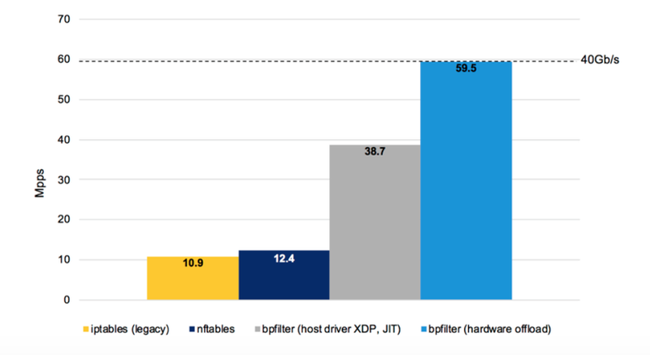

# 可行性报告

**Monthly Subscription Group**

   * [可行性报告](#可行性报告)
      * [项目介绍](#项目介绍)
      * [传统的包处理过程及其延迟来源](#传统的包处理过程及其延迟来源)
         * [传统的数据包接受过程](#传统的数据包接受过程)
            * [主要延迟来源](#主要延迟来源)
         * [传统的数据包发送过程](#传统的数据包发送过程)
            * [主要延迟来源](#主要延迟来源-1)
      * [理论依据](#理论依据)
         * [冯诺依曼瓶颈](#冯诺依曼瓶颈)
         * [网络处理与数据流结构](#网络处理与数据流结构)
         * [SmartNIC 的结构](#smartnic-的结构)
            * [SmartNIC 数据流网卡的性能表现示例](#smartnic-数据流网卡的性能表现示例)
               * [Open vSwitch](#open-vswitch)
               * [SDN](#sdn)
      * [技术依据](#技术依据)
         * [硬件卸载简介](#硬件卸载简介)
         * [关于 eBPF 硬件卸载](#关于-ebpf-硬件卸载)
            * [SmartNIC 上 eBPF 硬件卸载流程](#smartnic-上-ebpf-硬件卸载流程)
               * [编程、调试工具链](#编程调试工具链)
               * [Maps 卸载](#maps-卸载)
               * [BPF Helper Function](#bpf-helper-function)
               * [eBPF JIT 编译器](#ebpf-jit-编译器)
            * [硬件卸载效果](#硬件卸载效果)
               * [bpfilter](#bpfilter)
               * [Load Balancer](#load-balancer)
               * [XDP Latency](#xdp-latency)
      * [技术路线](#技术路线)
      * [参考文献](#参考文献)

## 项目介绍

我们的项目是：对计算机在网络包处理上进行非冯化改造，绕过 CPU 与操作系统内核，直接在网卡上对网络包进行数据流驱动的实时处理。目标是纳秒级的延迟。

## 传统的包处理过程及其延迟来源

首先，我们需要看一下传统情况下 Linux 处理网络包时延迟是如何产生的。

### 传统的数据包接受过程

一个数据包从外部网络进入网卡，要经过多次复制、转换和处理。数据包从网卡通过 DMA (Direct Memory Access) 将数据包写入内存中预先分配好的地址。数据包写入完毕后网卡产生一个硬件中断，处理过程中禁用硬件中断（网卡可以持续 DMA 写入更多数据包而不产生 IRQ，后面一并处理），再产生软件中断（为了避免硬件中断长期占用 CPU）。

```text
                   +-----+
                   |     |                            Memory
+--------+   1     |     |  2  DMA     +--------+--------+--------+--------+
| Packet |-------->| NIC |------------>| Packet | Packet | Packet | ...... |
+--------+         |     |             +--------+--------+--------+--------+
                   |     |<--------+
                   +-----+         |
                      |            +---------------+
                      |                            |
                    3 | Raise IRQ                  | Disable IRQ
                      |                          5 |
                      |                            |
                      ↓                            |
                   +-----+                   +------------+
                   |     |  Run IRQ handler  |            |
                   | CPU |------------------>| NIC Driver |
                   |     |       4           |            |
                   +-----+                   +------------+
                                                   |
                                                6  | Raise soft IRQ
                                                   |
                                                   ↓
```

软中断处理模块 `ksoftirq` 调用网卡驱动提供的函数，一个一个 (poll) 将写好的原始数据包转换成内核网络模块能识别的 skb (**s**oc**k**et **b**uffer) 格式（复制 + 转码，具体实现由网卡驱动提供）。在 skb 格式下，内核首先进行 GRO (Generic Receive Offload)（这里可以是硬件也可以是 CPU）。由于历史遗留原因，目前单个 “硬件数据包” 大小，也就是 MTU (Maximum Transfer Unit) 通常为 1500 字节，所以经常需要 GRO 将多个 “物理数据包” 合并为一个 “逻辑数据包”。接下来的 RSS (Receive Side Scaling) 和 RPS (Receive Packet Steering) 将逻辑数据包的处理任务分配给 CPU（调度）。这里如果有 `AF_PACKET` 类型的套接字（socket）侦听该网卡，还要将数据包再复制一份给对应的套接字（`tcpdump` 抓包位置）。最后，数据包交给协议栈部分（IP 等）处理。全部数据包处理完之后重新启用硬件中断，以后收到更多数据包时可以继续产生硬 IRQ。

```text
                                                     +-----+
                                             17      |     |
                                        +----------->| NIC |
                                        |            |     |
                                        |Enable IRQ  +-----+
                                        |
                                        |
                                  +------------+                                      Memory
                                  |            |        Read           +--------+--------+--------+--------+
                 +--------------->| NIC Driver |<--------------------- | Packet | Packet | Packet | ...... |
                 |                |            |          9            +--------+--------+--------+--------+
                 |                +------------+
                 |                      |    |        skb
            Poll | 8      Raise softIRQ | 6  +-----------------+
                 |                      |             10       |
                 |                      ↓                      ↓
         +---------------+  Call  +-----------+        +------------------+        +--------------------+  12  +---------------------+
         | net_rx_action |<-------| ksoftirqd |        | napi_gro_receive |------->| enqueue_to_backlog |----->| CPU input_pkt_queue |
         +---------------+   7    +-----------+        +------------------+   11   +--------------------+      +---------------------+
                                                               |                                                      | 13
                                                            14 |        + - - - - - - - - - - - - - - - - - - - - - - +
                                                               ↓        ↓
                                                    +--------------------------+    15      +------------------------+
                                                    | __netif_receive_skb_core |----------->| packet taps(AF_PACKET) |
                                                    +--------------------------+            +------------------------+
                                                               |
                                                               | 16
                                                               ↓
                                                      +-----------------+
                                                      | protocol layers |
                                                      +-----------------+
```

IP 层对数据包进行几个基本的检查，例如确认目标 MAC 和本机相符，处理此处注册的钩子（hook），然后进行转发（数据包目标不是本机）或者往上层传递（数据包目标是本机）。上层处理例如 TCP 和 UDP。TCP / UDP 层检查套接字和过滤条件，并将数据包丢弃或者送至对应应用程序的处理队列中。

#### 主要延迟来源

- DMA 复制和 CPU IRQ（处理中断需要进行上下文切换）
- 原始数据 → skb 的转化过程
- GRO (Generic Receive Offload)
- 针对 `AF_PACKET` 套接字的复制

### 传统的数据包发送过程

应用层准备数据，调用发送函数，创建连接。协议栈部分查找路由，选择设备（可能有多个网卡），封装数据包。在封装好的数据包进入网卡驱动前只有一次复制到 TAP (Network Tap)（这里的前期工作大部分是查找设备和节点等传输信息，外加丢弃不符合过滤条件的数据包）。内核网络模块收到准备好的、经过层层过滤的数据包后调用网卡驱动的发送函数。网卡驱动部分检查硬件的发送队列，将 skb 进行分拆入队并通知网卡开始发送，网卡发送完毕后产生硬件中断，内核再清理（释放）掉相关内存。

#### 主要延迟来源

与接收部分相似，发送延迟的主要来源以复制和处理数据包为主：

- 数据包复制到 TAP
- 硬件发送前对 skb 的处理（网卡驱动）
- 处理后 skb 到网卡的传递（主要在出站网络较为拥挤的情况下）

## 理论依据

### 冯诺依曼瓶颈

当涉及到对大量数据进行简单操作时，CPU 性能难以得到充分发挥，这时出现了所谓的“冯诺依曼瓶颈”。和内存的存储总量相比，CPU 和存储器之间的吞吐量很有限，这源于程序存储和数据存储之间没有明确的界限，并且共享输入输出总线。因为单总线的结构使其一次只能访问这两种存储中的一个，所以当数据量远大于程序指令量时，处理速度会严重受限。而这种限制随着 CPU 处理速度的提升体现的更加明显。

### 网络处理与数据流结构

对于网络数据处理，恰恰经常遇到大量、简单的处理工作，如果仍然依赖 CPU 的通用性，直接把工作交给 CPU 来做，性能势必会受到很大限制。于是考虑将工作转移到专用硬件（网卡）上，并且网卡不能再使用冯诺依曼结构，而要专门优化并行性。与冯氏结构完全不同，数据流结构在这方面可以得到应用。接下来具体分析数据流结构，以及它所带来的优势。

数据流的思想来源于这样一个概念：数据的价值随着时间的流逝而降低，所以事件出现后必须尽快地对它们进行处理，最好数据出现时便立刻对其进行处理，发生一个事件进行一次处理，而不是缓存起来成一批处理。在数据流模型中， 实现操作取决于数据的内部依赖性和资源的可利用性，它没有程序计数器，不会按照地址去寻找指令来执行，而是当一个操作需要的数据全部准备好后开始执行（称为点火 ，firing），并且输出的结果可以作为其他操作执行的前提条件。这样数据流计算模型中没有冯式结构中指令连续性的约束，可以更方便的使指令并行。另一方面，数据流计算模型中没有传统的变量这一概念，它仅处理数据值，忽略存放数据的容器（硬件层面是地址、软件层面指变量名）。基于这些特性，数据流结构计算模型拥有高实时性、低延迟的优点。

### SmartNIC 的结构

我们使用的智能网卡中的核心部分是型号为 NFP-4000 的网络流处理器，有别于为一些通用服务器提供的高性能处理，它可以用来提供高速的网络包处理。其拥有高度并行处理能力，并且有纳秒级的上下文切换速度。


*图：NFP-4000 微结构示意图*

如上图所示，NFP-4000 有 60 个流处理核心，他们被分组成多个集群，并且分布在多个岛（Island）上，这些核心都是 32 位的定制核，并且每一个核能同时支持八个线程，使得这款处理器最多可以同时处理 480 个数据包。此外，每个流处理核心都连接了大量通用寄存器，并拥有访问专用指令和数据内存的权限，这使得他们可用来减少一些典型的输入输出指令、访问内存指令的延迟。高度并行的特点使得多个线程可以同时运行，从而减少内存延迟的影响。

此外，它提供了硬件加速器，可以将一些简单的工作从 FPC 中分散到其他功能部件中以缩短 FPC 的指令周期。可以被加速的功能包括数据包修饰、统计引擎、负载平衡和流量管理等。

最后，整个架构通过高性能分布式交换结构（Distributed Switching Fabric）连接，该结构在设备中的所有组件之间提供高带宽的网络状连接使得各部件间能有效协作。

#### SmartNIC 数据流网卡的性能表现示例

SmartNIC 为网络处理设计的结构给网络相关领域带来了大量的性能提升。目前，此结构的智能网卡已经被应用到多个领域，包括数据中心的分布式内存、网络虚拟化，网络包处理等。


##### Open vSwitch

SmartNIC 显著地提高了 OVS (Open vSwitch - 开放虚拟交换) 的效率。通过使用 SmartNIC，OVS 得到了相较于内核层 OVS 50 倍、用户层 OVS 20 倍的性能提升。


*图：SmartNIC 在 OVS 中的使用*

##### SDN

同样，通过利用 SmartNIC，爱立信云 SDN（SDN 是一种网络虚拟化解决方案，可为基于虚拟，物理和容器的工作负载提供无缝的内部和数据中心间连接）在服务器吞吐量提升的同时也减小了成本。


*图：SmartNIC 在 SDN 中的使用*

## 技术依据

### 硬件卸载简介

“硬件卸载”（Hardware Offload）所讲的含义是，使用特定功能的硬件加速那些本该在软件层面上，或者是通用计算设备（CPU）上进行的工作。可以这样理解 offload 这个词：我们将某一个繁重的工作，从软件上、或者是我们的通用 CPU 上解放出来，而把这个任务交给一个专为此设计的、高效的另一个硬件来做。

某种程度上讲，GPU 就是这样的一个“专业、高效”的特定用途的硬件——图灵告诉我们，CPU 可以做任何“可计算的”工作，但把这些繁重的图形处理工作交给 GPU 去进行显然推动了计算机领域的一次革命——我们如今可以支持近乎完美的画面渲染，颇为逼真的 3D 游戏画面与方便高效的视频合成与剪辑。难以想象没有 GPU 的计算机如何达到这样的高度。

本课题所使用的“硬件卸载”技术更多的是指，使用附属的网络处理器，来“卸载”——或者说负担——大部分的网络数据处理工作，使 CPU 从这些每秒达几十 Gib 的数据流中解放出来。也就是说，我们使用高效的，高度并发的数据流处理器（Network Flow Processor）来处理繁重的网络任务，如网络交通，包过滤，协议等，而 CPU 可以专注于其他计算任务——当下，随着云数据中心的网络带宽达到 100Gbps 的量级，那些本就负担着上万个虚拟机、上百万用户进程的通用 CPU 集群服务器不得不引入 NFP 智能网卡来加速他们的云流量处理与协调并高效化硬件资源的分配。

在“硬件卸载”尚未应用到智能网卡之前，在软件层面（如操作系统上）发送或接受 TCP 数据需要许多指令周期才能完成，而对于专用硬件来说，这只是几个周期就可以解决的问题。同时，网络硬件卸载可以节约大量缓存资源（传统的过程必将网络数据存入 CPU 缓存进行处理），降低网络中断的执行次数，并且减少数据在内存和运算单元间的数据通路中的传输速度——而这同时是冯诺依曼架构的核心瓶颈之一。

### 关于 eBPF 硬件卸载

在 eBPF（包括 XDP，bpfilter 等与之相关的架构）获得硬件卸载的支持之前，这些架构通过在整个 Linux 的网络通路上添加“钩点”（hook），来获得更早处理网络数据的机会。

hook 应当解释为一个“嵌入”的结构：当数据到达数据路径的某一个节点时，挂在这个“嵌入”结构上的架构程序立刻开始执行，比如处理该数据包是否应该丢掉——而非等到数据包创建了 skb 之后再进行决定。这种嵌入架构允许我们提前做出决策，规避毫无意义的硬件、内核层数据传输和复制。

eBPF 程序的特性，支持它可以和内核的诸多架构配合，在网络数据通路的诸多节点上嵌入其程序。


*图：eBPF 程序可以嵌入的内核架构*

#### SmartNIC 上 eBPF 硬件卸载流程

简单地说，eBPF 的硬件卸载需要以下这些流程：

1. 编写程序并获得 eBPF 字节码：将写好的 C 语言程序通过 eBPF 的 `clang` 与 LLVM 后端将 C 程序编译成 eBPF 字节码，得到 ELF 文件。
2. 加载入内核：通过调用 `bpf()` 系统调用将程序加载到内核中。当程序要被硬件卸载时，我们需要向系统调用传递一个额外的接口索引，以指示将要卸载的设备。
3. 验证安全性：因为 eBPF 的代码是跑在内核空间中的，为了保障内核的正常工作，该程序在内核中将会被 Verifier验证，确保这个程序一定会终止，不会出现死循环，并且没有任何其他安全问题。
4. 使用 JIT 将 eBPF 字节码编译成本机指令。
5. 硬件卸载（offload）： 包含 maps offload 和 program offload。


*图：eBPF 硬件卸载到 SmartNIC 示意图*

下面详细介绍 SmartNIC 对各个环节的支持。

##### 编程、调试工具链

Netronome 提供了 `bpftool`，这是一个重要的调试 eBPF 程序、监视 maps 内容的工具。能让我们更好地开发 eBPF 程序并卸载到 SmartNIC 上。

并且，Netronome 提供了完备的工具链：Software Development Kit（SDK）。它包含编译器，链接器以及能够精确到到指令周期时间的模拟器（cycle accurate simulator），并将它们集成到了一个综合的开发环境中。SDK 在 Windows 平台上有图形化开发环境，在 Linux 平台上可以通过命令行使用。使用 SDK，我们可以直接使用 C 语言直接对 SmartNIC 进行编程。


*图：C 语言对 SmartNIC 编程示意图*

如图，我们可以使用 Network Flow C Compiler，这是是一个经过优化的、适配数据流架构的 C 编译器，并为 C 语言提供了一些扩展语法（extensions）。

使用 SDK（Software Development Kit）IDE 的完整开发流程如下。


*图：使用 SDK 的开发流程示意图*

##### Maps 卸载

eBPF maps 的功能是：在不同的 eBPF 程序之间、eBPF 程序与内核程序之间、eBPF 程序与用户程序之间共享数据，还可以用于记录 eBPF 程序的状态。Maps 可以理解成是各种程序之间实现通信的一种十分重要的方法。

Maps 是一组键值对，它的数据结构是任意的。常用的两种是哈希表 maps 和数组 maps。

Maps 只能由用户空间中的程序通过 eBPF 系统调用来创建，一个用户程序能够创造多个 maps，并通过文件描述符去访问它们的内容。用户程序与 eBPF 程序都能够更改储存在 maps 中的内容，而且不同的 eBPF 程序能够并行访问同一个 maps。


*图：eBPF 程序与 maps 卸载到 SmartNIC 示意图* 

为了保持 eBPF 在卸载之后仍能有优秀的实时处理性能，maps 可以同样卸载到 SmartNIC 上。并且 maps 在卸载之后仍然可以被主机上的程序访问，SmartNIC 对 eBPF maps offload 的支持体现在以下几点：

1. 用户程序可以在用户空间读取 maps 内容，用于调试或者收集数据等。
2. 用户程序可以在用户空间修改 maps 中存储的数据，比如设置 eBPF 程序在运行时要使用的参数，如需要阻塞的 IP 地址的列表等。
3. 硬件卸载后的 eBPF 程序可以读取 maps 中的值，比如说从中读取一些必要参数等。
4. 硬件卸载后的 eBPF 程序可以修改 maps 中的值。因为这涉及到 eBPF 程序之间的同步问题，一般情况下需要引入锁。为了提高并发性，SmartNIC提供了一种特别的“写入”原子操作。

目前 SmartNIC 已经支持最常用的数组 maps 和哈希 maps。


*图：Map offload 流程图*

##### BPF Helper Function

cBPF 和 eBPF 的区别之一就是 eBPF 程序可以在运行中调用 helper functions，而 cBPF 没有这种机制。

BPF helper function 是一类在内核中定义好的函数，eBPF 程序可以实时调用它们。这些 helper functions 可以理解成接口，为 eBPF 程序与内核交互、与它们工作的上下文交互提供了方便。例如，helpers 可用于打印调试消息、获取系统时间、与 eBPF maps 交互、操纵网络数据包等。

SmartNIC 当然也对 helpers 提供了必要的支持，并且提供了特定于设备的的 helpers 实现。卸载后的 eBPF 程序可以通过特殊的 maps 与这些 helpers 交互，提高数据处理的效率。

##### eBPF JIT 编译器

最新发布的 eBPF JIT compiler 已经可以支持间接逻辑移位与间接算术移位指令等少数在过去不能被编译的 eBPF 指令，同时 JIT 还可以检查一段指令序列中是否存在可以优化的部分，从而将原指令转化成另一端在机器执行中性能更好的指令。目前 JIT 仍在不断改进，有望在未来实现对以下功能更好的支持：

- 能够减少最终程序中的指令数量，以获得更好的性能或支持更高的指令总数。
- 能够通过支持在硬件上执行速度更快的指令来提升程序性能。
- 能够优化资源使用，例如在堆栈中使用的内存。

#### 硬件卸载效果

在近年来高热发展的 Linux 网络数据处理架构中，TC 和 XDP 都选择将其 hooks 嵌入到网络数据通路中尽可能低的部分。下图展示的是所有使用 eBPF 的高速网络处理架构在数据通路的位置及单核包处理表现。


*图：eBPF 高速网络处理架构在不同位置的性能比较*

可以看到，层次越低，包处理的速度越快，而以硬件卸载方式的速度十分超群（单线运算速率是 XDP 的近四倍）。

##### bpfilter

另一 eBPF 硬件卸载的发展结果是 bpfilter——同时兼顾加入 eBPF 的新特性与兼容固有防火墙与 ip 协议的高性能网络过滤内核模块。下图是将 bpfilter 硬件卸载到 SmartNIC 上，与使用八核处理器，使用旧有的传统 iptables 和较新的 nftables，其数据处理速度进行的对比。



*图：bpfilter 性能对比*

##### Load Balancer

基于数据流处理器的网络处理硬件卸载的高效还源自于，它规避了传统架构（如 x86）在 PCIe 带宽限制上不可避免的障碍。下图是使用 XDP 执行负载均衡时，使用 Agilio SmartNIC 硬件卸载与网卡驱动层 XDP，及使用 Intel Xeon CPU E5-2630 的性能对比，前者的数据包处理表现近乎是后者单核的 12 倍。


*图：XDP 在不同层处性能对比*

##### XDP Latency

同时，低延迟性也是选择硬件卸载 eBPF 的关键理由。由于 eBPF 程序直接在网卡上运行，数据包不必在跨越 PCIe 带宽造成的障碍，进而达到改善负载平衡和维护 DDoS 网络安全。下图展示了 XDP 在硬件卸载和网卡驱动层两个方式下的延迟对比，特别的，硬件卸载的延迟十分稳定。


*图：不同方式的延迟时间对比*

## 技术路线

综合上述内容，我们可以得出结论：eBPF 程序通过已有的官方工具，可以方便地编程到高度支持硬件卸载的 Agilio SmartNICs 上，并有效规避传统冯诺依曼架构中数据传输和计算的瓶颈，利用数据流处理器的高性能和高度并行性，获得高性能网络处理所需要的更高速的包处理和更低的延迟。

本小组课题的基本思路是：不依赖或尽可能少地依赖操作系统内核与传统冯诺依曼架构上的硬件，在 Agilio SmartNIC 上独立处理网络包和网络数据；利用数据流架构的高效和高度并发来获得更快速、更低延迟的网络包处理。使用 C 语言编写实现各种网络处理功能的 eBPF 程序并最终编译成 SmartNIC 指令，同时根据不同的网络处理需求，优化指令序列，并最终利用 Netronome 产品开发的 eBPF 各个硬件卸载工具，编程到智能网卡上。项目目标是：获得尽可能高的数据包处理速度，获得纳秒级的处理延迟与“终端到终端”响应时间。

我们现阶段确定的，计划使用的各项工具有：

- 网卡型号：Agilio CX 2x10GbE。
- 配套软件：Agilio eBPF Software 等。
- 操作系统使用 Linux，服务器与操作系统具体版本未定。

## 参考文献

1. [Linux网络 - 数据包的接收过程](https://segmentfault.com/a/1190000008836467)
2. [Linux网络 - 数据包的发送过程](https://segmentfault.com/a/1190000008926093)
3. [Von Neumann architecture - Design limitations](https://en.wikipedia.org/wiki/Von_Neumann_architecture#Design_limitations)
4. [NFP-4000 Theory of Operation](https://www.netronome.com/media/redactor_files/WP_NFP4000_TOO.pdf)
5. [Increase Application Performance with SmartNICs](https://www.openstack.org/assets/presentation-media/Netronome-OpenStack-Summit-Marketplace-presentation.pdf)
6. [BPF, eBPF, XDP and Bpfilter… What are These Things and What do They Mean for the Enterprise?](https://www.netronome.com/blog/bpf-ebpf-xdp-and-bpfilter-what-are-these-things-and-what-do-they-mean-enterprise/)
7. [Open Source Packet Filtering: eBPF at FOSDEM’19](https://www.netronome.com/blog/open-source-packet-filtering-bpf-fosdem19/)
8. [Network hardware offload](https://blogs.cisco.com/performance/network_hardware_offload)
9. [FRnOG 30: Faster Networking à la française](https://www.netronome.com/blog/frnog-30-faster-networking-la-francaise/)
10. [Ever Deeper with BPF – An Update on Hardware Offload Support](https://www.netronome.com/blog/frnog-30-faster-networking-la-francaise/ )
11. [eBPF maps](https://prototype-kernel.readthedocs.io/en/latest/bpf/ebpf_maps.html)
12. [BPF Hardware Offload Deep Dive](https://www.netronome.com/media/documents/BPF_HW_offload_deep_dive.pdf)
13. [BPF-HELPERS](https://github.com/iovisor/bpf-docs/blob/master/bpf_helpers.rst)
14. [Demystify eBPF JIT Compiler](https://www.netronome.com/media/documents/demystify-ebpf-jit-compiler.pdf)
