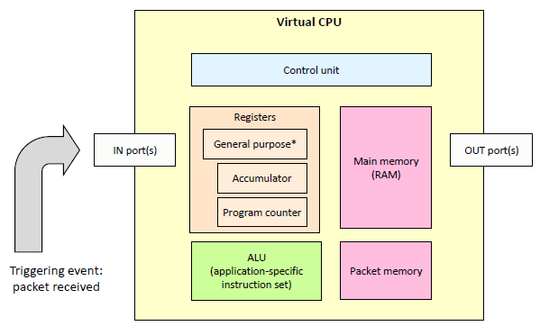

# 调研报告

**Monthly Subscription Group**

[TOC]

## 小组成员

- **赵家兴 (PB17111625) (组长)**
- 陶柯宇 (PB17111630)
- 付佳伟 (PB17111643)
- 陈昂 (PB17061250)
- 李喆昊 (PB17050941)

## 项目简介

我们的项目是：对冯·诺伊曼架构的计算机在网络包处理上进行非冯化改造，绕过 CPU 与操作系统内核，直接在网卡上对网络包进行数据流驱动、基于 eBPF 的实时处理。目标是纳秒级的延迟。

## 项目背景

### 一般的数据包处理模式

在网卡接收到数据包后，网卡会通过 DMA 把数据包复制到内核空间内存中（如果没有 DMA，那么复制就要由 CPU 来做）。之后产生硬件中断，通知 CPU 数据复制完成，此时 CPU 运行网卡驱动程序的对应函数，清空这个中断，并且启动 NAPI (New API) 的函数。在此之后，网卡驱动与内核还需要进行了一系列复杂的处理。

可以看到，这个过程中不可避免地会出现数据包的复制：从网卡到内核空间内存，如果需要的话，数据包还需要复制到用户层应用中；内核、驱动与网卡硬件的交互等，并且 CPU 也必须参与进网络包处理的过程中。

### cBPF 与 eBPF

我们如何对数据包进行一些处理，比如说过滤掉一些满足指定规则的包呢？在用户层写程序非常方便，但是用户层的网络处理程序很可能带来从内核层到用户层的复制等操作，降低效率。BPF (Berkeley Packet Filter) 的思想是：不需要处理的网络包就尽可能早地丢弃掉。为了实现这个目的，BPF 设计了一套虚拟机，允许用户在内核层执行 BPF 的字节码，减少不必要的从内核层到用户层的网络包复制。

#### cBPF

BPF 于 1992 年末由 Steve McCane 和 Van Jacobson 在论文 *The BSD Packet Filter: A New Architecture for User-level Packet Capture* 中提出。在 14 年新的 BPF 架构被提出之后，之前的 BPF 被称为 cBPF ("classic BPF")。cBPF 的虚拟机非常精简，只有用于索引的寄存器（Index register）与累加器两个寄存器，指令也只有二十余条。

在 cBPF 之前，也有与之类似思路的数据包过滤程序，如 CSPF (CMU/Stanford Packet Filter)。它也同样是内核级别的实现，也有虚拟机。其基于操作数堆栈，采用树形表达式方法。指令要么在栈上推送常量或包数据，或者在顶部执行二进制布尔运算或按位运算两个要素。过滤程序是顺序执行的列表指示。评估一个程序后，如果顶部堆栈具有非零值或堆栈为空，然后数据包为接受，否则被拒绝。

但 CSPF 的方法有两个实现缺点：

1. 必须模拟操作数堆栈。在古老的 PDP-11 机器上，这种思路可以运行得很好，但是在现代机器上，这意味着使用加法和减法运算维护一个模拟出的堆栈指针，并对内存进行加载和存储以模拟堆栈。由于内存是冯·诺伊曼架构的主要瓶颈，因此这样做带来了性能上的限制。

   而由于 BPF 使用一种重新设计的基于寄存器的“过滤器虚拟机”，而不是基于内存，能够在基于寄存器的 RISC 处理器上高效率地实现。

2. 并且，树模型通常进行不必要或多余的计算。 

Benchmark 也表明，cBPF 比 CSPF 效率要好得多。



*图：BPF 虚拟处理器结构示意图*

我们可以使用 Linux 上的 `tcpdump` 查看一些 cBPF 指令的例子。

```
$ sudo tcpdump -d ip
(000) ldh      [12]
(001) jeq      #0x800           jt 2	jf 3
(002) ret      #262144
(003) ret      #0
$ sudo tcpdump -d tcp
(000) ldh      [12]
(001) jeq      #0x86dd          jt 2	jf 7
(002) ldb      [20]
(003) jeq      #0x6             jt 10	jf 4
(004) jeq      #0x2c            jt 5	jf 11
(005) ldb      [54]
(006) jeq      #0x6             jt 10	jf 11
(007) jeq      #0x800           jt 8	jf 11
(008) ldb      [23]
(009) jeq      #0x6             jt 10	jf 11
(010) ret      #262144
(011) ret      #0
```

`-d` 参数会输出“人类可读”的 BPF 代码。上面两个例子分别过滤了 IP 包和 TCP 包。

2011 年，Eric Dumazet 将 BPF 转译器添加了 JIT，使得内核可以将 BPF 程序直接翻译为支持的目标架构的指令，如 x86，ARM，MIPS 等，进一步提高了处理速度。

#### eBPF

2014 年，Alexei Starovoitov 扩充了 BPF，实质上创建了一个新的架构，称为 eBPF (extended BPF)。eBPF 添加了以下这些新的改进：

- 与 x86-64 类似的架构：eBPF 使用 64 位寄存器，并将可用寄存器的数量从 2（累加器和 X 寄存器）增加到 10。 eBPF 还扩展了操作码的数量。
- 与网络子系统分离：cBPF 受限于基于数据包的数据模型。由于它用于包过滤，因此其代码存在于网络子系统中。但是，eBPF VM 不再受限于此。现在可以将 eBPF 程序附加到跟踪点或 kprobe 中。这为 eBPF 打开了插桩（Instrumentation），性能分析以及其他内核子系统中的更多用途的大门。
- 全局数据存储结构 Map：Map 是一种通用数据结构，以键值对的形式存储不同类型的数据。它们允许在 eBPF 内核程序之间以及内核和用户空间应用程序之间共享数据。
- 辅助函数（Helper functions）：如数据包重写，校验和计算或数据包克隆。与用户空间编程不同，这些函数在内核中执行。此外，还可以从eBPF程序执行系统调用。
- 尾调用（Tail-calls）：eBPF 程序大小限制为 4096 字节。尾调用功能允许 eBPF 程序通过控制新的 eBPF 程序来克服此限制。


*图：eBPF 程序的尾调用*

由于 eBPF 的指令集变得更加复杂，单纯使用汇编的方式进行开发是比较难的。目前，eBPF 程序可以使用 C 语言书写，使用 `clang` 和 `llvm` 编译之后就可以得到 eBPF 代码。最终，内核中的 JIT 编译器将 eBPF 代码转为原生代码。


*图：C 程序转为内核态原生指令的过程*

需要注意的是，eBPF 程序最终会注入内核，那么如何保证注入代码的安全性？eBPF 使用 verifier 来检测代码。

第一轮检查中，verifier 检测代码中是否出现以下现象：

- 循环（即代码是否构成有向无环图）。
- 跳出 eBPF 代码范围的 `JMP`。
- 无法到达的指令。
- 过长（超过了 4096 字节）

再之后第二轮检查中，verifier 细致地检查每一个分支，发现任何错误则失败。在第二轮检查中对分支数和指令数都有要求。

eBPF 的整体架构如下。


*图：eBPF 整体的运行时架构*

### XDP 与 DPDK

目前在 Linux 上的高性能网络处理实践中，主要有两种方案：XDP 和 DPDK。

#### DPDK

首先介绍 DPDK，它实现了 kernel bypass，在用户空间处理所有的网络请求。由于绕过了内核，网卡也需要由用户空间的驱动来管理。

将网卡的完全控制权交给用户空间程序的好处是，我们减少了内核所带来的障碍，比如上下文切换、网络层处理、中断等。这足以使网络数据传输达到 10Gbps 甚至更高。kernel bypass 与其他特性（如批量包处理）和性能调整方法（如 NUMA 感知，CPU 隔离等），整合出了高性能用户空间网络的基础结构。

但 DPDK 基于的用户空间网络的不足则在于：

- 用户空间程序绕过了操作系统内核，就意味着跳过了操作系统提供的硬件资源抽象而直接管理硬件本身。用户空间驱动程序虽然可以保证正常运作，但一般地相比内核更缺乏测试与兼容性。
- 用户空间程序同时跳过了内核提供的网络管理函数，这意味着用户空间程序要“重复发明轮子”，重新实现那些已经被内核提供过的功能。
- 程序在沙箱中运行，而这限制了它与操作系统其他部分的集成与交互。
- 内核可以为网络提供充分的安全层，而这在用户空间程序中并不存在。

#### XDP

与用户空间网络截然相反的是，XDP（eXpress Data Path）将诸如过滤器、映射器、路由等全部用户空间网络程序转移到了内核的领域里。XDP 允许我们的网络程序在网络包到达网卡而进入内核网络层之前立即执行，这显著提高了网络包处理速度。


*图：XDP 网络包处理整体情况*

XDP 基于上文提到的 BPF，实现高速的包处理。

## 立项依据

### 智能网卡  SmartNIC

#### 产生

现代的工作负载和数据中心设计给 CPU 核心带来了太多的网络开销。随着更快的网络速度（每个链接可高达 200 Gb/s）， CPU 花费了太多开销对网络流量进行分类、跟踪和控制。这些昂贵的 CPU 本是为通用应用程序处理而设计的，而不是消耗所有这些处理能力仅用来查看和管理数据的移动。

智能网卡（SmartNIC）应运而生，它可以将本应由 CPU 处理的工作转移到网卡上执行，减少 CPU 工作量的同时提高性能，其核心是通过 FPGA 协助 CPU 处理网络负载，具有以下特征：

- 通过 FPGA 本地化编程支持数据面（Data plane）和控制面（Control plane）功能定制，协助 CPU 处理网络负载。
- 通常包含多个端口和内部交换机，快速转发数据并基于网络数据包、应用程序套接字等智能映射到到相关应用程序。
- 检测和管理网络流量。

过去 30 年来，网卡已经从具有单一 MAC，PHY（端口物理层）和系统接口的简单网卡发展到具有多个网络接口和用于 TCP/IP 的硬件卸载（Hardware offload）引擎的高性能适配器、虚拟化等功能。最新的 NIC 基于支持高速网络接口的 I/O 控制器。SmartNIC 将 FPGA、处理器或基于处理器的智能 I/O 控制器与分组处理和虚拟化加速集成在一起。大多数 SmartNIC 可以使用标准的开发工具进行编程，越来越多的厂商也开始增加了对 eBPF 以及可编程语言 P4 的支持。

目前业界提供基于 FPGA 的 SmartNIC 的厂商包括 Accolade、BittWare、Enyx 等。这些适配器集成了来自 Intel 或 Xilinx 的 FPGA。而 Broadcom、Cavium、Intel、Netronome 等均可提供基于处理器的 SmartNIC。同时，亚马逊和谷歌已经开发了自己的 SmartNIC ASIC。

#### 应用场景

- 安全隔离

出于安全性考虑，有时需要将网络与 CPU 相隔离，通常黑客攻击和恶意软件来源于网络。使用智能网卡便可以在网卡上检查网络流量、阻止攻击和进行加密传输，从而带来了安全性上的提升。如果主 CPU 受到威胁，那么智能网卡仍然可以检测恶意活动，在不立即占用 CPU 资源的情况下阻止攻击。

- 存储虚拟化和云

智能网卡的一个较新的用例是虚拟化软件定义的存储、超融合基础架构和其他云资源。在超融合架构数据中心中，SmartNIC 为虚拟化应用程序提供硬件加速与网络接口紧密结合，并可分布在大型服务器网络中，减小 CPU 负载，提供额外的边缘计算能力，加速特定应用和虚拟化功能，并且通过正确的语言和工具链支持，为用户提供应用加速即服务的附加价值。智能网卡甚至可以虚拟化 GPU（或一些神经网络处理器），以便任何服务通过网络访问。


*图：SmartNIC 功能与对应硬软件情况*

一个好的智能网卡必须是可编程的。虽然为了获得最佳性能，大多数加速功能必须在硬件中运行，但为了获得最大的灵活性，这些功能的控制和编程需要在软件中运行。

有许多功能可以在智能网卡上编程。通常特定的卸载方法，加密算法和传输机制不会发生太大变化，但路由规则、加密密钥和网络地址始终会发生变化。我们将前者的功能视为数据面，后者则用作控制面功能。一旦建立标准化，数据面规则和算法就可以编写到硬件上了。然而控制面规则和编程变化多样，无法硬编码到芯片中，但可以在 FPGA 上运行或在 C 可编程的 Linux 环境中运行。

### 数据流计算机架构

#### 数据流架构与传统冯诺伊曼架构的区别

##### 回顾冯诺依曼架构


*图：冯·诺伊曼架构示意图*

**主要特点：**

- 基于控制流概念。
- 指令与数据一起放在内存中。
- 程序的执行需要依靠程序计数器（PC），通过移动 PC 将对应地址的指令取入 IR (Instruction Register) 并执行。

**缺陷：**

- 天生存在 CPU 与内存之间信息交换的瓶颈，在处理并行问题方面有本质困难。


*图：内存数据读写与 CPU 读写数据速度差距巨大*

- 近年来基于冯·诺依曼架构的新式计算机体系虽然采用并行技术，但没有摆脱传统的以控制流为主的设计思想，并行处理能力受限。

##### 数据流结构

区别于传统的冯诺依曼结构计算机或控制流计算机，数据流计算机 (Dataflow Architecture Computer) 是一种数据驱动方式系统结构的计算机，它在原理上不存在 PC 寄存器，只有当一条或一组指令所需的操作数全部准备好时，才能激发相应指令的一次执行，执行结果又流向等待这一数据的下一条或一组指令，以驱动该条或该组指令的执行。因此，程序中各条指令的执行顺序仅仅是由指令间的数据依赖关系决定的。虽然这种结构没有成功的应用在通用计算机上，但很多专用硬件使用这种结构获得了成功，这其中就包括网络路由、图像处理、数字信号处理等领域。

#### 优势

数据流计算机在许多方面的性能优于传统的冯·诺依曼型计算机，包括：

- 高度并行运算

数据流方法本身就体现了操作的高度并行性。在数据流方法中，由于没有指令执行顺序的限制。从理论上来讲，只要硬件资源充分就能获得最大的并行性。通过程序验证，许多问题的加速倍数随处理机数目的增加而线性的增长。

- 流水线异步操作

由于在指令中直接使用数值本身，而不是使用存放数值的地址，从而能实现无副作用的纯函数型程序设计方法，可以在过程级及指令级充分开发异步并行性，可以把实际串行的问题用简单的办法展开成并行问题计算。

- 纯函数化操作

在数据流计算机中，没有变量的概念，也不设置状态，在指令间直接传送数据，操作数直接以“令牌”（token）或“数值”的记号传递而不是作为“地址”变量加以访问。因此操作结果不产生副作用，也不改变机器状态，从而具有纯函数的特点。

#### 潜在问题

- 数据流机的主要目的是为了提高操作级并行的开发水平，但如果程序本身串行部分较多会使得效率反而比冯·诺依曼结构更低
- 在数据流机中为给数据建立、识别、处理标记，需要花费较多的辅助开销和较大的存储空间（可能比冯·诺依曼型的要大出 2 到 3 倍），但如果不用标记则无法递归并会降低并行能力。
- 数据流机不保存数组。在处理大型数组时，数据流机会因复制数组造成存储空间的大量浪费，增加额外数据传输开销。数据流机对标量运算有利，而对数组、递归及其他高级操作较难管理。
- 数据流语言的变量代表数值而不是存储单元位置，使程序员无法控制存储分配。为有效回收不用的存储单元，编译程序的难度将增大。同时程序也不易调试和维护。

#### 研究进展

随着数据流机研制的深入开展，已提出若干新的数据流机器，它们既继承了传统计算机采用的并行处理技术，又弥补了经典数据流机的一些缺陷。

- 提高并行度等级

由于经典的数据流机将数据流级的并行性放在指令级上，致使机器的操作开销大；现在将并行性级别提高到函数或复合函数一级上，用数据来直接驱动函数或复合函数，就可以较大地减少总的操作开销。1981 年 Motooka 等人及 1982 年 Gajks 等人提出复合函数级驱动方式，在全操作循环、流水线循环、赋值语句、复合条件语句、数组向量运算及线性递归计算上采用复合函数级的并行。这样，就可以用传统高级语言来编写程序，只是需要研制专门的程序转换软件，实现将传统高级语言编制的程序转换成复合函数级的数据流程图，并生成相应的机器码。

- 同步、异步结合

由于数据流机采用完全的异步操作，尤其是指令级的异步会造成系统操作开销的增大。所以，在指令级上适当采用同步操作，而在函数级及函数级之上采用异步操作，就可以减少机器的操作开销。指令级同步操作可以使中间结果不必存回存储器，直接被下一操作所用，指令中就不需要目标地址了，这样可缩短指令字长。指令级同步操作不需要回答信号，减少了系统的通信量，系统采用总线互连即可，简化了结构。虽然函数级并行异步的开销较大，例如取函数标题、取程序要多花费些时间，互连标题也还要多占用存储空间，但这些开销分摊到函数中的每条指令就少得多了。

- 控制流与数据流相结合

控制流与数据流相结合，可以继承传统控制流计算机的优点。例如，Cedar 数据流机就实现了函数级宏流水线，其指令级上仍采用控制流方式。

### Agilio CX SmartNIC 智能网卡

我们计划使用 Agilio CX SmartNIC 2x10GbE 这款智能网卡来进行我们的实验。其基于 Netronome 的 SmartNIC，核心部件为 NFP (Network Flow Processor)，它是一个多线程多核的网络流处理器。


*图：NFP-4000 网络流处理器的内部架构*

其拥有 60 个流处理核，可以支持我们运行 eBPF 程序的需求。

## 重要性与前瞻性分析

在部分行业、领域中，低延迟的网络是非常重要的一部分。例如在云服务公司与传统的数据中心中，它们需要满足用户更低延迟、更快速度的需求；再例如在部分金融行业中，较其他竞争者更低延迟的网络处理也是制胜的重要因素之一。

尽管目前有许多工作大幅提高了 Linux 上的网络处理速度，但是距离 NIC 性能的极限仍有一定的距离。我们希望能够尽可能发挥 NIC 的潜力。使用 eBPF 也一定程度上方便了现有应用的移植。

## 相关工作

上文提到的硬件卸载（Hardware offload）将一部分处理工作交给硬件实现以提高速度。

在 2016 年，东京 NetDev 1.2 大会上，Jakub Kicinski 与 Nic Viljoen 提出了将 eBPF/XDP 程序硬件卸载到 Netronome 的数据流处理器智能网卡上的架构方法。

在以 NPU 为基础的 SmartNIC 出现之前，由于传统 NIC 缺乏广泛的硬件卸载适配性，并且传统 x86 通用 CPU 已经能较好地实现硬件卸载，同时实现通用卸载要适配多种不同特定硬件架构的复杂性，少有成功的 eBPF 向 NIC 的硬件卸载。而随着通用 CPU 难以胜任目前的网络负载规模，并且 RISC 工作者在以 NPU 为基础的 SmartNIC 上的工作日趋成熟，向 SmartNIC 上硬件卸载 eBPF 程序正当其时。


*图：NFP 6xxx 芯片架构*

上图展示的是该二人使用的 NFP 6xxx 芯片的架构。NFP 结构中包含一系列的硬件单元，这些单元均是为了实现某种特定的功能（如加密，重排序等）。它们与一些完全可编程的微引擎结合，嵌入到了每个含 12 个微引擎的计算岛屿上（芯片中含微引擎总数在 72 到 120 之间），这些岛屿上还包括 SRAM 集群目标内存（CTM，256KB）和集群本地暂存（CLS，64KB）。NIC 上还包括一个 2~8 GB 的 DRAM 存储 EMEM 和 8 MB 的 SRAM 存储 IMEM。

在每个微引擎（Microengine）上，可以同时运行 4 到 8 个与浅管道协同复用的线程，这确保了时钟周期可以高效利用。无锁交换内存架构使得 NIC 的内存并不像其他架构的内存一样容易成为性能瓶颈。每个微引擎中有 256 个 32 位通用寄存器，分为 A 和 B 两组，它们被每个线程均分（在 8 上下文模式运行时，每个线程有 16 个 A 和 16 个 B 寄存器）。特别地，A 和 B 组中的寄存器仅能和另一个组的寄存器进行交互。每个微引擎中还有 256 个 32 位传输寄存器（128 读/写），4 KB 的本地 SRAM，以及 128 个 32 位下一相邻寄存器（next neighbour registers）。

Jakub Kicinski 与 Nic Viljoen 以此架构概念性地将 eBPF 虚拟机映射到了 NFP 上。


*图：eBPF 虚拟机到 NFP 的映射*

通过将 eBPF 的数据结构 maps 放在 DRAM 中，同时使用一定的缓存机制和多线程机制来提高速度，可以降低延迟。

栈可以放在微引擎 SRAM 和计算岛屿 SRAM 的集合上，这一般要取决于栈的大小。NFP 指令存储区可以存储达 8000 条 NFP 汇编指令，当然多个微引擎可以结合起来，将可存储指令的数目扩大。

最后，A、B 组通用寄存器，下一相邻寄存器，传输寄存器可以用来实现 eBPF 的 10 个 64 位寄存器。在 4 上下文运行模式下，每个线程分配的寄存器足以简单地满足这一映射；但在 8 线程下，需要一些管理与优化措施。

## 参考文献

1. [Packet processing](https://en.wikipedia.org/wiki/Packet_processing)
2. [Monitoring and Tuning the Linux Networking Stack: Receiving Data](https://blog.packagecloud.io/eng/2016/06/22/monitoring-tuning-linux-networking-stack-receiving-data/)
3. [The BSD Packet Filter: A New Architecture for User-level Packet Capture](http://www.tcpdump.org/papers/bpf-usenix93.pdf)
4. [eBPF 简史](https://www.ibm.com/developerworks/cn/linux/l-lo-eBPF-history/index.html)
