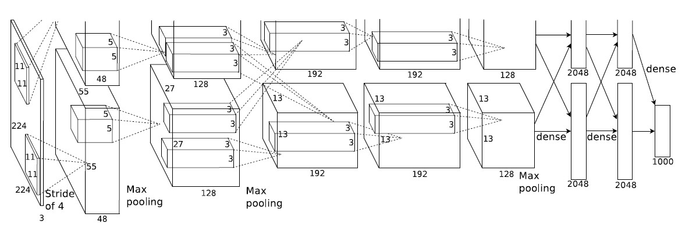
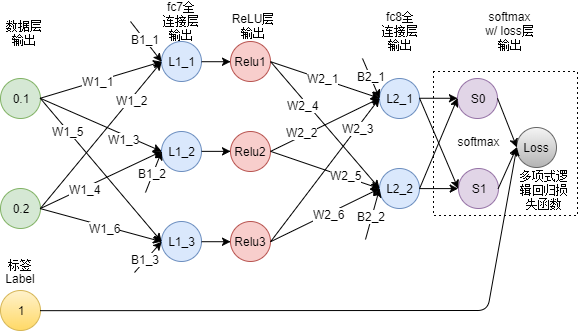

# AlexNet 调研报告

## 一、AlexNet 架构及原理

AlexNet属于深层卷积神经网络(CNN), 2015年在ImageNet图像识别挑战赛中大放异彩，具有里程碑意义。区别于此前的网络，有如下特性：

|        算法        |           作用           |
| :----------------: | :----------------------: |
|   ReLU & 多个GPU   |       提高训练速度       |
|      重叠池化      | 提高精度、不易发生过拟合 |
|     局部归一化     |         提高精度         |
| 数据扩充 & Dropout |        减少过拟合        |

###结构



输入$\rightarrow$ 卷积层1 $\rightarrow^{ReLU}$ 池化层1 $\rightarrow$ 卷积层2 $\rightarrow^{ReLU}$ 池化层2$\rightarrow$卷积层3,4,5$\rightarrow$ 池化层3$\rightarrow^{ReLU}$  全连接层1,2$\rightarrow^{SoftMax}$ 输出

### 数据

输入图像224 x 224 x 3 (RGB) $\rightarrow$ 卷积核大小11x11，步长是 4 $\rightarrow$ 得到 55x55 大小的特征矩阵，经ReLU激活 $\rightarrow$ 最大池化，得27x27大小矩阵  $\rightarrow$  卷积...

简化版本：



### 理论推导

基于上述的简化版本进行理论推导，对更复杂网络同理。

#### 参数 & 输入

$$
\begin{cases}
W(weight)=\begin{pmatrix}
w_{11} & w_{12} & \cdots w_{1n}\\
w_{21} & w_{22} & \cdots w_{2n}\\
\vdots && \vdots\\
w_{m1} & w_{m2} & \cdots w_{mn}\\
\end{pmatrix}\\[5ex]

x(input)=\begin{pmatrix}
x_1\\
x_2\\
\vdots\\
x_n
\end{pmatrix}
\end{cases}
$$

#### ReLU
$$
ReLU(x) = max\{0, x\}
$$

#### Softmax

$$
Softmax(x) = \frac{e^x_i}{\Sigma_{i = 1}^{n} e^x_i}
$$

#### 逻辑回归损失函数（MLL）

$$
Loss = -\frac1N \sum_{i=1}^{n} ln(S_i|i = Lable)
$$

#### 前向传播

$$
L_{i+1} = W_iL_{i} + b_i
$$

#### 输出层

$$
\begin{cases}
S(softmax\ layer) = Softmax(W_2 \cdot (ReLU(W_1 \cdot x + b_1) + b_2) \\[2ex]
Loss = -ln(\frac{e^{S_i-t}}{\Sigma_{i=0}^{n}e^{S_i-t}}|i = Lable), \ N=1 \\[2ex]
t=max\{{S_i}\}
\end{cases}
$$

#### 梯度下降

$$
\begin{cases}
\nabla_S Loss = 
\begin{pmatrix}
\frac{\partial Loss}{\partial S0}\
\frac{\partial Loss}{\partial S1}
\end{pmatrix}
=
\begin{pmatrix}
-\frac{1}{S0}\
-\frac{1}{S1}
\end{pmatrix}
\\[2em]

\nabla_{L_2} S = 
\begin{pmatrix}
\frac{\partial S_0}{\partial L2_1}\
\frac{\partial S_0}{\partial L2_2} \\
\frac{\partial S_1}{\partial L2_1}\
\frac{\partial S_2}{\partial L2_2}
\end{pmatrix}
=
\begin{pmatrix}
\cdots
\end{pmatrix}
\\[2em]

\nabla_{ReLU} L2 = 
\begin{pmatrix}
\frac{\partial L2_1}{\partial ReLU_1}\
\frac{\partial L2_1}{\partial ReLU_2}\
\frac{\partial L2_1}{\partial ReLU_3}\\
\frac{\partial L2_2}{\partial ReLU_1}\
\frac{\partial L2_2}{\partial ReLU_2}\
\frac{\partial L2_2}{\partial ReLU_3}
\end{pmatrix} \\[2em]

\nabla_{L_{1}} ReLU =
\begin{pmatrix}
1 \ 1 \ 1
\end{pmatrix}
\\[2em]

\end{cases}
$$

由链式法则：
$$
\frac{\partial Loss}{\partial LP_{ij}} = \frac{\partial Loss}{\partial L_i} \cdots \frac{\partial L_j}{\partial LP_{ij}}
$$

#### 更新参数

$$
LP_{ij}^{new} = LP_{ij} - \eta \cdot \frac{\partial Loss}{\partial LP_{ij}}
$$

其中 $\eta$ 为 学习率

#### 卷积与池化

采用重叠卷积池化的方法，步长小于卷积核的尺寸。

AlexNet中两个卷积层移动步长是4个像素，分成两组在两个 GPU 上计算。

RuLU 后的像素层再经过池化运算，池化运算的尺寸为3×3。

池化后的像素层再进行归一化处理，归一化运算的尺寸为5×5，归一化后的像素规模不变，同样分成两组在两个 GPU 上计算。

## 二、AlexNet 具体实现

###代码示例

```C
//输入：8x8(每个像素点0-255,__u8)(只有一层的灰度图)
//  __u8 image[8][8];
//卷积核，大小暂定5*5
//  __u8 filter[5][5]= random_initial(); //随机初始化

//卷积：
__u8 ** Convolution(__u8 *image[],__u8 *filter[]){
    //卷积核 大小5x5，步长1，这样卷积出来的结果是一个4x4的矩阵
    //卷积核中25个参数是要训练得到的
        __u8 conv_result[4][4]
    for(int i=0;i<16){ //卷积核移动 
        //矩阵乘法
        for(int j=0;j<5;j++){
            for(int k=0;k<5;k++){
                result[i/4][i%4]+=filter[j][k]*image[i/4+k][i%4+j];
            }
        }
    }
	return conv_result；
}
//ReLU 激活函数
__u8** ReLU(__u8 *x[],int n){
    __u8 result[n][n];
    for(int i=0;i<n;i++){
        for(int j=0;j<n;j++){
            result[i][j]=(x[i][j]>0)?x[i][j]:0;
        }
    }
    return result;
}

//池化：AlexNet中采用最大值池化
//卷积的结果是一个4x4的矩阵，池化后变成2x2的
__u8 ** Pooling(__u8 *conv_result[]){
    __u8 pool_result[2][2];
    for(int i=0;i<2;i++){
        for(int j=0;j<2;j++){
            pool_result[i][j]=max(
            conv_result[2*i][2*j],
            conv_result[2*i+1][2*j],
            conv_result[2*i][2*j+1],
            conv_result[2*i+1][2*j+1]);
        }
    }
    return pool_result;
}

//全连接层, 返回值是一维数组
__u8 *FullConnectLayer(__u8 *pool_result[],__u8 FCL_filter0* []，__u8 FCL_filter2* []，...，__u8 FCL_filter9* []，){
    //全连接层应该有10个神经元：对应数字识别
    __u8 neuron[10];
    for(i=0;i<10;i++){
	   Neuron[i]=**Convolution(pool_result,FCL_filter{i})；
    }
    return neuron;
}

//Softmax层，输出0-9的识别概率
int *Softmax(__u8 neuron[]){
    int probability[10];
    int sum=0;
    for(int i=0;i<10;i++){
        sum+=exp(neuron[i]);
    }
    for(int i=0;i<10;i++){
        probability[i]=exp(neuron[i])/sum;
    }
    return probability;
}
//选出概率最大的作为预测结果
int Argmax(int x[],int n){
    int max=0,arg;
    for(int i=0;i<n;i++){
        if(x[i]>max){max=x[i];arg=i;}
    }
    return arg;
}

int main(){
    //一张图片
    __u8 image[8][8]; 
    
    /* input image */
    //偏置，是不需要训练（？）的参数,先设置为0.1
    __u8 Bias[4][4]={0.1,...}; 
    //学习率，超参数，人为设定，比如说0.4
    const __u8 eta=0.4;  
    //卷积核初始化，可以全赋值为1
    __u8 filter[5][5]= random_initial();
    __u8 FCL_filter1,...9[2][2]= random_initial();
    
    //若对数字识别：result=0,1,2,...,9
    //搭建神经网络：
    int result=Argmax(
        Softmax(
        FullConnectLayer(
        Pooling(ReLU(Convolution(image,filter)+Bias,4))
    	FCL_filter0,...,FCL_filter9)),10
        );
    
    /*训练：进行验证，误差反向传播，使用BP算法训练参数 
      （这里可能很难实现，看需求，需要进一步调研）*/
    
    //误差可以采用均方误差（交叉熵要用log，算了）
    //每训练一组（batch），一组n张图，计算一次loss，然后用BP算法调参
    double loss=(求和(result-true_value)*(result-true_value))/n
       
    //BP 算法，我们得事先把偏导式子都算好
    //这里要调的参有：卷积核5x5=25 + FCL卷积核 10x2x2=40 =65个参数
    wi-=eta*(A*wi+B*wj+C*wk+...);  
    
    printf("Pridiction is %d",result);
}
```

### 实现思路：

Agilio SmartNIC 上有很多相对独立的流处理核心，可以给每个核心分配不同的计算任务，使其充当上述神经网络中某一个节点或者计算对应的梯度（偏导数），并且给 L1、L2 层分配一定的存储空间来储存权重矩阵和偏置参数以及中间数据。此外还应有整体控制模块，用来发出信号，控制每个核心的工作顺序。

计算节点在接收到信号后开始从固定位置获取信息，并完成该节点的计算任务，然后在合适的时间存储，以供下一层节点使用。

整个迭代过程分为输入数据，向前传播，计算梯度，更新参数。其中后面三个阶段均会涉及到多个处理核心之间的通信，以及核与存储之间大量数据读写。

### 存在的问题

将会遇到的问题包括：

- 真正的AlexNet有7层，650K个神经元，60M个参数，630M次连接，复现极为复杂，更何况我们基本上要从头造轮子，时间绝对不允许
- AlexNet训练过程中为了防止过拟合使用了诸如Dropout这样的trick，这个实现起来比较麻烦
- 涉及大量矩阵运算，不知道网卡对这个支持怎么样，栈很可能爆炸
- 输出时使用非线性函数如Softmax，对于不支持浮点数的ebpf来说实现起来比较麻烦
- 最大的问题可能还是参数的训练，一般的训练方法是使用基于梯度下降误差反向传播算法（BP算法），涉及到求偏导，这个在网络比较小时，可以采用提前求好算式把其写在程序里的方式凑合，但是网络大时这种方式不可行。
- Agilio SmartNIC 上程序大小受到严格限制，存储能力有限，并且多核间通信以及保持数据一致性是一个很大的问题
- 需要相对准确的时序控制来保证多个核心之间的正常协作，需要考虑给多核分配不同的任务，并且在合适的时间进行计算与记录

## 三、参考文献

1. [ImageNet Classification with Deep Convolutional Neural Networks](https://www.nvidia.cn/content/tesla/pdf/machine-learning/imagenet-classification-with-deep-convolutional-nn.pdf)
2. [实例详解神经网络的back propagation过程](https://software.intel.com/zh-cn/articles/step-by-step-explaination-on-neural-network-backward-propagation-process)

3. [多类别神经网络 (Multi-Class Neural Networks)：Softmax](https://developers.google.com/machine-learning/crash-course/multi-class-neural-networks/softmax)