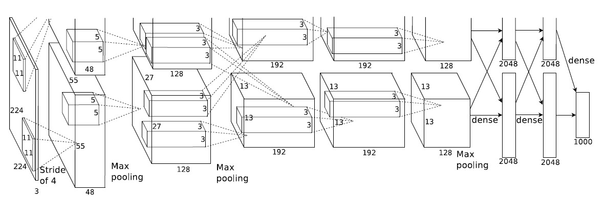
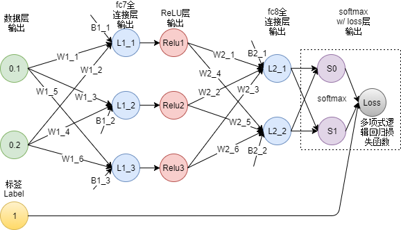

# AlexNet 调研

## 架构

简化版本:

|        算法        |           作用           |
| :----------------: | :----------------------: |
|   ReLU & 多个GPU   |       提高训练速度       |
|      重叠池化      | 提高精度、不易发生过拟合 |
|     局部归一化     |         提高精度         |
| 数据扩充 & Dropout |        减少过拟合        |

## 推导

$$
\begin{cases}
W(weight)=\begin{pmatrix}
w_{11} & w_{12} & \cdots w_{1n}\\
w_{21} & w_{22} & \cdots w_{2n}\\
\vdots && \vdots\\
w_{m1} & w_{m2} & \cdots w_{mn}\\
\end{pmatrix}\\[5ex]
x(input)=\begin{pmatrix}
x_1\\
x_2\\
\vdots\\
x_n
\end{pmatrix}
\end{cases}
$$

### 前向传播

$$
L = Wx + b
$$

### ReLU

$$
f(x) = max\{0, x\}
$$

### Softmax:

$$
f(x) = \frac{e^x_i}{\Sigma_{i = 1}^{n} e^x_i}
$$

### 逻辑回归损失函数:

$$
Loss = -\frac1N \sum_{i=1}^{n} ln(P_i|i = Lable)
$$

### output:

$$
\begin{cases}
S(softmax\ layer) = Softmax(W_2 \cdot (ReLU(W_1 \cdot x + b_1) + b_2) \\[2ex]
Loss = -ln(\frac{e^x_i}{\Sigma_{i=0}^{n}e^x_i}|i = Lable)
\end{cases}
$$

### 梯度下降：

$$
\begin{cases}
\nabla_S Loss = 
\begin{pmatrix}
\frac{\partial Loss}{\partial S0}\
\frac{\partial Loss}{\partial S1}
\end{pmatrix} \\[2em]

\nabla_{ReLU} L2 = 
\begin{pmatrix}
\frac{\partial L2_1}{\partial ReLU_1}\
\frac{\partial L2_1}{\partial ReLU_2}\
\frac{\partial L2_1}{\partial ReLU_3}\\
\frac{\partial L2_2}{\partial ReLU_1}\
\frac{\partial L2_2}{\partial ReLU_2}\
\frac{\partial L2_2}{\partial ReLU_3}
\end{pmatrix} \\[2em]

\end{cases}
$$

由链式法则：
$$
\frac{\partial Loss}{\partial LP_{ij}} = \frac{\partial Loss}{\partial L_i} \cdot \frac{\partial L_i}{\partial LP_{ij}}
$$

### 更新参数：

$$
LP_{ij}^{new} = LP_{ij} - \eta \cdot \frac{\partial Loss}{\partial LP_{ij}}
$$

其中 $\eta$ 为 学习率

## 实现细节

上述算法涉及到大量矩阵运算

欲在网卡上实现上述算法，将会面临困难，包括：

## Reference

ImageNet Classification with Deep Convolutional
Neural Networks