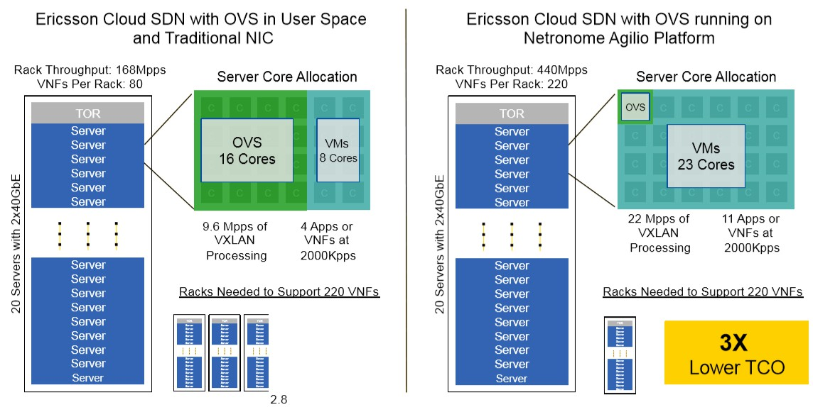

## 概要

> 一。区别于冯诺依曼架构 CPU 处理网络数据，数据流架构的网络处理有哪些理论，它的概念（如数据流架构如何处理数据，如何处理指令，如何并行等），它有哪些理论上的超越 CPU 处理网络的性能提升等级，它（如本实验使用网卡）为何能提高速度降低延迟等。
>
> 二。同时，当前使用数据流架构（如本实验使用的 SmartNIC 系列），诸如数据中心和云服务提供者，它们在此网卡的协作下将网络效果提高了多少。等等涉及 SmartNIC NFP 的性能表现，优化等级，延迟降低到什么级别，速度提高到什么等级，等等。

## 可行性报告

## 冯诺依曼结构的局限性

### 冯诺依曼瓶颈

当涉及到对大量数据进行简单操作时，CPU 性能难以得到充分发挥，这时出现了所谓的“冯诺依曼瓶颈”。和内存的存储总量相比，CPU 和存储器之间的吞吐量很有限，这源于程序存储和数据存储之间没有明确的界限，并且共享输入输出总线。因为单总线的结构使其一次只能访问这两种存储中的一个，所以当数据量远大于程序指令量时，处理速度会严重受限。而这种限制随着 CPU 处理速度的提升体现的更加明显[^1]。从本质上来说。冯诺依曼结构的局限是通用存储和总线导致的控制执行和数据存取上的串行性，整个处理过程受程序计数器引导，线性地读取下一条指令和数据，并以运算器为中心执行所有的计算操作。***（此总结局可去掉）***

### 提升并行性

一种解决上述问题的方法是使用并行计算。并行计算模型包括很多种，其中一种是基于冯氏结构的控制驱动模式，考虑使用并行控制，如流水线（多条指令内部重叠执行）和多核（同时执行多条指令）的方法，并行控制流计算机虽然摆脱了传统计算机单一控制流束缚，但它仍然存在两个缺点：1. 通常要依赖程序计数器来指明指令的执行过程、2. 通过访问一个共享的存储器在指令之间传送数据。

另一种观点，考虑到冯氏结构的天然局限性，直接使用非冯结构，重新组织功能部件以适应并行的需求。从上面的分析看出，串行性源于指令间由于其本身存储位置的连续性和使用到的数据的相互关联。我们希望摆脱用指令控制操作的局限，让数据一旦被准备好，计算就能及时执行，这是数据流结构的主要思想。

***此部分视篇幅是否足够可以决定是否进行缩略***

### 网络处理

对于网络数据处理，恰恰经常遇到大量、简单的处理工作，如果仍然依赖 CPU 的通用性，直接把工作交给 CPU 来做，性能势必会受到很大限制。于是考虑将工作转移到专用硬件（网卡）上，并且网卡不能再使用冯诺依曼结构，而要专门优化并行性。与冯氏结构完全不同，数据流结构在这方面可以得到应用。接下来具体分析数据流结构，以及它所带来的优势。

## 数据流结构

数据流的思想来源于这样一个概念：数据的价值随着时间的流逝而降低，所以事件出现后必须尽快地对它们进行处理，最好数据出现时便立刻对其进行处理，发生一个事件进行一次处理，而不是缓存起来成一批处理。在数据流模型中， 实现操作取决于数据的内部依赖性和资源的可利用性，它没有程序计数器，不会按照地址去寻找指令来执行，而是当一个操作需要的数据全部准备好后开始执行（称为点火 ，firing），并且输出的结果可以作为其他操作执行的前提条件。这样数据流计算模型中没有冯式结构中指令连续性的约束，可以更方便的使指令并行。另一方面，数据流计算模型中没有传统的变量这一概念，它仅处理数据值，忽略存放数据的容器（硬件层面是地址、软件层面指变量名）。基于这些特性，数据流结构计算模型拥有高实时性、低延迟的优点。

在这种模式下，我们使用数据流图来表示程序的逻辑执行过程。数据流图是有向偶图 。 它有两种不同的节点 , 分别称为链（link）和动作（actor）。由偶图性质可知 , 两个动作之间必有一链 , 两个链之间必有一动作。信息由记号（token）运载，指令的执行顺序由点火规则规定。下图是一个例子：[^2]

这种数据流图可以用数据流语言描述，并转化成代表链的一系列指令以存储在计算机中。也就是说计算机中存储的程序就是这种数据流图。数据流处理器本身用于识别其程序存储器中的哪些指令被启用，并且一旦资源可用，所有这些指令就被分派到执行单元。这种结构的控制不是聚焦在一个点上的，程序存储器中的任何两个指令可以同时执行，并且如果提供了足够的资源，则处理器可以同时执行程序中的所有并发操作。[^3]

***以上两段可以作为各组员的学习参考，不过可行性报告里可以视情况增减***

## SmartNIC 中的数据流结构

我们使用的智能网卡中的核心部分是型号为 NPF-4000 的网络流处理器，有别于为一些通用服务器提供的高性能处理，它可以用来提供高速的网络包处理。他拥有高度并行处理能力，并且有在纳秒级的上下文切换速度，下图是这款网络流处理器的微结构示意图：[^4]

***本部分和以下部分，整合为可行性报告时，注意和李喆昊的部分要交融起来***

### 流处理核心 (Flow Processing Cores - FPCs)

如上图所示，NFP-4000 有 60 个流处理核心，他们被分组成多个集群，并且分布在多个岛（Island）上，这些核心都是 32 位的定制核，并且每一个核能同时支持八个线程，使得这款处理器最多可以同时处理 480 个数据包。此外，每个流处理核心都连接了大量通用寄存器，并拥有访问专用指令和数据内存的权限，这使得他们可用来减少一些典型的输入输出指令、访问内存指令的延迟。高度并行的特点使得多个线程可以同时运行，从而减少内存延迟的影响。

此外，它提供了硬件加速器，可以将一些简单的工作从 FPC 中分散到其他功能部件中以缩短 FPC 的指令周期。可以被加速的功能包括数据包修饰、统计引擎、负载平衡和流量管理等。

最后，整个架构通过高性能分布式交换结构（Distributed Switching Fabric）连接，该结构在设备中的所有组件之间提供高带宽的网络状连接使得各部件间能有效协作。

### 性能

目前，智能网卡已经被应用到多个领域，如：数据中心中如分布式内存、网络虚拟化，网络包处理等占据 76% 工作量的任务可以使用智能网卡提升处理速度

显著提高 OVS（Open vSwitch - 开放虚拟交换）效率

爱立信云 SDN（一种网络虚拟化解决方案，可为基于虚拟，物理和容器的工作负载提供无缝的内部和数据中心间连接）的服务器吞吐量提升和成本减小：

## Reference

[^1]:[Von Neumann architecture](https://en.wikipedia.org/wiki/Von_Neumann_architecture#Design_limitations)
[^2]: 一种新的体系结构 — 数据流计算机， 中国科学技术大学 李国杰  

[^3]:Data Flow Computers, Ajinkya Gadkari, etc  

[^4]: NFP-4000 Theory of Operation,  Netronome

Increase Application Performance with SmartNICs,  Netronome