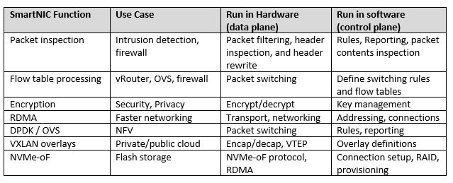
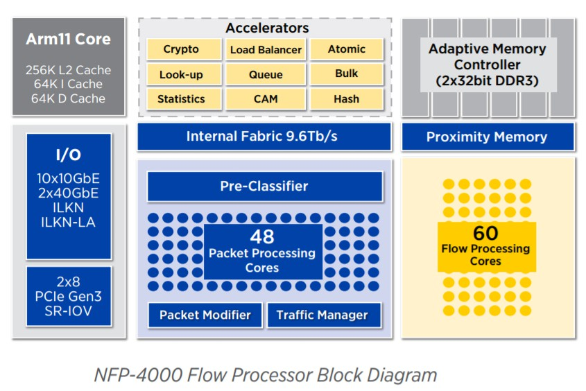
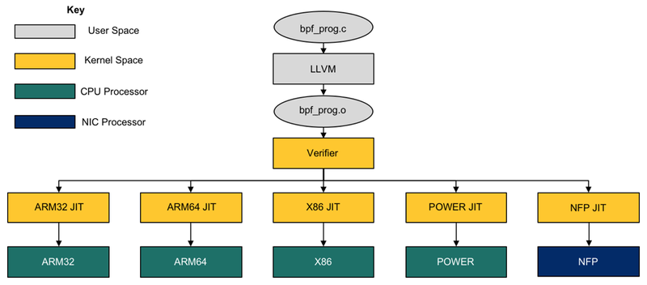

## 相关工作

###  数据流结构 Dataflow Architecture

#### 数据流计算机

区别于传统的冯诺依曼结构计算机或控制流计算机，数据流计算机 (Dataflow Architecture Computer) 是一种数据驱动方式系统结构的计算机，它在原理上不存在 PC 寄存器，只有当一条或一组指令所需的操作数全部准备好时，才能激发相应指令的一次执行，执行结果又流向等待这一数据的下一条或一组指令，以驱动该条或该组指令的执行。因此，程序中各条指令的执行顺序仅仅是由指令间的数据依赖关系决定的。虽然这种结构没有成功的应用在通用计算机上，但很多专用硬件使用这种结构获得了成功，这其中就包括网络路由、图像处理、数字信号处理等领域。[^1]

#### 优势

数据流计算机在许多方面的性能优于传统的冯·诺依曼型计算机，包括：

+ 高度并行运算

数据流方法本身就体现了操作的高度并行性。它不仅能开发程序中有规则的并行性，还能开发程序中任意的并行性。在数据流方法中，由于没有指令执行顺序的限制。从理论上来讲，只要硬件资源充分就能获得最大的并行性。已经通过程序验证，许多问题的加速倍数随处理机数目的增加而线性的增长。

+ 流水线异步操作

由于在指令中直接使用数值本身，而不是使用存放数值的地址，从而能实现无副作用的纯函数型程序设计方法，可以在过程级及指令级充分开发异步并行性，可以把实际串行的问题用简单的办法展开成并行问题计算。

+ 纯函数化操作

在数据流计算机中，没有变量的概念，也不设置状态，在指令间直接传送数据，操作数直接以“令牌”(token)或“数值”的记号传递而不是作为“地址”变量加以访问。因此操作结果不产生副作用，也不改变机器状态，从而具有纯函数的特点。

#### 潜在问题

+ 数据流机的主要目的是为了提高操作级并行的开发水平，但如果程序本身串行部分较多会使得效率反而比冯诺依曼结构更低
+ 在数据流机中为给数据建立、识别、处理标记，需要花费较多的辅助开销和较大的存储空间(可能比Neumann型的要大出2～3倍)，但如果不用标记则无法递归并会降低并行能力。
+ 数据流机不保存数组。在处理大型数组时，数据流机会因复制数组造成存储空间的大量浪费，增加额外数据传输开销。数据流机对标量运算有利，而对数组、递归及其他高级操作较难管理。
+ 数据流语言的变量代表数值而不是存储单元位置，使程序员无法控制存储分配。为有效回收不用的存储单元，编译程序的难度将增大。同时不易调试和维护程序

#### 研究进展

随着数据流机研制的深人开展，已提出若干新的数据流机器，它们既继承了传统计算机采用的并行处理技术，又弥补了经典数据流机的一些缺陷。

+ 提高并行度等级

由于经典的数据流机将数据流级的并行性放在指令级上，致使机器的操作开销大；现在将并行性级别提高到函数或复合函数一级上，用数据来直接驱动函数或复合函数，就可以较大地减少总的操作开销。1981年Motooka等人及1982年Gajks等人提出复合函数级驱动方式，在全操作循环、流水线循环、赋值语句、复合条件语句、数组向量运算及线性递归计算上采用复合函数级的并行。这样，就可以用传统高级语言来编写程序，只是需要研制专门的程序转换软件，实现将传统高级语言编制的程序转换成复合函数级的数据流程图，并生成相应的机器码。

+ 同步、异步结合

由于数据流机采用完全的异步操作，尤其是指令级的异步会造成系统操作开销的增大。所以，在指令级上适当采用同步操作，而在函数级及函数级之上采用异步操作，就可以减少机器的操作开销。指令级同步操作可以使中间结果不必存回存储器，直接被下一操作所用，指令中就不需要目标地址了，这样可缩短指令字长。指令级同步操作不需要回答信号，减少了系统的通信量，系统采用总线互连即可，简化了结构。虽然函数级并行异步的开销较大，例如取函数标题、取程序要多花费些时间，互连标题也还要多占用存储空间，但这些开销分摊到函数中的每条指令就少得多了。

+ 控制流与数据流相结合

控制流与数据流相结合，可以继承传统控制流计算机的优点。例如，Cedar数据流机就实现了函数级宏流水线，其指令级上仍采用控制流方式。[^2]

### 智能网卡 SmartNIC

#### 产生

现代的工作负载和数据中心设计给CPU核心带来了太多的网络开销。随着更快的网络速度(每个链接可高达200Gb/s)， CPU花费了太多开销对网络流量进行分类、跟踪和控制。这些昂贵的CPU内核是为通用应用程序处理而设计的，而不是消耗所有这些处理能力仅用来查看和管理数据的移动。

智能网卡（SmartNIC）应运而生，它可以将本应由CPU处理的工作转移到网卡上执行，减少CUP工作量的同时提高性能，其核心是通过FPGA(现场可编程门阵列)协助CPU处理网络负载，编程网络接口功能，具有以下特征：

* 通过FPGA本地化编程支持数据面和控制面功能定制，协助CPU处理网络负载；

* 通常包含多个端口和内部交换机，快速转发数据并基于网络数据包、应用程序套接字等智能映射到到相关应用程序；

* 检测和管理网络流量。

过去30年来，网卡已经从具有单一MAC，PHY和系统接口的简单网卡发展到具有一个，两个或更多网络接口和用于TCP/IP的硬件卸载引擎的高性能适配器、虚拟化等功能。最新的NIC基于支持10Gbit/s，25Gbit/s，50Gbit/s或100Gbit/s网络接口的输入/输出(I/O)控制器。Smart NIC将FPGA、处理器或基于处理器的智能I/O控制器与分组处理和虚拟化加速集成在一起。大多数Smart NIC可以使用标准的FPGA或处理器开发工具进行编程，越来越多的厂商也开始增加了对eBPF以及可编程语言P4的支持。

目前业界提供基于FPGA的Smart NIC的厂商包括Accolade、BittWare、Enyx、Ethernity、Napatech、Netcope、Reflex CES、Silicom和Solarflare。这些适配器集成了来自Intel或Xilinx的FPGA，其中一些采用了最新的Stratix 10和UltraScale + FPGA的FPGA。基本的I/O控制器功能是使用FPGA实现的，或者由单独的I/O控制器进行处理。Broadcom，Cavium，Intel，Kalray，Mellanox，**Netronome**，Silicom和SolidRun均可提供基于处理器的Smart NIC。Smart NIC使用带有集成处理器内核或可编程交换的处理器或智能I/O处理器，亚马逊和谷歌已经开发了自己的Smart NIC ASIC。

#### 应用场景

+ 安全隔离

出于安全性考虑，有时需要将网络与 CPU 相隔离，通常黑客攻击和恶意软件来源于网络。使用智能网卡便可以在网卡上检查网络流量、阻止攻击和进行加密传输，从而带来了性能和安全性的提升。如果主CPU受到威胁，那么智能网卡仍然可以检测恶意活动，在不立即占用CPU的情况下阻止攻击。

+ 存储虚拟化和云

智能网卡的一个较新的用例是虚拟化软件定义的存储，超融合基础架构和其他云资源。在超融合架构数据中心中，Smart NIC为虚拟化应用程序提供硬件加速与网络接口紧密结合，并可分布在大型服务器网络中，减小CPU负载，提供额外的边缘计算能力，加速特定应用和虚拟化功能，并且通过正确的语言和工具链支持，为用户提供应用加速即服务的附加价值。智能网卡甚至可以虚拟化GPU（或一些神经网络处理器），以便任何服务均可通过网络访问[^3]

一个好的智能网卡必须是可编程的。虽然为了获得最佳性能，大多数加速功能必须在硬件中运行，但为了获得最大的灵活性，这些功能的控制和编程需要在软件中运行。

有许多功能可以在智能网卡上编程，通常，特定的卸载（offload）方法，加密算法和传输机制不会发生太大变化，但路由规则，加密密钥和网络地址始终会发生变化。我们将前者的功能视为数据面，后者则用作控制面功能。一旦建立标准化，数据面规则和算法就可以编写到硬件上了。然而控制面规则和编程变化多样，无法硬编码到芯片中，但可以在FPGA上运行或在C可编程的Linux环境中运行。

#### Agilio SmartNIC

我们计划使用 **Agilio CX SmartNIC 2x10GbE**[^4] 这款智能网卡来实现 eBPF offload 的**相关功能**。

> Censyu： 补充下相关功能具体是什么。。。​:sweat_smile:

其核心部件为**NFP (Network Flow Processor)**，它是一个多线程多核的网络流处理器，相关参数如下[^5]：

它拥有60个流处理核可以支持我们使用 BPF/eBPF offload，具体流程如下图所示：

### BPF 衍生应用

BPF（Berkeley Packet Filter）这一概念提出于1992年，最初是一种过滤数据包并避免从内核到用户空间的无用数据包副本的方法。后来在2013年 Alexei Starovoitov 彻底重塑了它，开始添加新的功能（如映射、尾调用等）并改善 BPF 的性能。这个新版本被称为 **eBPF**（extended BPF），而前者则变为cBPF（classic BPF）。同时 JIT（Just-In-Time） compiling machine 也被重写，使得eBPF甚至比cBPF更贴近本地机器语言。eBPF后来被应用在网络编程中。除了套接字过滤器，eBPF程序还可以附加到TC（Linux Traffic Control Tool）的出入接口，并以有效的方式执行各种数据包处理任务。[^6]

#### eBPF

eBPF(extended Berkeley Packet Filter)，自2014年引入Linux内核以来，已经迅速被许多系统所采用，包括网络监控、网络流量操作和系统监控等，所有这些都可以通过Agilio CX SmartNIC编程和卸载方法来加速。

eBPF以多种方式扩展了经典的BPF虚拟机，引入了以下概念：

+ 与x86-64类似的架构：BPF使用64位寄存器，并将可用寄存器的数量从2（累加器和 X 寄存器）增加到10。 eBPF还扩展了操作码的数量。
+ 与网络子系统分离： BPF受限于基于数据包的数据模型。由于它用于包过滤，因此其代码存在于网络子系统中。但是，eBPF VM不再受限于数据模型，它可以用于任何目的。现在可以将eBPF程序附加到跟踪点或 kprobe 中。这为eBPF打开了插桩（Instrumentation），性能分析以及其他内核子系统中的更多用途的大门。
+ 全局数据存储（Map）：Map是一种通用数据结构，以键值对的形式存储不同类型的数据。它们允许在eBPF内核程序之间以及内核和用户空间应用程序之间共享数据。
+ 辅助函数（Helper functions）：如数据包重写，校验和计算或数据包克隆。与用户空间编程不同，这些函数在内核中执行。此外，还可以从eBPF程序执行系统调用。
+ 尾调用（Tail-calls）：eBPF程序限制为4096字节。尾调功能允许eBPF程序通过控制新的eBPF程序，克服此限制。[^7]

#### Hardware Offload

see more in [P4, eBPF and Linux TC offload](https://open-nfp.org/the-classroom/p4-ebpf-and-linux-tc-offload/)

### References

[^1]:	[Dataflow Architecture - Wikipedia](https://en.wikipedia.org/wiki/Dataflow_architecture)
[^2]:	[数据流计算机 - 百度百科](https://baike.baidu.com/item/%E6%95%B0%E6%8D%AE%E6%B5%81%E8%AE%A1%E7%AE%97%E6%9C%BA#6)  

[^3]:	[Why You Need a SmartNIC and Smart NIC Use Cases](http://www.mellanox.com/blog/2018/09/why-you-need-smart-nic-use-cases/) 

[^4]:	[Agilio CX SmartNIC 2x10GbE](https://www.netronome.com/products/agilio-cx/)

[^5]:[Netronome NFP-4000 Flow Processor](https://www.netronome.com/media/documents/PB_NFP-4000.pdf)
[^6]:	[Dive into BPF: a list of reading material](https://qmonnet.github.io/whirl-offload/2016/09/01/dive-into-bpf)
[^7]:	[A brief introduction to XDP and eBPF](https://blogs.igalia.com/dpino/2019/01/07/introduction-to-xdp-and-ebpf/)

ex. [What Makes a NIC a SmartNIC, and Why is it Needed?](https://www.netronome.com/blog/what-makes-a-nic-a-smartnic-and-why-is-it-needed/)