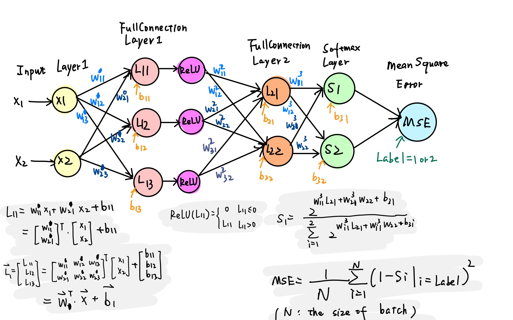
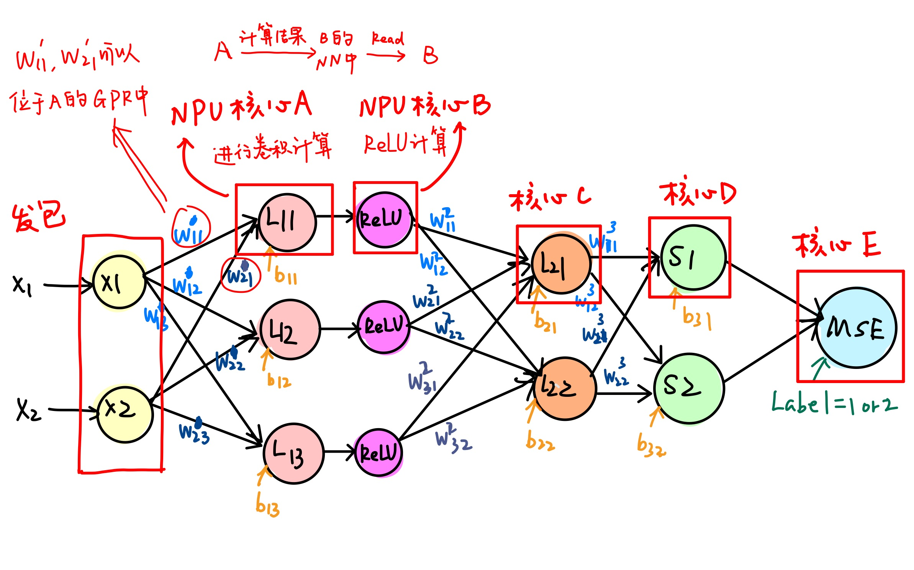
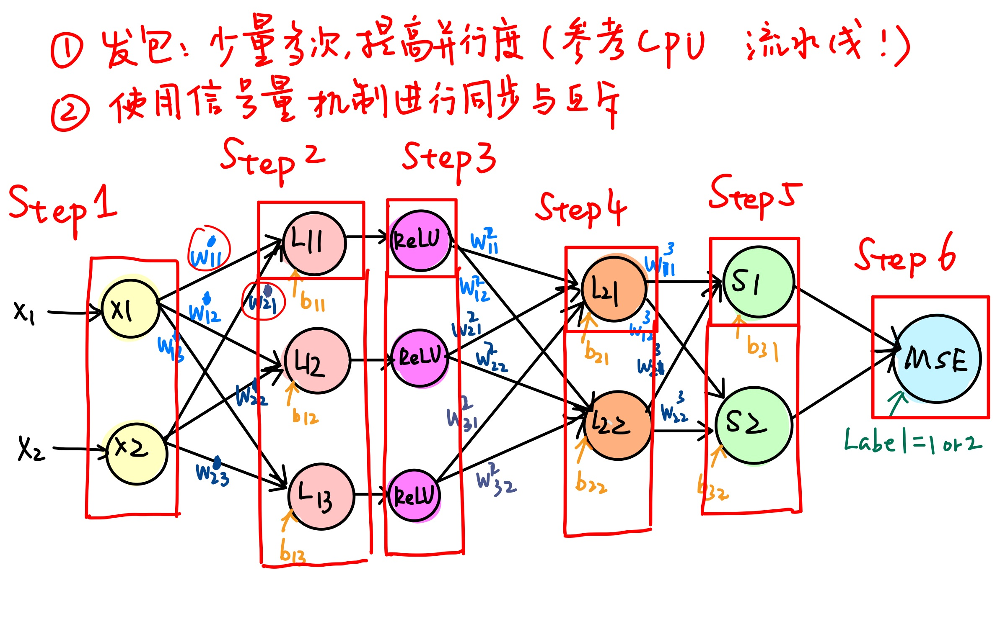

# AlexNet Hardware Offload 调研

## 回顾：最终报告中提出的Hardware Offload思路

- Agilio SmartNIC 上有很多相对独立的流处理核心，可以给每个核心**分配不同的计算任务**，使其充当上述神经网络中某一个节点或者计算对应的梯度，并且给两个隐藏层分配一定的**存储空间**来储存权重矩阵和偏置参数以及中间数据。此外还应有**整体控制模块**，用来发出信号，控制每个核心的工作顺序。

  计算节点在接收到信号后开始从固定位置获取信息，并完成该节点的计算任务，然后在合适的时间存储，以供下一层节点使用。

  整个迭代过程分为输入数据，前向传播，计算梯度，更新参数。其中后面三个阶段均会涉及到多个处理核心之间的通信，以及核与存储之间大量数据读写。

  ---

  **抽取出几个关键点具体分析**

  + 数据（参数）存储及共享数据的同步与互斥问题
  + 矩阵运算
  + 核心之间通信

## 1. 数据存储与共享

1. **数据存储（根据网卡C语言编程指南：UG_nfp6000_nfcc.pdf P37始)**
   
   Netronome Network Flow Processor 6xxx 提供的数据存储位置有：
   
   a. 寄存器
   
   + 寄存器分类：
   
     通用寄存器General Purpose Register: GPR
   
     传输寄存器Transfer Registers: XFR
   
     邻居寄存器Next Neighbor Register: NN
   
     不定寄存器Volatile Register
   
     
   
   + 每一个NFP 支持256个通用寄存器，这些寄存器被划分成两个banks: A&B，这里需要注意的是每个指令周期内只能读取一个bank中的一个寄存器，如二元运算`` w=r1+r2 ``, 若r1与r2在同一个bank，编译器会在编译时隐性增加数据转移指令将其中一个数据先移到不同bank。
   
     每个NFP还支持512个传输寄存器（其中256个 Transfer_In registers for I/O, 256个 Transfer_Out registers for I/O ）
   
     并且每个NFP有128个邻居寄存器（NN）。**NN可以用于两个相邻NFP核心之间的通信。是我们需要重点关注的。**
   
     NN有两种工作模式，可以对CTX_ENABLE CSR的NN_MODE位进行修改。
   
     当NN_MODE=0时，核心A不能向自己的NN中写数据而只能读，但可以向相邻的核心B的NN中写数据。
   
     NN_MODE=1时，核心A只能读写自己的NN。
   
     
   
   + 寄存器寻址模式：relative与absolute两种。
   
     
   
   b. Memory
   
   + Memory分类：
   
     核心内部：
   
     ​	Local Memory	
   
     外部：
   
     ​	SRAM（为了向后兼容而留下）
   
     ​	MEM（包含IMEM，EMEM和CTM）
   
     ​	Cluster Local scratch（CLS）
   
   + 每个NPU都有一个私有的Local Memory，大小是1024 longwords。
   
   + 需要注意的是，寄存器与Momory数据交换时需要使用传输寄存器（XFR）
   
     XFR有read XFR（作为Memory source），write XFR（作为Memory destination）*（P45）*
   
   + 需要注意的是，C代码中涉及对内存数据的读写时，编译器会自动保证数据的同步性。*（P44）*
   
     
   
   编程者可以使用``__deslspecs ``语句，指定程序中数据的存储位置，
   
   
   
2. **核心之间数据共享与同步（根据网卡C语言编程指南：UG_nfp6000_nfcc.pdf P)**

   我们知道，多个计算核心之间需要进行通信，比如下图中：$L_{11}$节点与ReLU节点需要通信

   
   
   设计如下图：
   
   通信参考：
   
   1. Next Neighbor Register 
   2. 一种名叫Reflector的运算*（UG_nfp6000_nfcc.pdf P46）*
   
   
   
   分析后发现：
   
   $( w_{11}^{1}，w^1_{21},b11)$这三个参数可以存储在核心A（$L_{11}节点$）的GPR中。因为这三个参数并未被其他节点所使用。
   
   但还有一个核心计算先后顺序的问题。如下图，
   
   信号量机制参考：
   
   1. Signals*（UG_nfp6000_nfcc.pdf P46）*
   2. Semaphore Library *(UG_nfp6000_nfcc.pdf )*
   
   

## 2. 矩阵运算

1. **参数表示与乘法（RM_nfp6000_microclib.pdf  P690始）**

   参数左移$2^{7}=128$，

   例：

   $(0000 0100 1000 1011)_{2}=(1163)_{10}$对应的参数值为$w= 1163/128=9.086$

   $(0000 0000 1000 1000)_{2}=(136)_{10}$对应的参数值为$b= 136/128=1.0625$

   若为图像识别，输入数据为像素值 $x\in [0,255]$ 可以用16位存储。

   $(0000 0000 11111111)_{2}=(255)_{10}$对应的输入数据值为$x=255$

   

   根据micro C lib文档，可以使用如下intrinsic function在Netronome Network Flow Processor 6xxx 实现 16b*16b 的乘法运算

   ```c
   unsigned int multiply_16x16(unsigned int x, unsigned int y)
   ```

   也可以实现 32b*32b的乘法运算

   ```c
   //取低32b
   unsigned int multiply_32x32_lo(unsigned int x, unsigned int y)
   
   //取高32b
   unsigned int multiply_32x32_hi(unsigned int x, unsigned int y)
   ```

   例：
   $$
   y_1=w_1\times x_1+b_1\\
   y_2=ReLU(y_1)
   $$

   ```c
   __declspec(gp_reg) unsigned int y1,y2,w1,b1;
   
   y1= multiply_16x16(w1,x1)+b1;
   
   y2=(y1>0)?y1:0;
   ```
   
   PS： 有函数可以计算$log_2x$,可以用于损失函数：对数似然

## 3. 核心间通信与各核心工作的协调

1. 可以参考管程或有限状态机设置一个顶层计算核心，专门负责接收各个核心工作完成signal，进行核心的协调。

## 最后：答辩时可能会被提问的问题

1. 为啥没写AlexNet代码？
   + 时间不够，已经有编程手册和IDE。
2. 待续（待开脑洞想各种可能会被怼的地方）