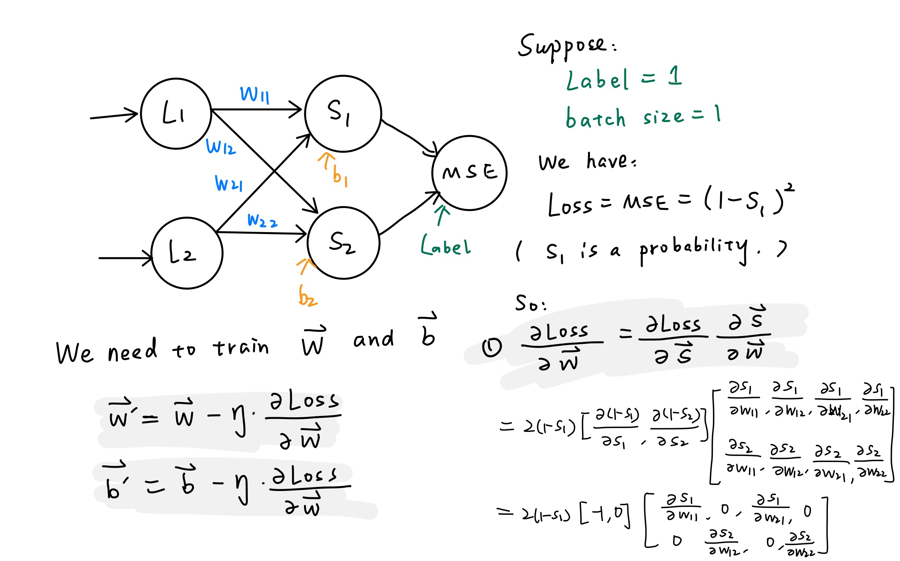
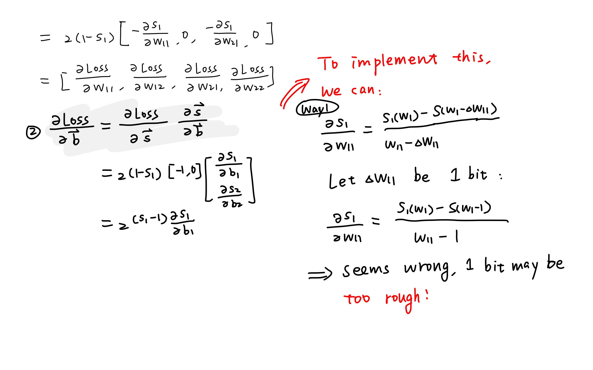
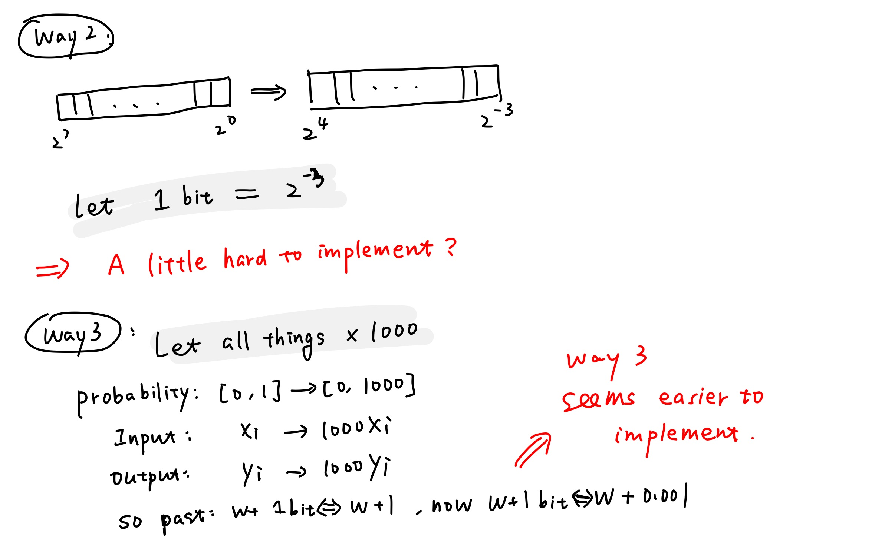

# AlexNet 技术报告

## 一. 回顾：技术上遇到的难题

  1. 硬件层面难题
	    1. 矩阵运算
	    	+ 需要使用网卡自带矩阵计算功能部件，目前无进展
	    2. 网卡Memory的使用
    		 + 无进展
	    3. 网卡多核心任务的分配与协调
    		 + 无进展
 2. 算法层面难题
 	1. 针对我们计划实现的简单的多层神经网络，反向传播算法如何利用差分设计
		+ 有一定进展，见二
	2. Softmax层设计
		+ 解决，见二

## 二. 反向传播算法的差分实现
1. 首先看一下一个简单神经网络（没有卷积层与池化层的最简单神经网络，加了卷积层与池化层后原理相同，我主要想说明softmax和MSE的问题）的例子，推导一下训练公式。网络结构与公式如下图。

抽出两层具体看一下梯度下降公式。

Way2与Way3是比较有可行性的。代码待补充。

## 三. 参考文献

1.  非常好的介绍反向传播算法推导过程的文章，还介绍了对卷积运算梯度的求解： <https://software.intel.com/zh-cn/articles/step-by-step-explaination-on-neural-network-backward-propagation-process>
2. Softmax ：<https://developers.google.com/machine-learning/crash-course/multi-class-neural-networks/softmax>

