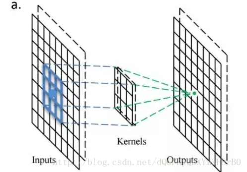
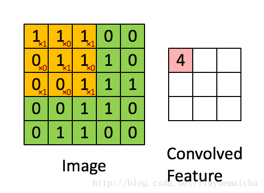
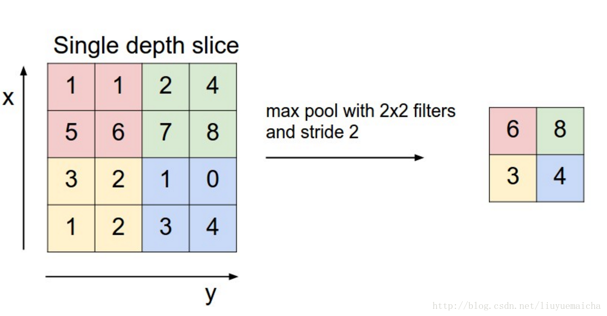

# AlexNet 调研报告

## 1. 原理 

AlexNet属于深层卷积神经网络(CNN), 2015年在ImageNet图像识别挑战赛中大放异彩，具有里程碑意义。其结构如下：


由于参数太多训练非常耗时，使用两个GPU分两路进行训练。

#### 结构：

 输入$\rightarrow$ 卷积层1 $\rightarrow^{ReLU}$ 池化层1 $\rightarrow$ 卷积层2 池化$\rightarrow^{ReLU}$ 层2$\rightarrow$卷积层3,4,5$\rightarrow$ 池化层3$\rightarrow^{ReLU}$  全连接层1,2$\rightarrow^{SoftMax}$ 输出

#### 数据：

输入图像224 x 224 x 3 (RGB) $\rightarrow$ 卷积核大小11x11，步长是 4 $\rightarrow$ 得到 55x55 大小的特征矩阵，经ReLU激活 $\rightarrow$ 最大池化，得27x27大小矩阵  $\rightarrow$  卷积...

#### 数学原理

1. 卷积：





2.池化：



3.误差反向传播算法（BP算法）：
$$
W^{'}= W-\eta*\frac {\partial Loss_{total}} {\partial W}
$$
大白话讲解BP算法<https://blog.csdn.net/zhaomengszu/article/details/77834845>


4.Softmax函数：归一化指数函数
$$
Softmax(x_i)=\frac {e^{x_i}} {\Sigma_{j=0}^n e^{x_j}} \in [0,1]
$$


5.ReLU: 激活函数
$$
ReLU(x)=max(x,0)
$$
6.全连接层

什么是全连接层<https://zhuanlan.zhihu.com/p/33841176>

---

## 2. AlexNet不可行点

+  真正的AlexNet有7层，650K个神经元，60M个参数，630M次连接，复现极为复杂，更何况我们基本上要从头造轮子，时间绝对不允许

+ AlexNet训练过程中为了防止过拟合使用了诸如Dropout这样的trick，这个实现起来比较麻烦

+ 涉及大量矩阵运算，不知道网卡对这个支持怎么样，栈很可能爆炸

+ 输出时使用非线性函数如Softmax，对于不支持浮点数的ebpf来说实现起来比较麻烦

+ 最大的问题可能还是参数的训练，一般的训练方法是使用基于梯度下降误差反向传播算法（BP算法），涉及到求偏导，这个除非我们提前求好式子，把其写在程序里面，否则难以实现。

  

  **总之，真正的AlexNet肯定是做不了的，能做出一个简单的卷积神经网络就不错了。**

---

## 3. 可行性

要复现真正的AlexNet难度太大了，但是也许可以做个简单的卷积神经网络跑跑MNIST手写数字识别。

从最简单的一个开始：

输入$\rightarrow$  卷积层1 $\rightarrow^{ReLU }$ 池化层1 $\rightarrow$ 全连接层1 $\rightarrow^{Softmax}$ 输出

```c
//输入：8x8(每个像素点0-255,__u8)(只有一层的灰度图)
//  __u8 image[8][8];
//卷积核，大小暂定5*5
//  __u8 filter[5][5]= random_initial(); //随机初始化

//卷积：
__u8 ** Convolution(__u8 *image[],__u8 *filter[]){
    //卷积核 大小5x5，步长1，这样卷积出来的结果是一个4x4的矩阵
    //卷积核中25个参数是要训练得到的
        __u8 conv_result[4][4]
    for(int i=0;i<16){ //卷积核移动 
        //矩阵乘法
        for(int j=0;j<5;j++){
            for(int k=0;k<5;k++){
                result[i/4][i%4]+=filter[j][k]*image[i/4+k][i%4+j];
            }
        }
    }
	return conv_result；
}
//ReLU 激活函数
__u8** ReLU(__u8 *x[],int n){
    __u8 result[n][n];
    for(int i=0;i<n;i++){
        for(int j=0;j<n;j++){
            result[i][j]=(x[i][j]>0)？x[i][j]:0;
        }
    }
    return result;
}

//池化：AlexNet中采用最大值池化
//卷积的结果是一个4x4的矩阵，池化后变成2x2的
__u8 ** Pooling(__u8 *conv_result[]){
    __u8 pool_result[2][2];
    for(int i=0;i<2;i++){
        for(int j=0;j<2;j++){
            pool_result[i][j]=max(
            conv_result[2*i][2*j],
            conv_result[2*i+1][2*j],
            conv_result[2*i][2*j+1],
            conv_result[2*i+1][2*j+1]);
        }
    }
    return pool_result;
}

//全连接层, 返回值是一维数组
__u8 *FullConnectLayer(__u8 *pool_result[],__u8 FCL_filter0* []，__u8 FCL_filter2* []，...，__u8 FCL_filter9* []，){
    //全连接层应该有10个神经元：对应数字识别
    __u8 neuron[10];
    for(i=0;i<10;i++){
	   Neuron[i]=**Convolution(pool_result,FCL_filter{i})；
    }
    return neuron;
}

//Softmax层，输出0-9的识别概率
int *Softmax(__u8 neuron[]){
    int probability[10];
    int sum=0;
    for(int i=0;i<10;i++){
        sum+=exp(neuron[i]);
    }
    for(int i=0;i<10;i++){
        probability[i]=exp(neuron[i])/sum;
    }
    return probability;
}
//选出概率最大的作为预测结果
int Argmax(int x[],int n){
    int max=0,arg;
    for(int i=0;i<n;i++){
        if(x[i]>max){max=x[i];arg=i;}
    }
    return arg;
}

int main(){
    //一张图片
    __u8 image[8][8]; 
    
    /* input image */
    //偏置，是需要的参数
    __u8 Bias[4][4]; 
    //学习率，超参数，人为设定，比如说0.4
    const __u8 eta=0.4;  
    //卷积核初始化，可以全赋值为1
    __u8 filter[5][5]= random_initial();
    __u8 FCL_filter1,...9[2][2]= random_initial();
    
    //若对数字识别：result=0,1,2,...,9
    //搭建神经网络：
    int result=Argmax(
        Softmax(
        FullConnectLayer(
        Pooling(ReLU(Convolution(image,filter)+Bias,4))
    	FCL_filter1,FCL_filter2,FCL_filter3,FCL_filter4))
        );
    
    /*训练：进行验证，误差反向传播，使用BP算法训练参数 
      （这里可能很难实现，看需求，需要进一步调研）*/
    
    //误差可以采用均方误差（交叉熵要用log，算了）
    //每训练一组（batch），一组n张图，计算一次loss，然后用BP算法调参
    double loss=(求和(result-true_value)*(result-true_value))/n
       
    //BP 算法，我们得事先把偏导式子都算好
    //这里要调的参有：卷积核5x5=25 + Bias4x4=16 + FCL卷积核 10x2x2=40 =81个参数
    wi-=eta*(A*wi+B*wj+C*wk+...);  
    
    printf("Pridiction is %d",result);
}
```

---

## 3. 参考文献

1. 什么是全连接层<https://zhuanlan.zhihu.com/p/33841176>
2.  维基百科