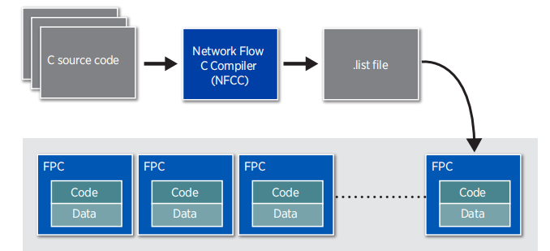
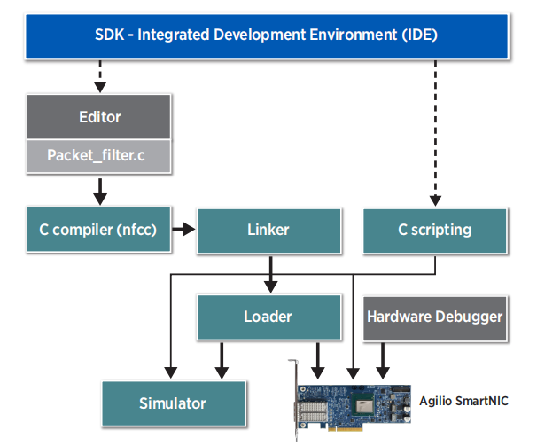

### 负责内容

------

- 当前 eBPF 从 C / P4 高级语言编写到生成 eBPF 字节码的整个过程，各个步骤的可以展开的细节（cLang 做了什么，LLVM 做了什么等等），一步步往下的图解，到硬件卸载翻译成硬件的指令（包括本地CPU 和 SmartNIC ）之前经过 JIT ，JIT 是什么（一些概念和解读细节等）。
- 本实验使用 SmartNIC 对 eBPF offload 的支持，所提供的工具链，添加一些能查到总结到的资料扩展一些细节等等。

------

#### => 本报告 focus on 我们能用哪些工具，这些工具与我们目标之间的关系，突出“可行性”。

------

### 1. Why we need to programme the NFP

------

- 为了实现用户定制化的数据处理功能
- 为了充分利用Agilio SmartNIC性能，提高数据处理速度

### 2. Programming the NFP with C

------

- ***C语言的高效性***：

  ​     使用C语言对Agilio SmartNIC进行编程是效率最高的一种方式，因为使用C语言可以充分利用Agilio SmartNIC 架构中一些特殊的数据结构。

- 使用C语言对数据流处理器进行编程的流程图如下：

- ***NFCC***:  
  - Network Flow C Compiler，是一个经过优化的、适配数据流架构的C编译器。
  - NFCC 为C语言提供了一些扩展语法（“extensions”），这些扩展大部分通过给C代码加上特定注释实现。

- ***FPC***：

  - NFP由多个数据流处理核心（FPCs: Flow Processing Cores）组成，而每一个数据流处理核心都是标准化的、基于RISC架构、可被编程的多线程计算核心。NFP与通用CPU的区别是：为了加速包处理，NFP中的FPC都与一系列外部功能单元相连接以实现特定的功能。

  - 每个FPC上可以运行8个线程，这些线程共享一个内部ALU，每时每刻只能有一个线程处于运转状态。
  - FPC中的线程调度是非抢占性的，各线程协同工作的方式很简单：必须在上一个线程释放它对FPC的控制后，下一个线程才会运行。这种非抢占式的简单调度方式简化了FPC内部的线程同步问题。

- ***流程***：

  - 用户编写的c程序首先通过NFCC被编译与链接成一个.list file，每一个.list file都代表着一个完整的程序。
  - 然后这些.list file会被下载到一些指定的FPCs上。

- 使用SDK(Software Development Kit)-IDE的完整开发流程：

------

#### 参考资料：

1. 

