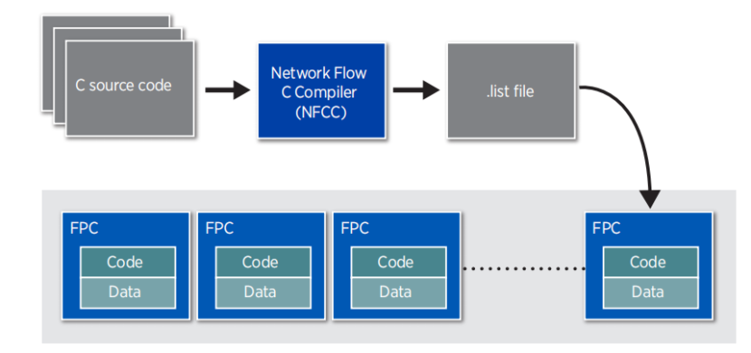
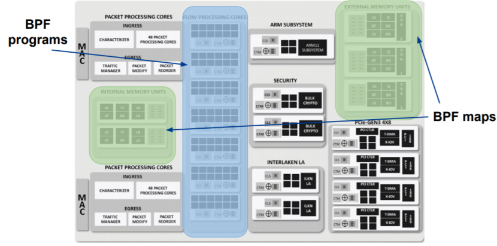
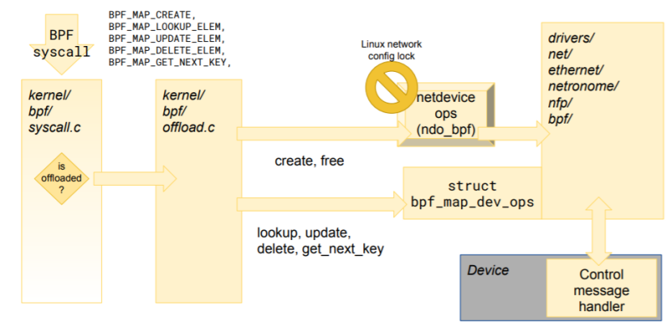
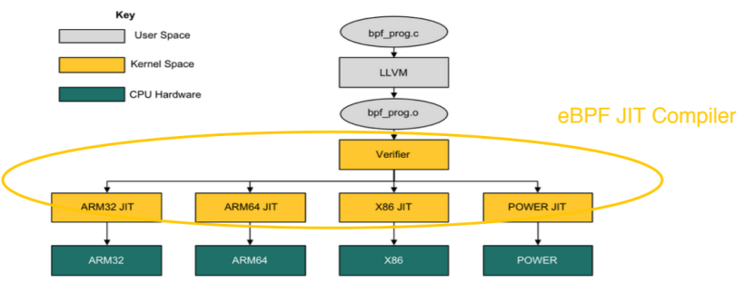
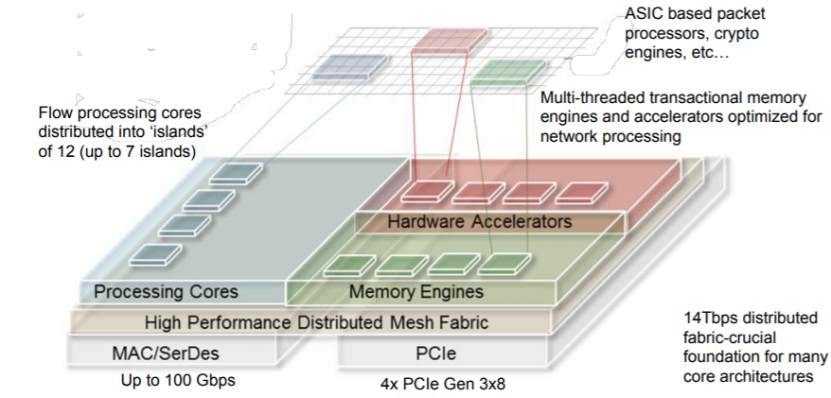
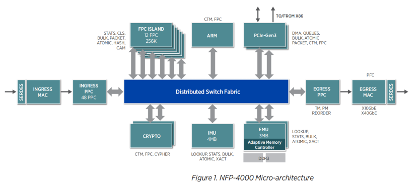
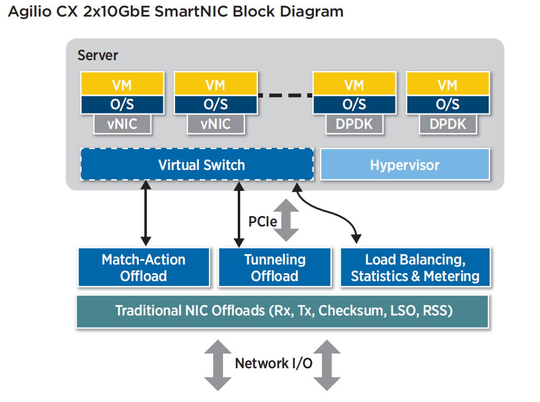

### 负责内容

------

- 当前 eBPF 从 C / P4 高级语言编写到生成 eBPF 字节码的整个过程，各个步骤的可以展开的细节（cLang 做了什么，LLVM 做了什么等等），一步步往下的图解，到硬件卸载翻译成硬件的指令（包括本地CPU 和 SmartNIC ）之前经过 JIT ，JIT 是什么（一些概念和解读细节等）。
- 本实验使用 SmartNIC 对 eBPF offload 的支持，所提供的工具链，添加一些能查到总结到的资料扩展一些细节等等。

------

# SmartNIC对eBPF硬件卸载的充分支持

我们将要使用的SmartNIC已经对eBPF的硬件卸载从硬件到软件做了充分的支持。***你不觉得这句话把标题又说了一遍？***

## SmartNIC 上 ebpf hardware offload 流程

1. 编写程序并获得eBPF字节码：将写好的C语言程序通过eBPF的clang与LLVM后端将C程序编译成eBPF字节码(Bytecode)，得到elf文件。

2. 加载入内核：然后通过调用bpf() 系统调用将程序加载到内核中。当程序要被硬件卸载时，我们需要向系统调用传递一个额外的接口索引，以指示将要卸载的设备。

3. 验证安全性（Verify）：因为eBPF 的代码是跑在内核空间中的，为了保障内核的正常工作，该程序在内核中将会被Verifier验证，确保这个程序一定会终止，不会出现死循环，并且没有任何其他安全问题，

4. 使用JIT将eBPF字节码编译成本机指令

5. 硬件卸载（offload）： 包含maps offload 和program offload。

   ------

   ***下面对SmartNIC是怎样支持流程中的每个环节进行展开.***

   

## 1.SmartNIC 对编程、调试工具链的支持

1. Netronome 提供了bpftool，这是一个重要的调试bpf程序、监视maps内容的工具。能让我们更好地开发bpf程序并卸载到SmartNIC上。

   其具有方便用户检查maps中数据结构内容、易于安装***（***、目前仍在不断更新改进***）******（这算优点嘛？？？）***等优点。

​      2. [Netronome的Agilio eBPF支持网站](https://help.netronome.com/)还提供了在 CX SmartNIC（即我们使用的型号）上运行卸载的BPF程序所需的 Agilio BPF 固件等。***（帮助文档的事就别提了）***

3. Netronome 提供了完备的工具链：Software Development Kit（SDK）
   它包含编译器，连接器以及能够精确到到指令周期时间的模拟器（cycle accurate simulator），并将它们集成到了一个综合的开发环境中。SDK 在 Window 平台上有图形化开发环境，在 Linux 平台上可以通过命令行使用。使用 SDK ，我们可以直接使用 C 语言直接对 SmartNIC 进行编程。

​     上图中，我们可以使用 Network Flow C Compiler，这是是一个经过优化的、适配数据流架构的 C 编译器，并为 C 语言提供了一些扩展语法（extensions）。

​     使用 SDK（Software Development Kit）IDE 的完整开发流程：

## 2. SmartNIC 硬件架构对 maps offload 的支持：

***BPF maps***：

eBPF maps的功能是：在不同的ebpf程序之间、bpf程序与内核程序之间、bpf程序与用户程序之间共享数据，还可以用于记录bpf程序的状态。maps可以理解成是各种程序之间实现通信的一种十分重要的方法。

maps就是一个键值对，它的数据结构是任意的。常用的两种是哈希表maps和数组maps。

maps只能由用户空间中的程序通过bpf系统调用来创建，一个用户程序能够创造多个maps，并通过file descriptors去访问它们的内容。用户程序与ebpf程序都能够更改储存在maps中的内容，而且不同的ebpf程序能够并行访问同一个maps。

------

为了保持ebpf在offload之后仍能有优秀的实时处理性能，maps可以同样offload到SmartNIC上。

并且maps在offload之后仍然可以被host程序访问，SmartNIC对ebpf maps offload的支持体现在以下几点：

1. 用户程序可以在用户空间读取maps内容，用于调试或者收集数据等
2. 用户程序可以在用户空间修改maps中存储的数据，比如设置ebpf程序在运行时要使用的参数，如需要阻塞的ip地址的列表等。
3. 硬件卸载后的ebpf程序可以读取maps中的值，比如说需要从中读取一些必要参数等（table lookups）
4. 硬件卸载后的ebpf程序可以修改maps中的值。因为这涉及到ebpf程序之间的同步问题，一般情况下需要引入锁，为了提高并发性，SmartNIC提供了一种特别的“写入”原子操作，更快而且更有用。

目前SmartNIC已经支持最常用的数组maps和哈希maps，可以说maps offload的功能已经很齐全并且高效。

下图：Map Offload

## 3. SmartNIC 架构对 bpf helper function 的支持

***helper function***：

cbpf和ebpf的区别之一就是ebpf程序可以在运行中调用helper functions而cbpf没有这种机制。

bpf helper function 是一类在内核中定义好的函数，bpf程序可以实时调用它们。这些helper functions可以理解成接口，为ebpf程序与内核交互、与它们工作的上下文交互提供了方便。例如，helpers可用于打印调试消息、获取系统时间、与eBPF maps交互、操纵网络数据包等。

------

SmartNIC当然也对helpers提供了必要的支持，并且提供了device-spcific的helpers实现。卸载后的bpf程序可以通过特殊的maps与这些helpers 交互，提高数据处理的效率。

## 4. Netronome 对 eBPF JIT 编译器的优化：

   最新发布的 eBPF JIT compiler 已经可以支持间接逻辑移位与间接算术移位指令等少数在过去不能被编译的 bpf 指令，同时 JIT 还可以检查一段指令序列中是否存在可以优化的部分，从而将原指令转化成另一端在机器执行中性能更好的指令。目前 JIT 仍在不断改进，有望在未来实现对以下功能更好的支持：

- 能够减少最终程序中的指令数量，以获得更好的性能或支持更高的指令总数。
- 能够通过支持在硬件上执行速度更快的指令来提升程序性能。
- 能够优化资源使用，例如在堆栈中使用的内存。

## 使用SmartNIC与NFP实现纳秒级相应时间的可行性

上图: SoC Architecture-Conceptual Components

1. 在传统通用服务器处理器上提升性能的方法已不再适用于现代高速网络包处理。数据中心的网络包处理需要纳秒级的上下文切换速度与极高的并行程度。为了解决这一问题，NFP-4000 使用了高度并行化的数据流处理核心（FPCs: Flow Processing Cores）， 这些FPC是专门为基于数据包和流的处理而构建和优化的。NFP-4000最高支持60FPCs，每个FPC可以支持8线程，因此，NFP-4000可以最多同时处理480个网络包，有着巨大的吞吐量与高效的处理能力。

2. 内存：NFP-4000支持以分层方式组织多个存储器单元。 内部存储器单元（IMU）支持4MB SRAM，外部存储器单元（EMU）支持3MB的SRAM。 每个存储器单元都支持专用的硬件加速器来提供强大的数据包流处理功能。

3. *发现陈昂已经写了一些,这里可以将他的部分与我的结合起来*

   ***你能发现真是太好了***

## Agilio CX 2x10GbE 的优势

1. 高效处理能力： Agilio CX SmartNIC是专门为解决现代网络包数据处理问题而设计的，通过有效地硬件卸载虚拟切换过程（vitual switching）可以提高性能并通过取代脆弱的服务器端CPU来降低CAPEX、提高安全性。
1. 高吞吐量：最多2M的卡上流量，最多500k的通道数。
2. 易用性：P4 & C 可编程，利于功能快速迭代

参考资料：

<https://www.netronome.com/blog/ever-deeper-bpf-update-hardware-offload-support/?tdsourcetag=s_pctim_aiomsg>

maps 概念 <https://prototype-kernel.readthedocs.io/en/latest/bpf/ebpf_maps.html>

对bpf offload的较深讲解，难懂<https://www.netronome.com/media/documents/BPF_HW_offload_deep_dive.pdf>

helpers 的一些概念 <https://github.com/iovisor/bpf-docs/blob/master/bpf_helpers.rst>

对jit的介绍<https://www.netronome.com/media/documents/demystify-ebpf-jit-compiler.pdf>

PB_Agilio_CX_2x10GbE.pdf

