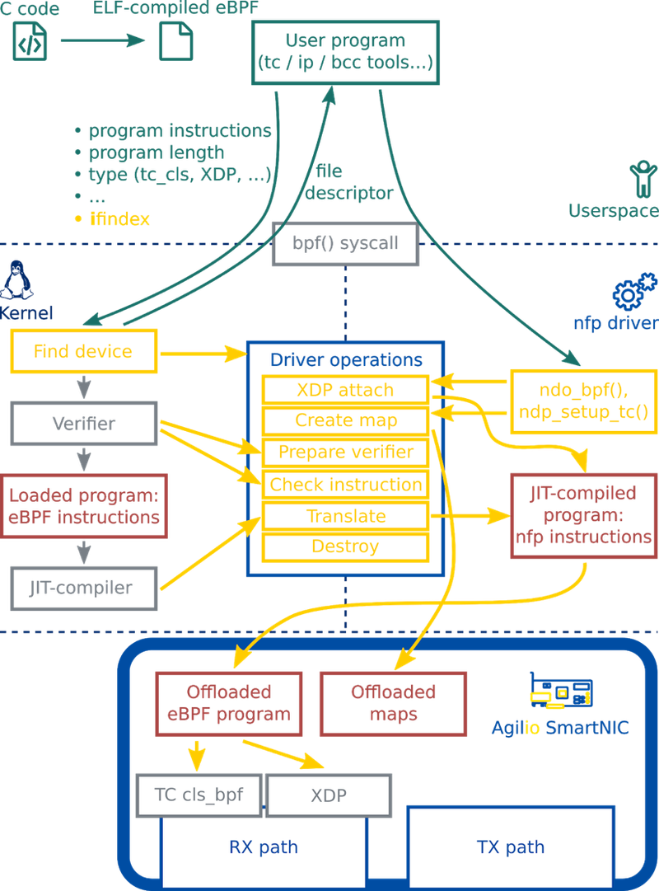

### 负责内容

------

- 当前 eBPF 从 C / P4 高级语言编写到生成 eBPF 字节码的整个过程，各个步骤的可以展开的细节（cLang 做了什么，LLVM 做了什么等等），一步步往下的图解，到硬件卸载翻译成硬件的指令（包括本地CPU 和 SmartNIC ）之前经过 JIT ，JIT 是什么（一些概念和解读细节等）。
- 本实验使用 SmartNIC 对 eBPF offload 的支持，所提供的工具链，添加一些能查到总结到的资料扩展一些细节等等。

------

#### => 本报告 focus on 我们能用哪些工具，这些工具与我们目标之间的关系，突出“可行性”。

# 1. Overview the offload path we will take

### ----From C & eBPF bytecode to offload & beyond (Copy from ICS )

------

较复杂版本的整个硬件卸载流程图如下：

1. ***编写程序并获得eBPF字节码***：我们先写好C语言程序，然后通过eBPF的clang(4.0 or 6.0)与LLVM后端将C程序编译成eBPF字节码(Bytecode)，得到elf文件。

   - **clang和LLVM**：

     Clang 是一个C、C++、Objective-C和Objective-C++编程语言的编译器前端。它采用了LLVM作为其后端，而且由LLVM2.6开始，一起发布新版本。

     (目前，支持生成 BPF 伪代码的编译器只有 LLVM 一家，即使是通篇使用 gcc 编译的 Linux 内核，samples 目录下的 eBPF范例也要借用 LLVM 来编译完成)

     

2. ***加载入内核*** ：然后通过调用bpf（）系统调用将程序加载到内核中。对于网络程序，此调用通常由tc filter add或ip link等工具进行*（具体功能待查）*。当程序要被硬件卸载时，我们需要向系统调用传递一个额外的接口索引，以指示将要卸载的设备。

3. ***验证安全性（Verify）***：因为eBPF 的代码是跑在内核空间中的，为了保障内核的正常工作，该程序在内核中将会被Verifier验证，确保这个程序一定会终止，不会出现死循环，并且没有任何其他安全问题，

4. ***使用JIT将eBPF字节码编译成本机指令*** 

   - JIT：

     

5. ***硬件卸载（offload）*** ： 包含maps offload 和program offload

6. ***运行！~~4.3 !~~***

 

# 2. More about eBPF offload on SmartNIC

------

# 3. Why to programme the NFP

### ------Whether we need to programme the NFP itself remains to be a question, and I tend to the view that  we just need to deal with the programming of eBPF on the NFP and the eBPF offload

------

- 为了实现用户定制化的数据通路（Data Path）与数据处理功能
- 为了充分利用Agilio SmartNIC性能，提高数据处理速度

# 4. Programming the NFP with C

------

- ***C语言的高效性***：

  ​     使用C语言对Agilio SmartNIC进行编程是效率最高的一种方式，因为使用C语言可以充分利用Agilio SmartNIC 架构中一些特殊的数据结构。

- 使用C语言对数据流处理器进行编程的流程图如下：

- ***NFCC***:  
  - Network Flow C Compiler，是一个经过优化的、适配数据流架构的C编译器。
  - NFCC 为C语言提供了一些扩展语法（“extensions”），这些扩展大部分通过给C代码加上特定注释实现。
  - ***FPC***：
    - NFP由多个数据流处理核心（FPCs: Flow Processing Cores）组成，而每一个数据流处理核心都是标准化的、基于RISC架构、可被编程的多线程计算核心。NFP与通用CPU的区别是：为了加速包处理，NFP中的FPC都与一系列外部功能单元相连接以实现特定的功能。
    - 每个FPC上可以运行8个线程，这些线程共享一个内部ALU，每时每刻只能有一个线程处于运转状态。
    - FPC中的线程调度是非抢占性的，各线程协同工作的方式很简单：必须在上一个线程释放它对FPC的控制后，下一个线程才会运行。这种非抢占式的简单调度方式简化了FPC内部的线程同步问题。
  - ***流程***：
    - 用户编写的c程序首先通过NFCC被编译与链接成一个.list file，每一个.list file都代表着一个完整的程序。
    - 然后这些.list file会被下载到一些指定的FPCs上。
- 使用SDK(Software Development Kit)-IDE的完整开发流程：

------

#### 参考资料：

1. <https://www.netronome.com/blog/ever-deeper-bpf-update-hardware-offload-support/?tdsourcetag=s_pctim_aiomsg>
2. <https://www.ibm.com/developerworks/cn/linux/l-lo-eBPF-history/index.html>
3. A thorough introduction to eBPF <https://lwn.net/Articles/740157/>

