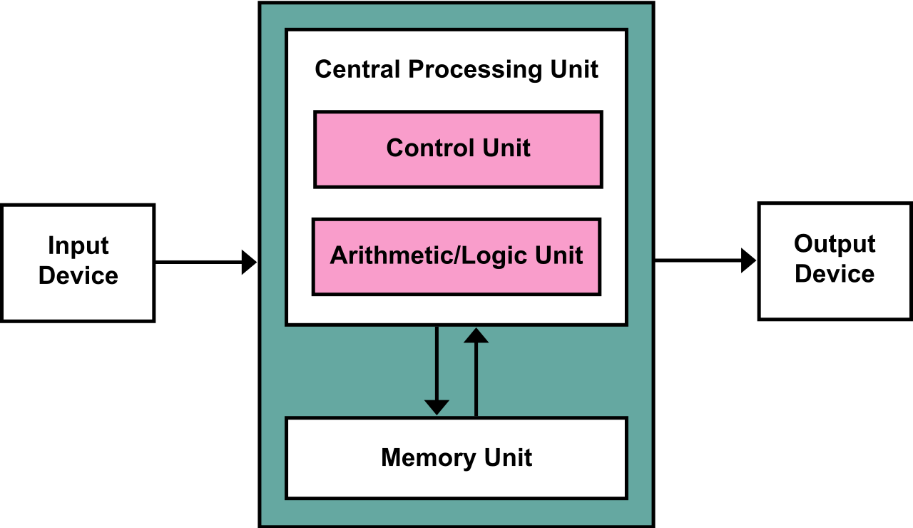
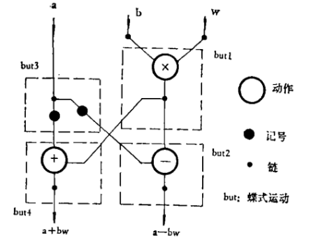
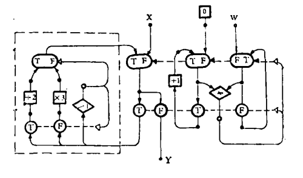
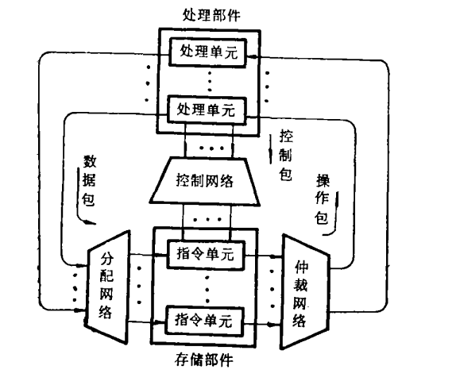

## 数据流架构与传统冯诺伊曼架构的区别
---

### 1. 回顾冯诺依曼架构

   

   ​				                     图1   冯诺依曼架构示意图
   

   **主要特点：**

   + 基于控制流概念

   + 指令与数据一起放在memory中

   + 程序的执行需要依靠PC (Program Counter)，通过移动PC将对应地址的指令取入IR (Instruction Register)并执行
   

   **缺陷：**

   - 天生存在CPU与Memory之间信息交换的瓶颈, 在处理并行问题方面有本质困难

     

     ​               图二  memory数据读写数据与CPU读写数据差距巨大
     

   - 近年来基于冯诺依曼架构的新式计算机体系虽然采用并行技术，但没有摆脱传统的以控制流为主的设计思想，并行处理能力受限

   

### 数据流架构 

   **特点：**

   + 基于数据流概念
   + 舍弃PC：指令的执行完全有数据驱动，由操作数的到达顺序与可获取性来驱动指令的执行。
   + 采用异步控制，以自然方式提升并行性

   

   **数据流语言：**

   + 数据流语言是一种用图表示的机器语言（？），是数据流计算机的基础，通过编码成为机器指令存在于计算机中。

   + 数据流语言表示为有向偶图。它有两种不同的节点, 分别称为链 (Iink)和 动作 (actor), 一个动作表示进行一步运算，其结果由链传送到下一个动作。

     

   ​                                  图三 一个快速傅里叶变换的图
   

   + 指令的执行顺序由“点火规则（firing rule）”决定。以J·B·Dennis 1973年提出的第一个数据流语言方案[^1 ]为例: 1. 节点的每一个输出链上都有记号，而任何输出链上没有记号，则称此节点就绪, 任何就绪的节点可以点火。2. 链的点火是从输入弧上移去记号放到它的每一条输出弧上。3. 一个动作点火是从它的每一输入弧上移去记号，用输入记号传送来的值确定一个结果放在它的输出弧上

   +  一个代码示例：

     ```c
     input(int w,int x){
         int y=x;
         int t=0;
         while(t!=W){
             if(y>1) y=y/2;
             else y=y*3;
             t=t+1;
         }
     }
     ```

  对应的数据流图：
     

**数据流计算机的结构：**

​    

+ 存储部件

+ 处理部件

+ 控制网络

+ 分配网络

+ 仲裁网络

  数据流计算机实际上是一个包通讯系统，除了存储部件和处理部件外，其余3部分都是通讯网络，这些网络的基本元件是仲裁单元、开关单元和缓冲器。

  ​      

## BPF之前的包处理模型及他们与BPF的对比 
---
### CSPF

**CMU / Stanford数据包过滤器**（CSPF，1987）是第一个数据包过滤器，并与其他协议栈并行实现。

它带来了一些重要的对数据包过滤的改进：

- **内核级别的实现**：处理速度更快，因为避免了内核空间和用户空间之间上下文切换的成本，尽管它更容易破坏整个系统;
- **数据包批处理**：内核缓冲区不会立即传递到达应用程序的数据包，而是等待待存储的操作数，然后将它们一起复制到用户缓冲区中以减少上下文切换次数;
- **虚拟机**：过滤器不再是硬编码的，但是用户级代码可以在运行时实例化一段伪编译器语言的代码，指定过滤操作以确定数据包是否可以通过或必须被丢弃，以及虚拟数据包过滤器中的机器在实际上由所有可能的指令组成的`交换机盒组成`，模拟处理器，该处理器为传输中的每个数据包解释该代码。

CSPF过滤器引擎基于操作数堆栈，采用树形表达式方法。指令要么在栈上推送常量或包数据，或者在顶部执行二进制布尔运算或按位运算两个要素。过滤程序是顺序执行的列表指示。评估一个程序后，如果顶部堆栈具有非零值或堆栈为空，然后数据包为接受，否则被拒绝。

表达式树方法有两个实现缺点：

1. 必须模拟操作数堆栈。 在最现代的机器上，这意味着使用加法和减法运算维护一个模拟出的堆栈指针，并对内存进行加载和存储以模拟堆栈。**由于内存是冯诺伊曼架构的主要瓶颈，因此这样做带来了性能上的限制。**

   > 由于BPF使用一种重新设计的基于寄存器的“过滤器虚拟机”，而不是基于内存，能够在基于寄存器的RISC处理器上高效率地实现。

2. 树模型通常进行不必要或多余的计算。 


