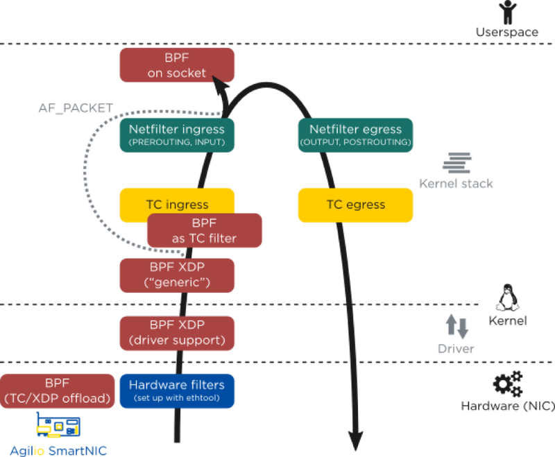

# zjx 可行性报告

## 备选资料来源

- https://www.netronome.com/blog/bpf-ebpf-xdp-and-bpfilter-what-are-these-things-and-what-do-they-mean-enterprise/
- https://www.netronome.com/blog/open-source-packet-filtering-bpf-fosdem19/ bpfilter（introduction mostly，not such a good material）
- http://vger.kernel.org/lpc_net2018_talks/Brandeburg_networking_hardware_offloads.pdf 2018，Intel，“What’s Happened to the World of Networking Hardware Offloads?”（内容过于庞杂，put aside！）
- https://blogs.cisco.com/performance/network_hardware_offload HW offload concept intro
- https://www.netronome.com/blog/frnog-30-faster-networking-la-francaise/ bpfilter

## 关于“硬件卸载” (Hardware Offload)

### 硬件卸载 简介

“硬件卸载” （Hardware Offload）所讲的含义是，使用特定功能的硬件加速那些本该在软件层面上，或者是通用计算设备（CPU）上进行的工作。可以这样理解 offload 这个词：我们将某一个繁重的工作，从软件上、或者是我们的通用CPU上解放出来，而把这个任务交给一个专为此设计的、高效的另一个硬件来做。

某种程度上讲，GPU 就是这样的一个“专业、高效”的特定用途的硬件——图灵告诉我们，CPU 可以做任何“可计算的”工作，但把这些繁重的图形处理工作交给 GPU 去进行显然推动了计算机领域的一次革命——我们如今可以支持近乎完美的画面渲染，颇为逼真的 3D 游戏画面与方便高效的视频合成与剪辑。难以想象没有 GPU 的计算机如何达到这样的高度。

本课题所使用的“硬件卸载”技术更多的是指，使用附属的网络处理器，来“卸载”——或者说负担——大部分的网络数据处理工作，使 CPU 从这些每秒达几十 Gib 的数据流中解放出来。也就是说，我们使用高效的，高度并发的数据流处理器（Network Flow Processor）来处理繁重的网络任务，如网络交通，包过滤，协议等，而CPU可以专注于其他计算任务——当下，随着云数据中心的网络带宽达到 100Gbps 的量级，那些本就负担着上万个虚拟机、上百万用户进程的通用CPU集群服务器不得不引入 NFP 智能网卡来加速他们的云流量处理与协调并高效化硬件资源的分配。

在“硬件卸载”尚未应用到智能网卡之前，在软件层面（如操作系统上）发送或接受 TCP 数据需要许多指令周期才能完成，而对于专用硬件来说，这只是几个周期就可以解决的问题。同时，网络硬件卸载可以节约大量缓存资源（传统的过程必将网络数据存入CPU缓存进行处理），降低网络中断的执行次数，并且减少数据在内存和运算单元间的数据通路中的传输速度——而这同时是冯诺依曼架构的核心瓶颈之一。

***建议在讲述下一部分之前提前讲李喆昊负责的“SmartNIC对eBPF硬件卸载的支持”***

### eBPF 等依赖它的架构的硬件卸载及其效果

在 eBPF （包括 XDP，bpfilter 等与之相关的架构）获得硬件卸载的支持之前，这些架构通过在整个 Linux 的网络通路上添加“钩点”（hook），来获得更早处理网络数据的机会。

hook 应当解释为一个“嵌入”的结构：当数据到达数据路径的某一个节点时，挂在这个“嵌入”结构上的架构程序立刻开始执行，比如处理该数据包是否应该丢掉——而非等到数据包创建了 skb 之后再进行决定。这种嵌入架构允许我们提前做出决策，规避毫无意义的硬件、内核层数据传输和复制。

eBPF 程序的特性，支持它可以和内核的诸多架构配合，在网络数据通路的诸多节点上嵌入其程序。下图展示了 eBPF 程序可以嵌入的内核架构（同时包括了网卡驱动和硬件卸载）。

近年来高热发展的 Linux 网络数据处理架构中，TC 和 XDP 都选择将其 hooks 嵌入到网络数据通路中尽可能低的部分。下图展示的是所有使用 eBPF 的高速网络处理架构在数据通路的位置及单核包处理表现。

可以看到，层次越低，包处理的速度越快，而以硬件卸载方式的速度十分超群（单线运算速率是 XDP 的进四倍）。

另一 eBPF 硬件卸载的发展结果是 bpfilter——同时兼顾加入 eBPF 的新特性与兼容固有防火墙与 ip 协议的高性能网络过滤内核模块。下图是将 bpfilter 硬件卸载到 SmartNIC 上，与使用八核处理器，使用旧有的传统 iptables 和较新的 nftables，其数据处理速度进行的对比。

基于数据流处理器的网络处理硬件卸载的高效还源自于，它规避了传统架构（如 x86）在 PCIe 带宽限制上不可避免的障碍。下图是使用 XDP 执行负载均衡时，使用 Agilio SmartNIC 硬件卸载与网卡驱动层XDP，及使用 Intel Xeon CPU E5-2630 的性能对比，前者的数据包处理表现近乎是后者单核的12倍。

同时，低延迟性也是选择硬件卸载 eBPF 的关键理由。由于 eBPF 程序直接在网卡上运行，数据包不必在跨越 PCIe 带宽造成的障碍，进而达到改善负载平衡和维护 DDoS 网络安全。下图展示了 XDP 在硬件卸载和网卡驱动层两个方式下的延迟对比，特别的，硬件卸载的延迟十分稳定。

## 项目概要设计

综合上述内容，我们可以得出结论：eBPF 程序通过已有的官方工具，可以方便地编程到高度支持硬件卸载的 Agilio SmartNICs 上，并有效规避传统冯诺依曼架构中数据传输和计算的瓶颈，利用数据流处理器的高性能和高度并行性，获得高性能网络处理所需要的更高速的包处理和更低的延迟。

本小组课题的基本思路是：不依赖或尽可能少地依赖操作系统内核与传统冯诺依曼架构上的硬件，在 Agilio SmartNIC 上独立处理网络包和网络数据；利用数据流架构的高效和高度并发来获得更快速、更低延迟的网络包处理。使用 C 语言编写实现各种网络处理功能的 eBPF 程序并最终编译成 SmartNIC 指令，同时根据不同的网络处理需求，优化指令序列，并最终利用 Netronome 产品开发的 eBPF 各个硬件卸载工具，编程到智能网卡上。项目目标是：获得尽可能高的数据包处理速度，获得纳秒级的处理延迟与“终端到终端”响应时间。

我们现阶段确定的，计划使用的各项工具有：
- 网卡型号：[Agilio CX 2x10GbE](https://www.netronome.com/products/agilio-cx/)
- 配套软件：[Agilio eBPF Software](https://www.netronome.com/products/agilio-software/agilio-ebpf-software/) 等。
- 服务器：具体型号未定。
- 配套操作系统：Linux，版本未定。