# 赵家兴调研结果

## 出自 PB_Agilio_CX_2x10GbE.pdf

如今，数据中心无时无刻不面临着大容量存储与计算增长所带来的挑战。伴随着云基础的、按需分配的服务模式，云服务公司与传统的数据中心都需要满足客户关于更低延迟、更快速度的需求。在这样的市场背景下，许多软件层面的解决方案应用而生，但它们更多的仅能提高网络服务的敏捷度。而Agilio CX SmartNICs不仅能提供服务器网络所需的敏捷性与对快速的要求，更能使单服务器支持更多的安全虚拟机成为可能。

云数据中心需要同时在数十万台服务器上分布的，上百万个虚拟机上，服务成千上万的客户并管理他们的应用程序。同时，为了平滑地将企业用户的应用转移到云上，服务供应商提供给他们特定独享的云网络和与之相配的安全协议。于是，这些占据了数据中心75%交通量的，不断增长的虚拟机与应用数量，急需让防火墙协议与虚拟机直接配合。最终，这导致了虚拟网络、安全协议与密钥数量的爆炸式增长，需要动态地加以管理与供给。

近年来，以实现规模化与节约成本为目标，基于服务器的网络与智能终端已迅速发展。典型的内联网络功能包括“隧道封装”，“负载平衡和计量”，“精确匹配”，“外卡匹配”，“基于动作的无状态与有状态流处理”。内联加密现在对于在安全传输中的数据访问至关重要，将粒度策略应用于更靠近虚拟机与程序这样的需求，导致要使用虚拟交换数据路径来实现这些内联功能。但是，由于服务器中这些10、25、40、100GbpE的链接，使这些内联功能所需的CPU核心数与功率变得令人望而却步。而Agilio CX SmartNICs专门用于解决此类挑战：通过有效地卸载虚拟交换数据路径，Agilio CX SmartNICs可以释放服务器CPU内核来提高性能，并为服务器提供更安全的虚拟机，同时降低运营成本。

## 出自 A brief introduction to XDP and eBPF https://blogs.igalia.com/dpino/2019/01/07/introduction-to-xdp-and-ebpf/

近年来，为了冲破Linux内核进行高效网络包处理时的瓶颈，新的编程工具包与技术不断涌现。

其中最为知名的一个当属Kernel Bypass技术，即跳过内核的网络层并把所有的网络包处理交由用户空间执行。Kernel bypass同时要求在用户空间管理网卡，或者说，网卡要依赖用户空间中的驱动来发挥功能。

将网卡的完全控制权交给用户空间程序的好处是，我们减少了内核所带来的障碍，比如上下文切换、网络层处理、中断等。这足以使网络数据传输达到10Gbps甚至更高。kernel bypass与其他特性（如批量包处理）和性能调整方法（如NUMA感知，CPU隔离等），整合除了高性能用户空间网络的基础结构。这种新的数据包处理方法的典型代表应当是英特尔的DPDK，同时还有其他为人熟知的VPP，PF_Ring和Snabb。

而用户空间网络的不足则在于：

- 用户空间程序跳过了操作系统内核，就意味着跳过了操作系统提供的硬件资源抽象而直接管理硬件本身。用户空间驱动程序虽然可以保证正常运作，但一般地相比内核更缺乏测试与兼容性。
- 用户空间程序同时跳过了内核提供的网络管理函数，这意味着用户空间程序要重新实现那些已经被内核提供过的功能。
- 程序以沙箱模式运行，而这限制了它与操作系统其他部分的集成于交互。
- 内核为网络提供充分的安全层，而这在用户空间程序中并不存在。

与用户空间网络截然相反的是，XDP（eXpress Data Path）将诸如过滤器，映射器，路由的全部用户空间网络程序转移到了内核的领域里。XDP允许我们的网络程序在网络包到达网卡而进入内核网络层之前立即执行，这显著提高了网络包处理速度。

而为了让用户程序在内核领域内执行，BPF（Berkeley Packet Filtering）进行了有效的实现。

BPF实质上是一个特定功能的虚拟CPU模型，这个虚拟机是为包过滤处理而特别设计的。BPF虚拟CPU及其字节码是1992年末由Steve McCane和Van Jacobson与论文“The BSD Packet Filter: A New Architecture for User-level Packet Capture”（http://www.tcpdump.org/papers/bpf-usenix93.pdf 首先提出。BPF虚拟机定义了BPF程序执行的环境：除字节码之外，还定义了一个基于数据包的内存模型（“加载”指令在处理数据包上隐式执行），A与X（Accumulator and Index register）两个寄存器，临时存储器存储和隐式程序计数器。

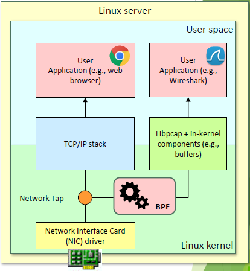

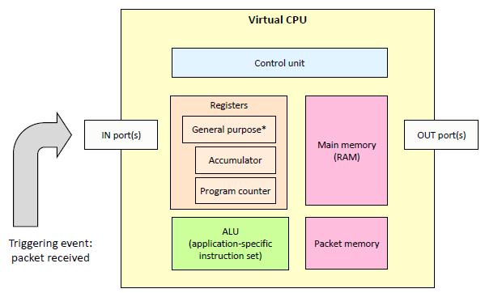

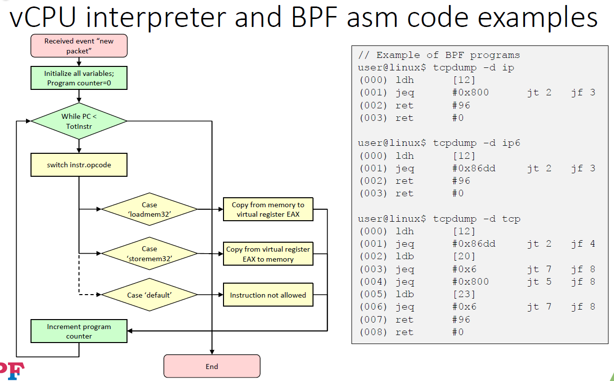

***注：18HPSR-eBPF第7页讲解了虚拟CPU与完全虚拟机之间的区别，如非篇幅需要，可以略去不谈.***

2011年，Eric Dumazet将BPF转译器更改为JIT，使得内核可以将BPF程序直接翻译为支持目标架构：如x86，ARM，MIPS等。

后来，在2014年，Alexei Starovoitov扩充了BPF JIT，实质上创建了一个新的BPF架构，称为extended BPF（eBPF）。在BPF的基础上，eBPF：
- 将架构更接近于x86-64。eBPF使用64位寄存器并将寄存器数量从2扩展到10，同时扩充了机器操作码。

- 将网络子系统与其自身分离。BPF是与数据包模型绑定的，而eBPF可以支持许多其他用途。现在我们可以将eBPF程序附加在跟踪点或kprobe上，这使eBPF可以用于机器监控、性能分析以及更多内核子系统中的其他用途。

- 创建了称为“映射”（Maps）的全局数据存储结构。Maps是键/值数据结构，它允许在eBPF程序之间，乃至内核和用户空间程序之间交换数据。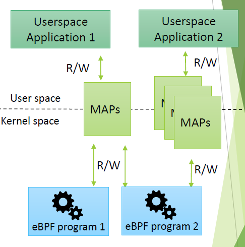

  ***17到19页更多地展开了maps的结构，如非篇幅需要，本人觉得不必过多展开***

- 协助函数（Helper functions）。比如数据包重写、克隆、校验和计算，这些功能在内核执行。同时，也可以在eBPF中执行系统调用。***18HPSR-eBPF.pdf的第32页到33页也有关于helper的更多介绍，如非篇幅需要，本人觉得不必过分展开***

- 尾调用。eBPF程序限制为4096字节。 尾调用功能允许eBPF程序通过控制新的eBPF程序来克服此限制。

## 以下出自18HPSR-eBPF.pdf

eBPF使得多种网络“钩点”（hook points for networking）成为可能。它们位于Linux网络栈的不同层级，提供了响应网络交通（traffic）的能力，无论它是否已经被其他栈的部分处理过——这同时打开了在栈的各个层面实现网络程序的机会。

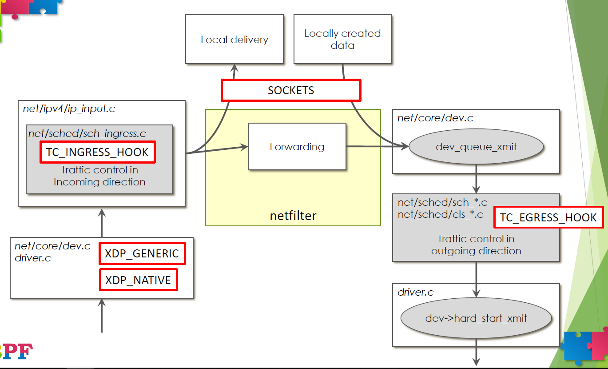

而XDP提供了更高效的钩点，允许用户在网络驱动的更早阶段运行eBPF程序。这种技术可以用于早期丢包，防火墙，加载平衡，转发等。

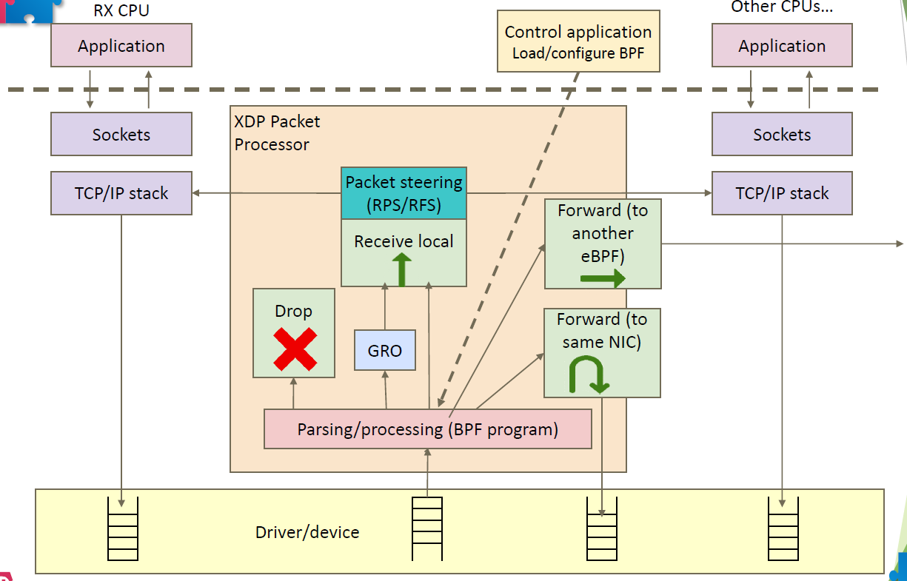

同时，eBPF程序本身可以直接连接到任何物理或虚拟网卡上，或任何隧道适配器（如GRE，PIsec，Vxlan）。而通过尾调用技术，不同的eBPF程序可以被连接起来，创建一个复杂的服务程序链。

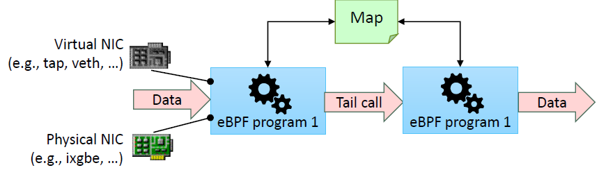

eBPF程序甚至可以直接用（restricted）C语言编写。C语言使用CLANG编译，并借助于LLVM调整并生成代码，最终用JIT将eBPF汇编指令翻译成本地指令。

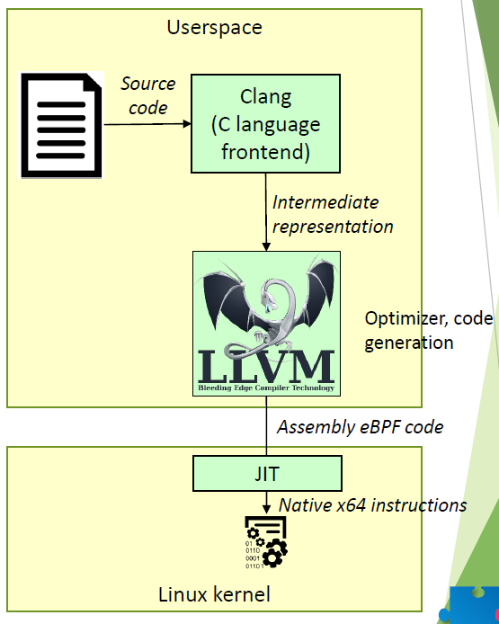

下图展示了eBPF运行时的基本运行架构。

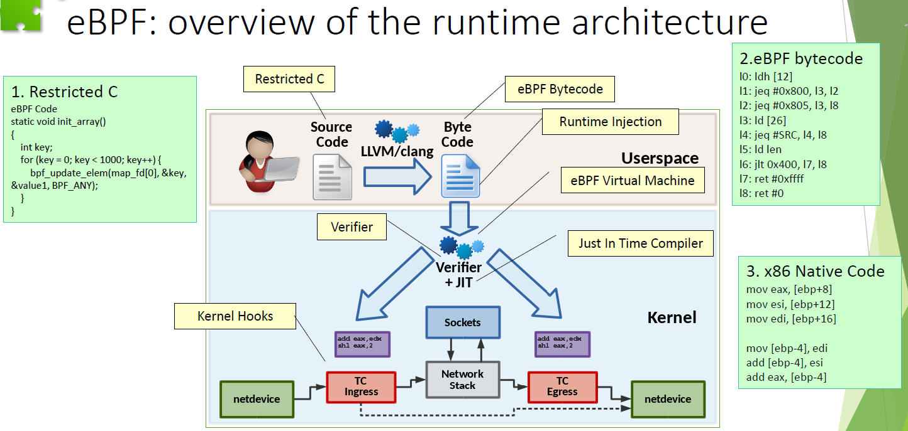

近年来，有人尝试将eBPF程序“硬件卸载”（Hardware offload）到SmartNIC上，并获得了出众的性能表现。

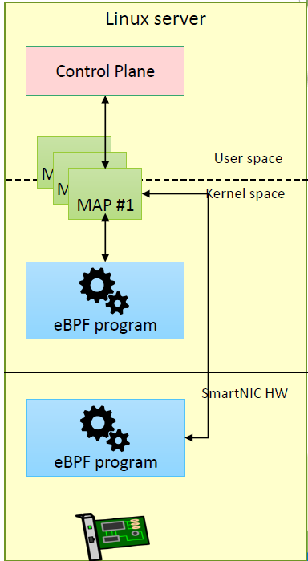

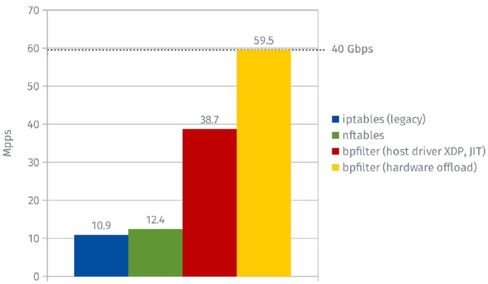

（Quentin Monnet , FRnOG30, "bpfilter, pare-feu Linux a la sauce eBPF", March 2018, https://www.qmo.fr/docs/talk_20180316_frnog_bpfilter.pdf）

## 以下出自 eBPF/XDP hardware offload to SmartNICs https://netdevconf.org/1.2/session.html?jakub-kicinski

在2016年，东京netdev 1.2大会上，Jakub Kicinski与Nic Viljoen提出了将eBPF/XDP程序硬件卸载到NETRONOME的数据流处理器智能网卡上的架构方法。

在以NPU为基础的SmartNIC出现之前，由于传统NIC缺乏广泛的硬件卸载适配性，并且传统x86通用CPU已经能较好地实现硬件卸载，同时实现通用卸载要适配多种不同特定硬件架构的复杂性，少有成功的eBPF向NIC的硬件卸载。而随着通用CPU难以胜任目前的网络负载规模，并且RISC工作者在NPU为基础的SmartNIC上的工作日趋成熟，向SmartNIC上硬件卸载eBPF程序正当其时。

***此处在eBPF_HW_OFFLOAD.pdf中简略提到了NFP的结构，但十分简略而难懂，故不必使用这部分内容进行NPU的展开***

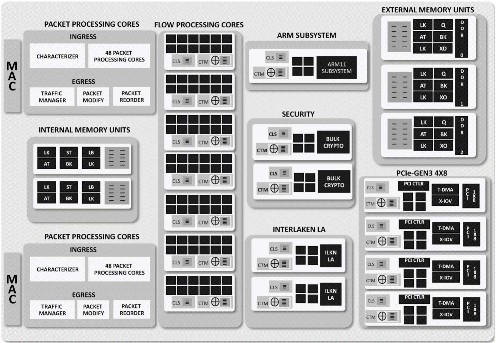

上图展示的是该二人使用的NFP 6xxx芯片的架构。NFP结构中包含一系列的硬件单元，这些单元均是为了实现某种特定的功能（如加密，重排序等）。它们与一些完全可编程的微引擎结合，嵌入到了每个含12个微引擎的计算岛屿上（芯片中含微引擎总数在72到120之间），这些岛屿上还包括SRAM集群目标内存（CTM，256KB）和集群本地暂存（CLS，64KB）。NIC上还包括一个2~8GB的DRAM存储EMEM和8MB的SRAM存储IMEM。

在每个微引擎（Microengine）上，可以同时运行4到8个与浅管道协同复用的线程，这确保了时钟周期可以高效利用。无锁交换内存架构使得NIC的内存并不像其他架构的内存一样容易成为性能瓶颈。每个微引擎中有256个32位通用寄存器，分为A和B两组，它们被每个线程均分（在8上下文模式运行时，每个线程有16个A和16个B寄存器）。特别地，A和B组中的寄存器仅能和另一个组的寄存器进行交互。每个微引擎中还有256个32位传输寄存器（128读/写），4KB的本地SRAM，以及128个32位下一相邻寄存器（next neighbour registers）。

***此处应当插入NFP的架构讲解（非本人部分），然后接下来引出下面的内容***

Jakub Kicinski与Nic Viljoen使用NETRONOME的NFP 6xxx架构，概念性地将eBPF虚拟机映射到了NFP上。

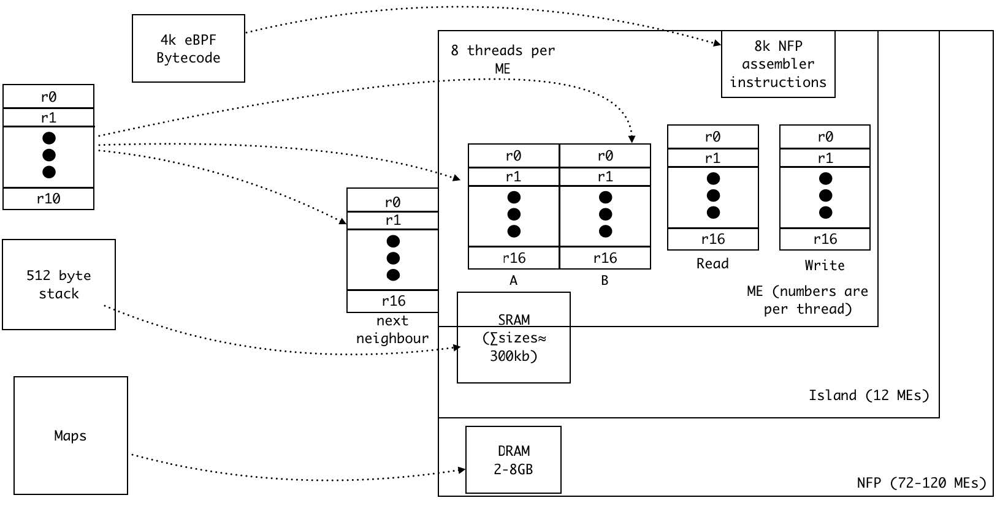

上图展示的是一个eBPF虚拟机是如何映射到NFP上的。eBPF的数据结构MAPs可以放在DRAM里，同时使用一定的缓存机制和多线程机制来提高速度，降低延迟。

栈可以放在微引擎SRAM和计算岛屿SRAM的集合上，这一般要取决于栈的大小。NFP指令存储区可以存储达8000条NFP汇编指令，当然多个微引擎可以结合起来，将可存储指令的数目扩大。

最后，A、B组通用寄存器，下一相邻寄存器，传输寄存器可以用来实现eBPF的10个64位寄存器。在4上下文运行模式下，每个线程分配的寄存器足以简单地满足这一映射；但在8线程下，需要一些管理与优化措施。